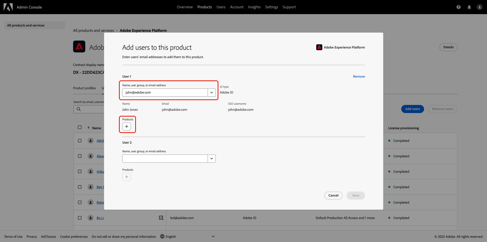
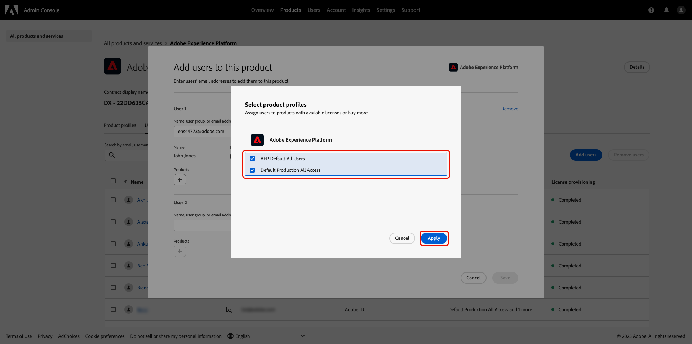
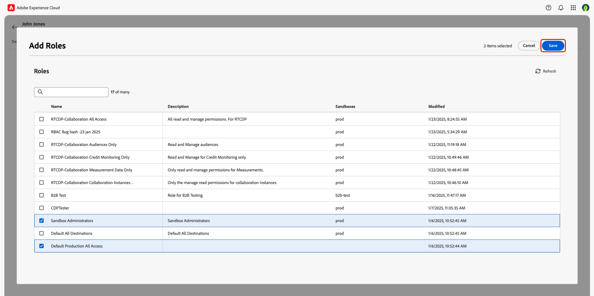
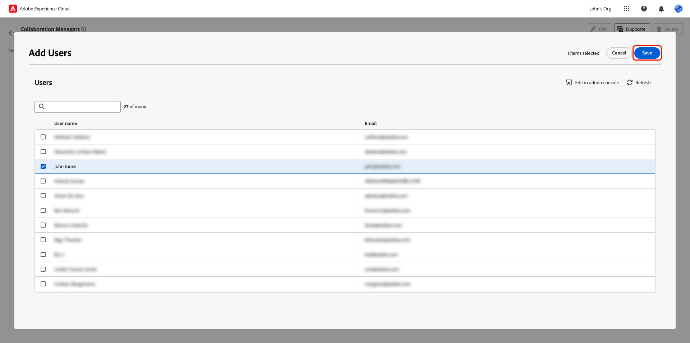

# 権限によるユーザーアクセスの管理 {#manage-user-access}

{{limited-availability-release-note}}

Experience Cloud [権限](https://experienceleague.adobe.com/en/docs/experience-platform/access-control/abac/permissions-ui/browse){target="_blank"} インターフェイスを使用して、Real-時間 CDP コラボレーション内の個人コンポーネントへの権限とユーザーアクセスを管理します。 権限を使用すると、システム管理者と製品管理者は [ロール](./manage-roles.md) を定義して、特定の機能やリソースへのユーザーアクセス管理ことができます。

## 権限へのアクセスの設定 {#permissions-access}

権限にアクセスするには、製品管理者と Adobe Experience Platform 製品に対する ユーザー アクセス権の両方が必要です。 製品管理者権限の設定にはシステム管理者が必要ですが、ユーザー権限の設定はシステム管理者または製品管理者が行うことができます。 管理ロールの詳細については、 [アクセス制御階層](./overview.md#hierarchy) ガイドを参照してください。

>[!TIP]
>
>このガイドでは、「管理者&#x200B;****&#x200B;は&#x200B;**システム管理者と製品管理者の両方**&#x200B;を指します。

### システム管理者:製品管理者アクセスの設定 {#admin-access}

以下のステップを使用して、ユーザー製品管理者にアクセス権を付与して、Experience Platform製品内の管理機能を付与します。

>[!IMPORTANT]
>
>システム管理者は、Adobe Admin Console などの特定の Experience Cloud 製品にすぐにアクセスできます。 ただし、権限を使用するには、自分自身にExperience Platform製品の製品管理者およびユーザーアクセス権を付与する必要があります。 システム管理者として自分自身にアクセス権を付与するには、以下のステップバイステップガイドに従います。

資格情報を使用して ](https://experience.adobe.com/){target="_blank"}0}Adobe Experience Cloud} にログインします。 [ホームビューは、「**[!UICONTROL クイックアクセス]**」セクションに使用可能な製品のリストと共に表示されます。 「**[!UICONTROL Admin Console]**」を選択します。

{zoomable="yes"}

[Adobe Admin Console](https://adminconsole.adobe.com/) 概要ダッシュボードが表示されます。 ]**製品とサービス]** の下にある **[!UICONTROL 製品]** リストから **[!UICONTROL 0}Adobe Experience Platform} を選択します。**[!UICONTROL 

{zoomable="yes"}

Adobe Experience Platform ダッシュボードが表示されます。 **[!UICONTROL 管理者]** タブを選択してから、**[!UICONTROL 管理者を追加]** を選択します。

{zoomable="yes"}

**[!UICONTROL 製品管理者を追加]** ダイアログが表示されます。 ユーザーのメールアドレスまたはユーザー名を「**[!UICONTROL メールまたはユーザー名]**」テキストフィールドに入力し、ドロップダウンから正しいアカウントを選択します。 「**[!UICONTROL 保存]**」を選択して、ユーザーの製品管理者としての追加を終了します。

{zoomable="yes"}

製品管理者権限を持ち、Admin Console内の製品に対してユーザーや他の管理者を追加するなどの管理機能を実行できるようになりました。 次に、権限内の機能にアクセスして実行するには、Experience Platform製品へのユーザーアクセス権が必要になります。

### 管理者：Experience Platformへのユーザーアクセスの設定 {#user-access}

ユーザーに製品管理者アクセス権を付与したら、Experience Platform製品へのユーザーアクセス権を付与する必要があります。 アクセス設定の一部として、ユーザー固有の [ 製品プロファイル ](https://helpx.adobe.com/jp/enterprise/using/manage-product-profiles.html) を割り当てます。

>[!TIP]
>
>前の節の手順を実行している場合は、既にAdobe Experience Platform製品に含まれているため、最初の手順をスキップしてもかまいません。

[Admin Console](https://adminconsole.adobe.com/){target="_blank"} に移動し、{ 製品 ]**リストから {2****Adobe Experience Platform**[!UICONTROL  を選択します ]****[!UICONTROL 

{zoomable="yes"}

「**[!UICONTROL ユーザー]**」タブを選択し、「**[!UICONTROL ユーザーを追加]**」を選択します。

{zoomable="yes"}

**[!UICONTROL この製品にユーザーを追加]** ダイアログが表示されます。 ユーザーの名前またはメールを「**[!UICONTROL 名前、ユーザーグループまたはメールアドレス]**」テキストフィールドに入力し、ドロップダウンから正しいアカウントを選択します。 次に、「**[!UICONTROL 製品]** 追加」オプションを選択します。

{zoomable="yes"}

**[!UICONTROL 製品プロファイルを選択]** ダイアログが表示されます。 「**[!UICONTROL AEP-Default-All-Users]**」と「**[!UICONTROL Default Production All Access]**」を選択し、「**[!UICONTROL 適用]**」を選択します。

{zoomable="yes"}

情報が正しい確認、[ **[!UICONTROL 保存]**] を選択します。

{zoomable="yes"}

これで、製品管理者と製品にExperience Platformへのアクセス権が付与され、権限にアクセスできるようになります。 次に、ユーザーに 2 つの基本的な役割を割り当て、Experience Platform UI へのアクセス権を付与する必要があります。

### 管理者：Experience Platform UI アクセスの設定 {#product-access}

Real-Time CDP Collaborationでは、管理者とエンドユーザーは、オーディエンスや監査ログなど、Experience Platformのデータを操作します。 このデータは、サンドボックスと呼ばれるExperience Platformのインスタンス内に保持されます。 ユーザーがこのデータを確実に操作できるようにするには、ユーザーに [ デフォルトの役割 ](https://experienceleague.adobe.com/en/docs/experience-platform/access-control/home#default-roles){target="_blank"} を割り当てる必要があります。

開始するには、[Adobe Experience Cloud](https://experience.adobe.com/) に移動します。 **[!UICONTROL クイックアクセス]** 内に ]**0}Experience Platform} と**[!UICONTROL  権限 ]**が表示されます。**[!UICONTROL 

{zoomable="yes"}

>[!NOTE]
>
> 製品がにアクセスできるようになるまでに数分かかる場合があります。アクセス権が付与されたことを知らせるメールが届きます。 メールの受信後にAdobe Experience CloudにExperience Platformまたは権限が表示されない場合は、ログアウトしてからアカウントにログインし直してください。

この段階で、**[!UICONTROL 権限]** にアクセスできます。 **[!UICONTROL Experience Platform]** にアクセスしようとすると、次に示すように、有効なサンドボックスがないことを示す警告が表示されます。 これを解決するには、ユーザーにデフォルトの役割を割り当てる必要があります。 開始するには、「**[!UICONTROL 権限]**」を選択します。

{zoomable="yes"}

**[!UICONTROL 権限]** ダッシュボードが表示されます。 左側のパネルから **ユーザー** を選択し、ユーザー名を選択します。

{zoomable="yes"}

「 **[!UICONTROL ロール]** タブを選択し、「 **[!UICONTROL ロール追加]**」を選択します。

{zoomable="yes"}

**[!UICONTROL 役割を追加]** ダイアログが表示されます。 「**[!UICONTROL デフォルトの実稼動環境へのすべてのアクセス]**」と「**[!UICONTROL サンドボックス管理者]**」を選択し、「**[!UICONTROL 保存]**」を選択します。

{zoomable="yes"}

これで、Experience Platformと権限にアクセスできるようになりました。 最後の手順で、Real-Time CDP Collaborationへのアクセス権を付与します。

### 管理者:Real-時間 CDP コラボレーションアクセスの設定 {#RTCDP-collaboration-access}

Real-時間 CDP コラボレーションへのアクセス権をユーザに付与するには、ロールと呼ばれるアクセス制御概念を使用します。 役割は、組織内の [リソース](https://experienceleague.adobe.com/en/docs/experience-platform/access-control/home#permissions) に対して管理者またはユーザーが持つアクセスのレベルを定義します。

Real-時間 CDP コラボレーションへの個人アクセスを設定する場合は、コラボレーション リソースからのアクセス許可を含むユーザーのロールを割り当てます。 [管理 ロール](./manage-roles.md)ガイドを使用すると、次の情報を確認できます。

- [2 つの標準ロール](./manage-roles.md#standard-roles)と、それらが Real-時間 CDP コラボレーションに付与するアクセスレベル
- コラボレーションリソースを使用した [カスタムロール](./manage-roles.md#specific-access-roles) の作成
- コラボレーションリソースに含まれる権限リスト

>[!NOTE]
>
>さらに、**[!UICONTROL サンドボックス]**&#x200B;リソース内の&#x200B;**[!UICONTROL 製品]**&#x200B;権限を含む役割にユーザーを割り当てる必要があります。どちらの標準ロールにもこの権限が含まれています。 ユーザーに標準役割ではなくカスタム役割を割り当てる場合は、この権限を含むように割り当てられているロールの 1 つを確認する必要があります。

ユーザーが必要とするアクセス レベルを含む役割を選択または作成したら、その役割にユーザーを割り当てる必要があります。

#### 役割の割り当て

複数の役割を 1 人のユーザーに割り当てることも、複数のユーザーを 1 つの役割に割り当てることもできます。 最初のケースは、Experience Platformへのアクセス権をユーザーに付与する [ デフォルトのロールの割り当て ](#product-access) を行う際に取り上げました。 次の手順では、選択した役割に直接ユーザーを割り当てます。

**[!UICONTROL 権限]** 左側のパネルから **[!UICONTROL 役割]** を選択し、リストから役割を選択します。

{zoomable="yes"}

役割の詳細ページが表示されます。 「**[!UICONTROL ユーザー]**」タブを選択し、「**[!UICONTROL ユーザーを追加]**」を選択します。

{zoomable="yes"}

**[!UICONTROL ユーザーを追加]** ダイアログが表示されます。 リストからユーザーを選択し、「**[!UICONTROL 保存]**」を選択します。

{zoomable="yes"}

これで、Experience Cloudの ]**クイックアクセス**[!UICONTROL  の下に商品としてリストされた **[!UICONTROL RTCDP Collaboration]** が表示されます。

## 次の手順

これで、ユーザーはReal-Time CDP Collaborationにアクセスできるので、製品の使用を開始できます。 製品全体の詳細については、[ 概要ガイド ](../home.md) を参照してください。
