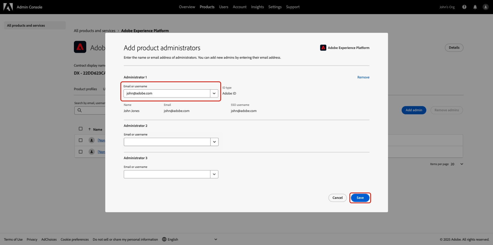
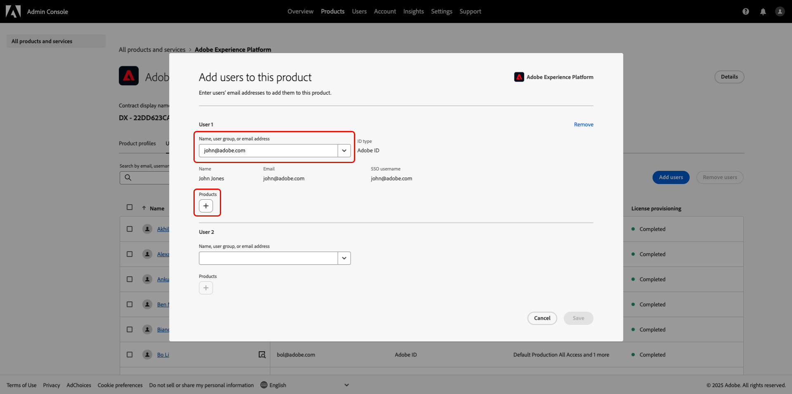
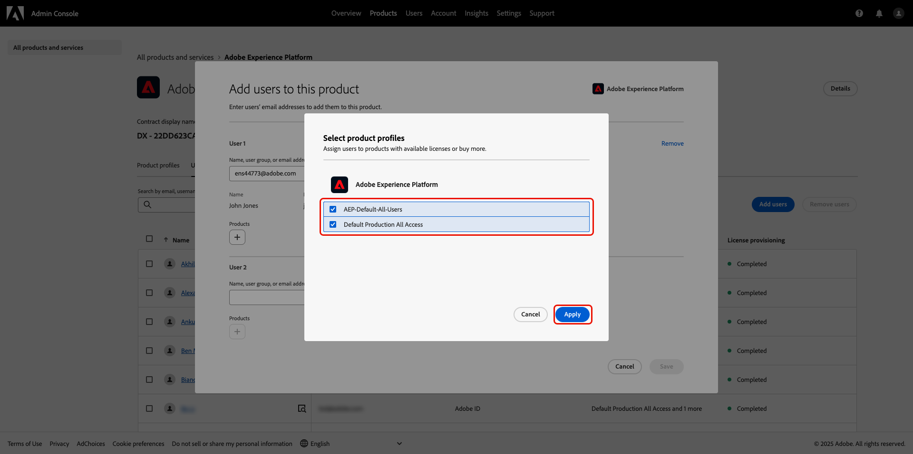
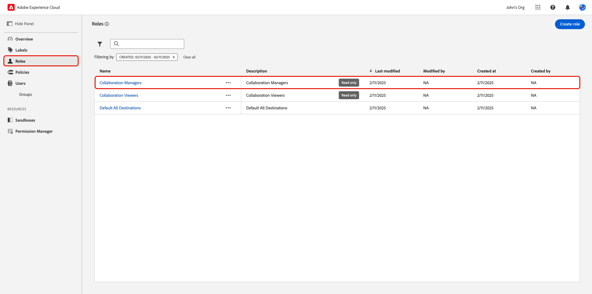
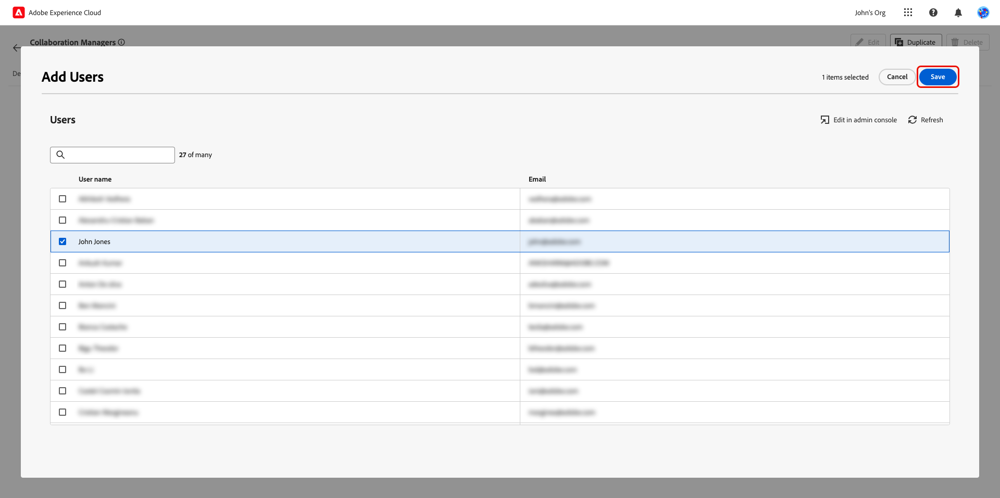

# 権限によるユーザーアクセスの管理 {#manage-user-access}

{{limited-availability-release-note}}

Experience Cloud [権限](https://experienceleague.adobe.com/en/docs/experience-platform/access-control/abac/permissions-ui/browse){target="_blank"} インターフェイスを使用して、Adobe Real-Time CDP Collaboration内の個々のコンポーネントに対する権限とユーザーアクセスを管理します。 権限を使用すると、システム管理者と製品管理者は[役割](./manage-roles.md)を定義して、特定の機能とリソースへのユーザーアクセスを管理できます。

## 権限へのアクセス権の設定 {#permissions-access}

権限にアクセスするには、製品管理者とAdobe Experience Platform製品へのユーザーアクセス権の両方が必要です。 製品管理者権限を設定するにはシステム管理者が必要ですが、ユーザー権限はシステム管理者または製品管理者が設定できます。 管理ロールについて詳しくは、[&#x200B; アクセス制御の階層](./overview.md#hierarchy) ガイドを参照してください。

>[!TIP]
>
>このガイド全体を通して、**管理者**&#x200B;は&#x200B;**システム管理者と製品管理者**&#x200B;の両方を参照します。

### システム管理者：製品管理者アクセス権の設定 {#admin-access}

次の手順に従って、ユーザー製品管理者にExperience Platform製品内の管理機能を付与するアクセス権を付与します。

>[!IMPORTANT]
>
>システム管理者は、Adobe Admin Consoleなどの特定のExperience Cloud製品にすぐにアクセスできます。 ただし、権限を使用するには、製品管理者とユーザーにExperience Platform製品へのアクセス権を付与する必要があります。 次の手順に従って、システム管理者としてアクセスできるようにします。

資格情報を使用して[Adobe Experience Cloud](https://experience.adobe.com/){target="_blank"}にログインします。 ホームビューには、**[!UICONTROL クイックアクセス]** セクション内の利用可能な製品のリストが表示されます。 「**[!UICONTROL Admin Console]**」を選択します。

{zoomable="yes"}

[Adobe Admin Console](https://adminconsole.adobe.com/)概要ダッシュボードが表示されます。 **[!UICONTROL 製品とサービス]**&#x200B;の下の&#x200B;**[!UICONTROL 製品]** リストから&#x200B;**[!UICONTROL Adobe Experience Platform]**&#x200B;を選択します。

{zoomable="yes"}

Adobe Experience Platform ダッシュボードが表示されます。 「**[!UICONTROL 管理者]**」タブを選択し、「**[!UICONTROL 管理者を追加]**」を選択します。

{zoomable="yes"}

「**[!UICONTROL 製品管理者を追加]**」ダイアログが表示されます。 ユーザーの電子メールまたはユーザー名を&#x200B;**[!UICONTROL 電子メールまたはユーザー名]** テキストフィールドに入力し、ドロップダウンから正しいアカウントを選択します。 **[!UICONTROL 保存]**&#x200B;を選択して、製品管理者としてのユーザーの追加を完了します。

{zoomable="yes"}

ユーザーには製品管理者権限が付与され、Admin Console内で製品にユーザーや他の管理者を追加するなどの管理機能を実行できるようになりました。 次に、Experience Platform製品へのユーザーアクセス権を持ち、権限の中で機能にアクセスして実行する必要があります。

### 管理者：Experience Platformへのユーザーアクセス権の設定 {#user-access}

ユーザー製品管理者にアクセス権を付与したら、ユーザーにExperience Platform製品へのユーザーアクセス権を付与する必要があります。 アクセス設定の一部として、ユーザー固有の[製品プロファイル &#x200B;](https://helpx.adobe.com/jp/enterprise/using/manage-product-profiles.html)を割り当てます。

>[!TIP]
>
>前のセクションから進めている場合は、すでにAdobe Experience Platform製品内に存在しているため、最初のステップはスキップできます。

[Admin Console](https://adminconsole.adobe.com/){target="_blank"}に移動し、**[!UICONTROL 製品とサービス]**&#x200B;の&#x200B;**[!UICONTROL 製品]** リストから&#x200B;**[!UICONTROL Adobe Experience Platform]**&#x200B;を選択します。

{zoomable="yes"}

「**[!UICONTROL ユーザー]**」タブを選択し、「**[!UICONTROL ユーザーを追加]**」を選択します。

「ユーザー」タブが選択され、「ユーザーを追加」がハイライト表示された{zoomable="yes"}

この製品&#x200B;**にユーザーを追加ダイアログが表示されます。**&#x200B;ユーザーの名前または電子メールを「**[!UICONTROL 名前、ユーザーグループ、または電子メールアドレス]**」テキストフィールドに入力し、ドロップダウンから正しいアカウントを選択します。 次に、**[!UICONTROL 製品]**&#x200B;追加オプションを選択します。

{zoomable="yes"}

**[!UICONTROL 製品プロファイルの選択]** ダイアログが表示されます。 **[!UICONTROL AEP-Default-All-Users]**&#x200B;と&#x200B;**[!UICONTROL Default Production All Access]**&#x200B;を選択し、**[!UICONTROL Apply]**&#x200B;を選択します。

{zoomable="yes"}

情報が正しいことを確認し、**[!UICONTROL 保存]**&#x200B;を選択します。

{zoomable="yes"}

これで、ユーザーは製品管理者とExperience Platformへの製品アクセス権を持ち、権限にアクセスできるようになります。 次に、Experience Platform UIへのアクセス権を付与するために、ユーザーに2つの基本的な役割を割り当てる必要があります。

### 管理者：Experience Platform UI アクセス権の設定 {#product-access}

Real-Time CDP Collaborationでは、管理者とエンドユーザーは、オーディエンスや監査ログなど、Experience Platformのデータを使用して作業します。 このデータは、サンドボックスと呼ばれるExperience Platformのインスタンス内に保持されます。 ユーザーがこのデータを操作できるようにするには、[&#x200B; デフォルトの役割](https://experienceleague.adobe.com/en/docs/experience-platform/access-control/home#default-roles){target="_blank"}をユーザーに割り当てる必要があります。

最初に、[Adobe Experience Cloud](https://experience.adobe.com/)に移動します。 **[!UICONTROL クイックアクセス]**&#x200B;の中に&#x200B;**[!UICONTROL Experience Platform]**&#x200B;と&#x200B;**[!UICONTROL 権限]**&#x200B;が表示されるようになりました。

{zoomable="yes"}

>[!NOTE]
>
> 製品へのアクセスが可能になるまでに数分かかる場合があり、アクセスを受け取ったことを知らせるメールが届きます。 メールを受信した後にAdobe Experience CloudにExperience Platformまたは権限が表示されない場合は、ログアウトしてからアカウントに再度ログインします。

この段階で、**[!UICONTROL 権限]**&#x200B;にアクセスできるようになります。 **[!UICONTROL Experience Platform]**&#x200B;にアクセスしようとすると、以下に示すように、サンドボックスが有効になっていないという警告が表示されます。 これを解決するには、デフォルトの役割をユーザーに割り当てる必要があります。 最初に、**[!UICONTROL 権限]**&#x200B;を選択します。

{zoomable="yes"}

**[!UICONTROL 権限]** ダッシュボードが表示されます。 左側のパネルから「**ユーザー**」を選択し、ユーザーの名前を選択します。

ユーザーのワークスペースが表示され、ユーザーがハイライト表示された{zoomable="yes"}

「**[!UICONTROL 役割]**」タブを選択し、「**[!UICONTROL 役割を追加]**」を選択します。

{zoomable="yes"}

**[!UICONTROL 役割を追加]** ダイアログが表示されます。 **[!UICONTROL Default Production All Access]**&#x200B;と&#x200B;**[!UICONTROL サンドボックス管理者]**&#x200B;を選択し、**[!UICONTROL 保存]**&#x200B;を選択します。

{zoomable="yes"}

Experience Platformと権限にアクセスできるようになりました。 最後のステップでは、Real-Time CDP Collaborationへのアクセス権を付与します。

### 管理者：Real-Time CDP Collaboration アクセスの設定 {#RTCDP-collaboration-access}

>[!CONTEXTUALHELP]
>id="rtcdp_collaboration_organization_permissions"
>title="ユーザーアクセスの管理ガイド"
>abstract=""

Collaborationへのアクセス権をユーザーに付与するには、ロールというアクセス制御コンセプトを使用します。 役割は、組織内の管理者またはユーザーが[&#x200B; リソース &#x200B;](https://experienceleague.adobe.com/en/docs/experience-platform/access-control/home#permissions)に対して持つアクセスのレベルを定義します。

Collaborationへの個別アクセスを設定する場合は、コラボレーションリソースの権限を含むユーザーの役割を割り当てます。 [役割の管理](./manage-roles.md) ガイドを使用して、次の情報を確認できます。

- [2つの標準ロール &#x200B;](./manage-roles.md#standard-roles)と、Collaborationに付与するアクセス レベル
- Collaboration リソースを使用して[&#x200B; カスタムロール &#x200B;](./manage-roles.md#specific-access-roles)を作成しています
- コラボレーションリソースに含まれる権限のリスト

>[!NOTE]
>
>さらに、**[!UICONTROL サンドボックス]** リソースの&#x200B;**[!UICONTROL Prod]**&#x200B;権限を含む役割にユーザーを割り当てる必要があります。 両方の標準ロールにこの権限が含まれています。 標準の役割ではなくカスタム役割をユーザーに割り当てる場合は、この権限を含むように割り当てられた役割の1つを確認する必要があります。

ユーザーが必要とするアクセスレベルを含む役割を選択または作成したら、その役割にユーザーを割り当てる必要があります。

#### 役割の割り当て

1人のユーザーに複数の役割を割り当てたり、1つの役割に複数のユーザーを割り当てたりできます。 最初のケースは、[&#x200B; デフォルトのロールを割り当てて](#product-access) ユーザーにExperience Platformへのアクセス権を付与する際に、先ほど説明しました。 次の手順では、選択した役割にユーザーを直接割り当てます。

**[!UICONTROL 権限]**&#x200B;で、左側のパネルから&#x200B;**[!UICONTROL 役割]**&#x200B;を選択し、リストから役割を選択します。

{zoomable="yes"}

役割の詳細ページが表示されます。 「**[!UICONTROL ユーザー]**」タブを選択し、「**[!UICONTROL ユーザーを追加]**」を選択します。

{zoomable="yes"}

「**[!UICONTROL ユーザーを追加]**」ダイアログが表示されます。 リストからユーザーを選択し、**[!UICONTROL 保存]**&#x200B;を選択します。

{zoomable="yes"}

これで、**[!UICONTROL RTCDP Collaboration]**&#x200B;がExperience Cloudの&#x200B;**[!UICONTROL クイックアクセス]**&#x200B;の下に商品として表示されます。

## 次の手順

Real-Time CDP Collaborationへのアクセス権を付与したので、ユーザーは商品の使用を開始できます。 製品全体について詳しくは、[概要ガイド &#x200B;](../home.md)を参照してください。
