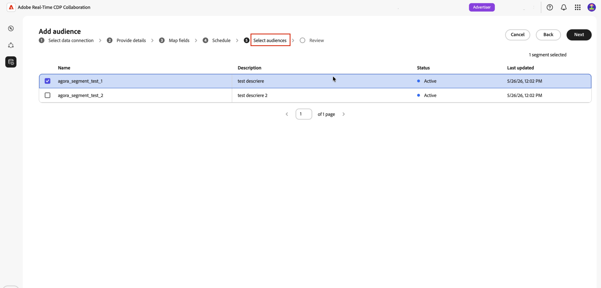
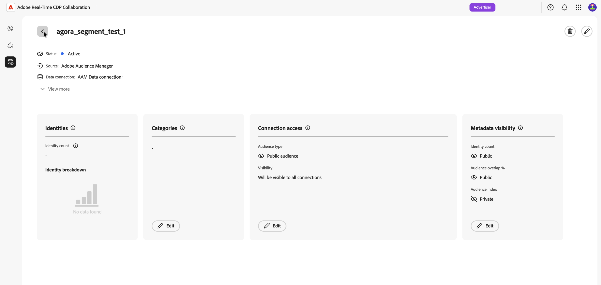

# オーディエンスソーシング用にAdobe Audience Managerを設定する

Adobe Audience Manager（AAM）インスタンスをAdobe Real-Time CDP Collaborationに接続して、適格な1st パーティセグメントをプラットフォームに調達できるようにする方法について説明します。 接続を作成すると、CollaborationはAdobe Audience Managerから定期的にオーディエンスメンバーシップを取得し、それらのオーディエンスをコラボレーションプロジェクト内で重複分析およびアクティブ化に利用できるようにします。

>[!NOTE]
>
> Audience Managerから取得したオーディエンスは、Adobe Experience Platformから取得したオーディエンスと同じガバナンスとデータ処理ルールに従います。 ファーストパーティデータソースから構築されたセグメントのみが対象となります。 サードパーティデータやAudience Marketplace ソースを含むセグメントはサポートされていません。

## 前提条件 {#prerequisites}

設定ワークフローを開始する前に、このセクションのすべての項目を完了してください。 不完全な前提条件は、設定が失敗したり、オーディエンスがソーシング後に表示されなかったりする最も一般的な理由です。 このガイドに従う前に、[&#x200B; アカウントのオンボーディングと設定](./onboard-account.md)を完了している必要があります。

### Adobe Audience Managerへのアクセスと権限 {#aam-access-and-permissions}

続ける前に、以下の項目を確認してください。

* アクティブなAdobe Audience Manager コントラクトとプロビジョニングされたAudience Manager インスタンス。
* Adobe Audience Managerのユーザーインターフェイスにアクセスし、取得するセグメントを表示する権限を持つ。
* Audience Manager インスタンスとCollaboration アカウントは、同じAdobe IMS組織でプロビジョニングされます。 組織をまたいだソーシングはサポートされていません。

### セグメントの適格性の要件 {#aam-segments-requirements}

接続を設定すると、Collaborationは次のルールに基づいてセグメントリストを自動的にフィルタリングします。

**ファーストパーティデータのみ**

自社の1st パーティデータにもとづいたセグメントのみをソーシングに利用できます。 サードパーティデータプロバイダーやAAM Audience Marketplaceの特性を含むセグメントは除外されます。

**最新性フィルター**

過去13か月以内に&#x200B;**作成または更新されたセグメントのみ**&#x200B;をソーシングできます。 古いセグメントは、接続の設定中および後続の各更新時に除外されます。

### 同意要件 {#consent-requirements}

CollaborationにソースされたすべてのAAM セグメントは、同意後にフィルタリングする必要があります。 書き出し時にプロファイルにオプトアウトマーカーが存在する場合、そのプロファイルはCollaborationに到達する前に除外されます。

>[!IMPORTANT]
>
>お客様は、Collaborationに接続する前に、Audience Manager インスタンス内で同意が正しく設定および適用されていることを確認する責任があります。 Adobeでは、データがAudience Managerを離れた後も、同意ルールは再適用されません。

## Audience Manager接続の設定 {#configure-aam-connection}

設定ワークフローは、**[!UICONTROL セットアップ]** ワークスペース内のマルチステップ ウィザードです。 各ステップを順番に進めていきます。 接続を作成する前に、最終レビュー画面の鉛筆アイコンを使用して、任意の手順に戻ることができます。

### データ接続の追加 {#add-data-connection}

**[!UICONTROL セットアップ]** ワークスペース内の&#x200B;**[!UICONTROL マイオーディエンス]** タブから、追加アイコン（）を選択します。 **[!UICONTROL Audience]**&#x200B;を選択します。

これが初めてのオーディエンスの場合は、**[!UICONTROL オーディエンスを追加]** オプションを選択することもできます。

オーディエンスを追加ワークフローが表示されます。 「**[!UICONTROL 新しいデータ接続を追加]**」を選択し、「**[!UICONTROL 次へ]**」を選択します。

{zoomable="yes"}

### Adobe Audience Managerをデータ接続として選択 {#select-aam}

データソース選択画面には、使用可能なすべての接続タイプが一覧表示されます。 **[!UICONTROL Adobe Audience Manager]**&#x200B;をデータ接続として選択し、**[!UICONTROL 次へ]**&#x200B;を選択します。

### 同意とデータ使用を確認 {#confirm-consent-data-use}

続ける前に、Collaborationに送信するオーディエンスデータに法律で必要なオプトアウトを適用していることを確認してください。 データがこの要件を満たしているかどうかわからない場合は、続行する前に、[&#x200B; ガバナンスポリシーと施行アクション &#x200B;](./onboard-audiences.md#governance-policy-and-enforcement-actions) ガイドを確認してください。 確認チェックボックスを選択し、**[!UICONTROL OK]**&#x200B;を選択して続行します。

### 接続の詳細を提供 {#provide-connection-details}

次に、このデータ接続の名前とオプションの説明を入力します。 接続を作成すると、指定した名前が「**[!UICONTROL データ接続]**」タブに表示され、今後このソースを特定するのに役立ちます。

* **[!UICONTROL データ接続名]** （必須）
* **[!UICONTROL データ接続の説明]** （オプション）

完了したら、**[!UICONTROL 次へ]**&#x200B;を選択します。

### ID マッピングの確認 {#review-identity-mapping}

**[!UICONTROL マッピング]**&#x200B;画面は読み取り専用です。 Collaborationは、AAM セグメントからサポートされるID出力を、Collaboration ID フィールドに自動的にマッピングします。 詳しくは、次の表を参照してください。

| AAM ID出力 | Collaboration ID フィールド | メモ |
| ------------------- | ---------------------------- | ----- |
| `Demdex ID` | `DEMDEX_ID` | この統合でサポートされているID出力。 Collaborationは、ソーシング中にDemdex IDをECIDに変換しません。 |
| `GAID` | `GAID` | この統合でサポートされているID出力。 |
| `IDFA` | `IDFA` | この統合でサポートされているID出力。 |

{style="table-layout:auto"}

マッピングはレビューできますが、この段階で修正することはできません。 「**[!UICONTROL 次へ]**」をクリックして続行します。

にマッピングされたソースフィールドを表示する「フィールドをマップ」ステップにオーディエンスワークフローを追加する

### データ更新のスケジュール {#schedule-data-refresh}

**[!UICONTROL スケジュール]** ビューで、CollaborationがAAM セグメントから更新されたオーディエンスメンバーシップデータを取得する更新頻度を設定し、ソーシングのアクティブな日付範囲を定義します。

**[!UICONTROL 頻度]** ドロップダウンを使用して、1日から6日の間の更新間隔を選択します。 次に、カレンダーを使用して、オーディエンスのソーシングの開始日と終了日を設定します。 終了日に達すると、ソーシングが停止し、以前にソースしたオーディエンスが期限切れになります。

>[!IMPORTANT]
>
>通常、Audience Managerのセグメントは、特性の最新性と頻度のルールにもとづいて、24～48時間ごとに更新されます。 これより短いCollaboration更新間隔を設定すると、更新された結果なしでCollaboration クレジットが使用される場合があります。 クレジットの使用状況を監視するには、[&#x200B; クレジットの使用状況を追跡](./my-activity.md)を参照してください。

完了したら、**[!UICONTROL 次へ]**&#x200B;を選択します。

### オーディエンスを選択 {#select-audiences}

1st パーティデータソース特性を使用し、過去13か月間に作成または更新された適格セグメントのリストを表示できます。

Collaborationに取り込むセグメントを選択します。 名前で検索するか、スクロールして特定のセグメントを検索できます。 完了したら、**[!UICONTROL 次へ]**&#x200B;を選択します。

>[!TIP]
>
>表示されるセグメントがリストに表示されていない場合は、過去13か月間に更新され、1st パーティデータソース特性のみを使用していることを確認します。 サードパーティまたはAudience Marketplaceの特性を持つセグメントは除外されます。

### 接続を確認して完了 {#review-and-complete}

接続を作成する前に、完全な設定の概要を確認してください。 概要画面には、次のセクションが表示されます。

* **[!UICONTROL 詳細]**：このデータ接続の名前とオプションの説明。
* **[!UICONTROL Audience selection]**：選択したAAM セグメント。
* **[!UICONTROL マッピング]**: AAM ソースフィールドからCollaboration ID フィールドへのID フィールドマッピング。
* **[!UICONTROL スケジュール]**：更新頻度とアクティブな日付範囲。

変更が必要な場合は、任意のセクションの横にある鉛筆アイコン（）を選択します。 すべてのセクションを確認するには、**[!UICONTROL 完了]**&#x200B;を選択します。

データ接続が作成され、オーディエンスのソーシングが進行中であることを示す確認ダイアログが表示されます。

## ソース別オーディエンスの確認 {#review-sourced-audiences}

ウィザードが完了すると、Collaborationは、選択したAAM セグメントからオーディエンスメンバーシップデータの取得を非同期で開始します。 **[!UICONTROL セットアップ &#x200B;] / [!UICONTROL &#x200B; マイオーディエンス]**&#x200B;に移動して、進行状況を監視します。

### オーディエンスのソーシングの進捗状況の監視 {#monitor-progress}

CollaborationがAAM セグメントデータを取得している間、**[!UICONTROL マイオーディエンス]** ワークスペースの上部にあるバナーは、ソーシングが進行中であることを示します。 各セグメントのソーシングが完了すると、個々のオーディエンスがリストに表示されます。

### ソースされたオーディエンスの詳細の表示 {#view-sourced-audience-details}

ソーシングが完了すると、AAM セグメントが「**[!UICONTROL マイオーディエンス]**」タブに表示されます。 **[!UICONTROL Source]**&#x200B;列では、それらを&#x200B;**[!UICONTROL Adobe Audience Manager]**&#x200B;と識別します。

行または「**[!UICONTROL オーディエンスを表示]**」オプションを選択して、特定のオーディエンスの詳細ビューを開きます。

詳細ビューには、次の情報が表示されます。

* **[!UICONTROL ID]**：合計ID数と使用可能な内訳の情報。
* **[!UICONTROL カテゴリ]**: オーディエンスの整理またはフィルタリングに適用したすべてのタグ。
* **[!UICONTROL 接続アクセス]**: オーディエンスがプライベート、パブリック、または特定の共同作業者と共有されているかどうか。
* **[!UICONTROL メタデータの表示]**：共同作業者に表示されるオーディエンス情報。

このビューを使用して、コラボレーションプロジェクトでオーディエンスを使用する前に、オーディエンスの設定と表示設定を確認します。 カテゴリ、接続アクセス、またはメタデータの表示を更新するには、[個々のオーディエンスの表示と管理](./onboard-audiences.md#view-individual-audiences)を参照してください。

## 既知の制限事項

Audience Manager ソースコネクタを設定して使用する場合は、次の制約に注意してください。

* **ファーストパーティデータのみ：** サードパーティデータプロバイダーまたはAdobe Audience Marketplaceの特性を含むセグメントは取得できません。 1st パーティデータソースから構築されたセグメントのみが対象となります。
* **13か月のセグメント最新性ウィンドウ：**&#x200B;設定中およびスケジュールされた各更新で選択できるのは、過去13か月以内に作成または更新されたセグメントのみです。
* **オンデマンド更新なし：**&#x200B;設定したスケジュールでオーディエンスデータが更新されます。 手動による即時の更新はサポートされていません。
* **組織ごとに1つのアクティブなAAM接続：** IMS組織ごとに1つのアクティブなAAM データ接続のみがサポートされます。
* **一致キーの制約：** データ接続で一致キーが有効になると、削除できません。 アクティブな一致キーを変更するには、接続を削除して新しい接続を作成します。

## トラブルシューティング {#troubleshooting}

初期接続を確立した後に発生する一般的な問題を解決するには、この節を参照してください。

**オーディエンスが表示されていないか、ソーシングに予想以上の時間がかかっています**

* ソーシング時間は、選択したセグメントの数と各セグメント母集団のサイズに合わせて拡大・縮小されます。
* オーディエンスが24時間以内に表示されない場合は、選択したセグメントがAudience Managerで引き続きアクティブであり、母集団の数が0以外であることを確認します。
* 接続のエラーインジケーターについては、**[!UICONTROL データ接続]** タブを確認してください。
* 問題が解決しない場合は、Adobe カスタマーサポートにお問い合わせください。お客様のデータ接続名と、表示されないセグメントの名前を入力してください。

**選択すると思われるセグメントは、セットアップ中に利用できませんでした**

次のセグメントを確認します。

* 過去13か月以内に作成または最終更新されたものです。 古いセグメントは表示されません。
* 1st パーティ特性のみを使用する： サードパーティまたはAudience Marketplaceの特性を持つセグメントは除外されます。
* 接続用に設定されたIMS組織に属します。

**最初に成功した後、データ接続に失敗したステータスが表示される**

* AAM インスタンスとCollaboration アカウントのIMS組織の関係が変更されていないことを確認します。
* 選択したセグメントがAAMにまだ存在し、削除されていないことを確認します。
* 問題が解決しない場合は、[接続を削除して新しい接続を作成するか、Adobe カスタマーサポートにお問い合わせください。](./manage-data-connection.md#delete-data-connection)

## 次の手順 {#next-steps}

これで、Audience ManagerをCollaborationのデータソースとして設定しました。 ソーシングが完了すると、オーディエンスは&#x200B;**[!UICONTROL マイオーディエンス]** ワークスペースで使用できるようになり、コラボレーションプロジェクトで使用できるようになります。 最初のソーシングプロセスの完了後にオーディエンスが表示されない場合は、このページの「[&#x200B; トラブルシューティング &#x200B;](#troubleshooting)」セクションを参照してください。

ここから、次の操作を実行できます。

* [コラボレーションプロジェクトの作成と管理](../collaborate/manage-projects.md)
* [プロジェクト内でオーディエンスを活用](../collaborate/activate.md)
* [重複を確認し、パフォーマンスを測定する](../collaborate/measure.md)
* [オーディエンス設定と可視性の管理](./onboard-audiences.md)
* [データ接続の管理](./manage-data-connection.md)

その他のオーディエンスのソーシング方法については、次を参照してください。

* [オーディエンスのソーシング用に [!DNL Amazon S3] を設定](./configure-aws-s3-audience-sourcing.md)
* [オーディエンスのソーシング用に [!DNL Google Cloud Storage] を設定](./configure-gcs-audience-sourcing.md)
* [オーディエンスのソーシング用に [!DNL Snowflake] を設定](./configure-snowflake-audience-sourcing.md)
* [Experience PlatformのSource オーディエンス](./onboard-audiences.md)
* [オーディエンスのソーシング用にCSV ファイルをアップロード](./upload-csv-audience-sourcing.md)
