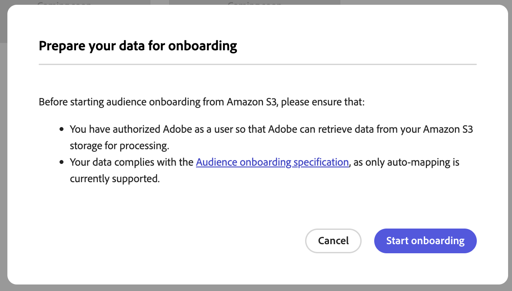
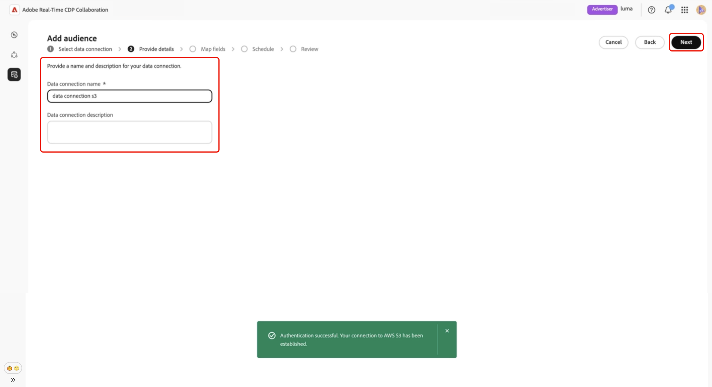
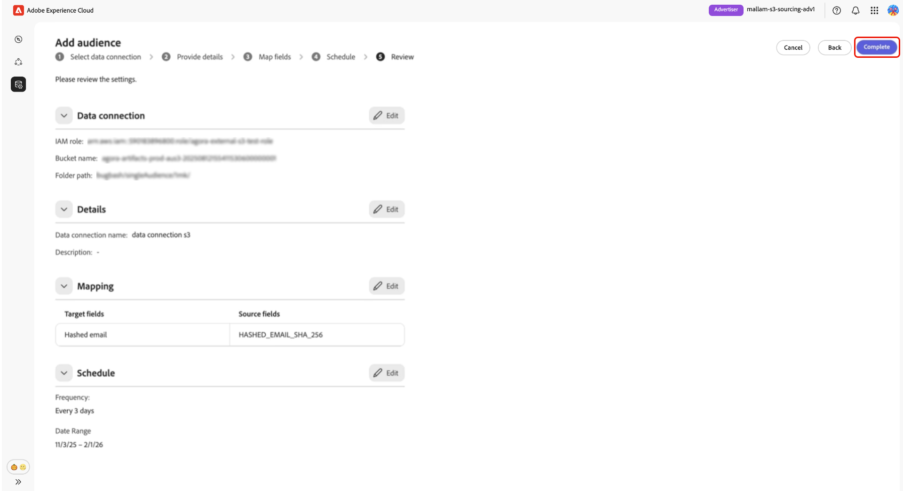

# オーディエンスのソーシング用に[!DNL Amazon S3]を設定

Adobe Real-Time CDP Collaboration UIで[!DNL Amazon S3] ストレージを設定して接続し、アクティベーションおよび重複分析のためにオーディエンスデータをソースする方法について説明します。

>[!IMPORTANT]
>
>このガイドに従う前に、AWS アカウント内でAdobeのIAM ロールを認証する手順を完了している必要があります。\
>手順ごとの設定手順については、「**[オーディエンスソーシング用にAWS権限を設定する](./configure-aws-permissions-audience-sourcing.md)**」ガイドを参照してください。

## 概要 {#overview}

このワークフローを使用して、[!DNL Amazon S3]から直接1st パーティオーディエンスを調達および管理します。 設定後、CollaborationはS3 バケットからオーディエンスを自動的にソースし、インサイトとアクティベーションに利用できるようにします。

S3を通じてソースされたオーディエンスは、Adobe Experience Platformからソースされたオーディエンスと同じガバナンスおよびデータ処理ルールに従います。

## 前提条件 {#prerequisites}

S3 データ接続を設定する前に、次の点を確認してください。

* **[オーディエンスソーシング仕様（v1.1）](../../assets/quick-start/RTCDP_Collaboration_Audience_Sourcing_Spec_v1.2.pdf)**&#x200B;に準拠するオーディエンスファイルを含むアクティブな&#x200B;**[!DNL Amazon S3]バケット**&#x200B;にアクセスできます。
* **想定ロール** メソッドを使用してバケットにアクセスする権限をAdobeに付与する&#x200B;**IAM ロール**&#x200B;がAWSに作成されました（アクセス/秘密鍵ではありません）。 詳しい手順については、**[オーディエンスのソーシングに対するAWS権限の設定](./configure-aws-permissions-audience-sourcing.md)**&#x200B;を参照してください。 IAMの役割には、次の権限を含める必要があります。

   * `ListBucket`
   * `GetBucketLocation`
   * `GetObject`

* 次の値を用意しています。

   * **IAM ロール Amazon リソース名（ARN）**
   * **S3 バケット名**
   * **フォルダーパス** （オーディエンスファイルを含むディレクトリ接頭辞）

>[!NOTE]
>
>オーディエンスファイルは、承認済みS3 バケットの&#x200B;**ルートフォルダーパス**&#x200B;に配置する必要があります。 サブフォルダー構造はサポートされていません。

## [!DNL Amazon S3]接続の設定 {#configure-aws-s3-connection}

**[!UICONTROL セットアップ]** ワークスペース内の「**[!UICONTROL 自分のオーディエンス]**」タブから、追加アイコン（を選択します。 **[!UICONTROL Audience]**&#x200B;を選択します。

初めてのオーディエンスの場合は、**[!UICONTROL 追加]** オプションを選択することもできます。

The Add audience workflow appears. Select **[!UICONTROL Add a new data connection]** and then select **[!UICONTROL Next]**.

{zoomable="yes"}

### Select [!DNL Amazon S3] as the data connection {#select-aws-s3}

Select **[!UICONTROL Amazon S3]** as a data connection, followed by **[!UICONTROL Next]**.

![The data connection selection screen with [!DNL Amazon S3] available as a selectable option.](../../assets/setup/aws-audience-sourcing/select-s3-data-connection.png)

### オーディエンスファイルの要件の確認 {#review-audience-requirements}

>[!CONTEXTUALHELP]
>id="rtcdp_collaboration_audience_sourcing_specifications"
>title="オンボーディング用にデータを準備"
>abstract="Amazon S3 for Collaboration から取り込むオーディエンスデータをフォーマットおよび構造化する方法について詳しくは、オーディエンスソーシング仕様ガイドを参照してください。"
>additional-url="https://www.adobe.com/go/rtcdp-collaboration-audience-sourcing" text="詳しくは、ガイドを参照してください。"

A dialog appears that explains how your audience files must be structured. Use the link to the **[[!UICONTROL Audience Sourcing Specification]](../../assets/quick-start/RTCDP_Collaboration_Audience_Sourcing_Spec_v1.2.pdf)** to learn how to format and structure audience data from [!DNL Amazon S3] for Collaboration to read it correctly.

>[!IMPORTANT]
>
>You must have authorized Adobe as an [!DNL Amazon S3] user so that Adobe can retrieve data from your [!DNL Amazon S3] storage for processing.

Your audience files must comply with the Audience Sourcing Specification. The match keys are automatically mapped based on the required format.

Key considerations include:

* Files must be in CSV format, using commas as delimiters and pipes (`|`) for multiple values.
* If uploading multiple files, ensure all files contain identical columns.
* Each audience record must include an `AUDIENCE_ID` and at least on match key, such as `HASHED_EMAIL_SHA_256`, `HASHED_PHONE_SHA_256`, `HASHED_IPV4_SHA_256`, `CRM_ID`, `LOYALTY_ID`, or `ADFIXUS_ID`.
* Data refreshes occur every 1–6 days based on your selection during the sourcing setup in Collaboration.

### S3 接続の認証 {#authenticate-s3-connection}

>[!CONTEXTUALHELP]
>id="rtcdp_collaboration_sources_s3_folderpath"
>title="フォルダーパス形式"
>abstract="オーディエンスファイルが格納されている [!DNL Amazon S3] バケット内のフォルダーパス（接頭辞）を入力します。 <ul><li>パスの先頭にスラッシュ（/）を使用しないでください。</li><li>パスの末尾にスラッシュを含めます。</li><ul> 有効な例：`base/path/` 無効な例：`/base/path`"

>[!CONTEXTUALHELP]
>id="rtcdp_collaboration_audience_sharing_amazon_s3"
>title="Amazon S3 のオーディエンスを追加"
>abstract="Amazon S3 ストレージを接続するには、Adobe サービスユーザーを認証して、処理用のオーディエンスデータを取得します。 Experience League で説明されている手順に従い、アドビに対して、Amazon S3 ストレージへのアクセスを許可します。"

Next, provide your [!DNL Amazon S3] credentials to connect your S3 bucket to Collaboration.

Follow the steps outlined in **[Configure AWS permissions for audience sourcing](./configure-aws-permissions-audience-sourcing.md)** to grant Adobe access to your
[!DNL Amazon S3] storage. Once complete, input your values into the following UI fields:

* IAM 役割
* S3 Bucket Name
* Folder Path

![The [!DNL Amazon S3] connection form with fields for IAM role, S3 Bucket Name, and Folder Path.](../../assets/setup/aws-audience-sourcing/s3-authentication-credentials-form.png)

### Confirm consent acknowledgment {#confirm-consent}

次に、続行する前に、同意オプトアウトが削除されたことを確認する必要があります。 確認ボックスにチェックを入れ、**[!UICONTROL OK]**&#x200B;にチェックを入れて確認します。

### 認証結果を検証 {#validate-authentication}

接続後、システムは資格情報を検証し、次のいずれかのメッセージを表示します。

| ステータス | メッセージ | 説明 |
|---| ---|---|
| **成功** | **[!UICONTROL 認証に成功しました]** | [!DNL Amazon S3]への接続が正常に確立されました。 |
| **失敗** | **[!UICONTROL 認証に失敗しました]** | 資格情報を確認して、もう一度試してください。 |
| **アクセスが拒否されました** | **[!UICONTROL アクセスが拒否されました]** | この[!DNL Amazon S3] バケットにアクセスするために必要な権限が資格情報にありません。 アクセス設定を確認するか、管理者にお問い合わせください。 |
| **無効なファイル形式** | **[!UICONTROL 無効なファイル形式]** | オーディエンスデータが予期された構造と一致しません。 ファイルがオーディエンスソーシング仕様に準拠していることを確認してください。 |
| **オーディエンスファイルが見つかりません** | **[!UICONTROL オーディエンスファイルが見つかりません]** | オーディエンスファイルが指定されたフォルダーパスに存在し、パスにアクセスできることを確認してください。 |
| **内部エラー** | **[!UICONTROL 内部エラーが発生しました]** | 再試行してください。 問題が解決しない場合は、カスタマーサポートにお問い合わせください。 |

### 接続の詳細を提供 {#provide-connection-details}

S3 データ接続のわかりやすい名前とオプションの説明を入力します。 次のUI フィールドに値を入力します。

* **[!UICONTROL データ接続名]** （必須）
* **[!UICONTROL データ接続の説明]** （オプション）

### 自動マッピングされたID フィールドの確認 {#auto-mapped-fields}

**[!UICONTROL マッピング]**&#x200B;画面は読み取り専用です。 変換を追加、削除、または適用することはできません。 Collaborationは、オーディエンスソーシング仕様に基づいて、オーディエンスファイルのソース ID フィールドをターゲットフィールドに自動的にマッピングします。

マッピングされたフィールドを視覚的に確認し、**[!UICONTROL 次へ]**&#x200B;を選択して続行します。

### スケジュール更新頻度と日付範囲 {#schedule-refresh}

**[!UICONTROL スケジュール]** ビューが表示されます。 ドロップダウンメニューを使用して、1日から6日の間の更新頻度を選択し、アクティブな日付範囲を設定します。 カレンダーアイコンを使用して、開始日と終了日を指定します。

>[!IMPORTANT]
>
>Collaboration クレジットを効果的に管理するには、更新の頻度を、基礎となるS3 データの更新頻度と一致するか、それを超えるように設定します。 サポートされる最小の更新間隔は、6日ごとに1回です。

### 接続を確認して完了 {#review-and-complete}

最後に、サマリー画面で設定を確認します。 このビューには、次のセクションの概要が含まれています。

* **[!UICONTROL データ接続]**: IAMの役割、S3 バケット名、設定したフォルダーパスが表示されます。
* **[!UICONTROL 詳細]**: データ接続の名前とオプションの説明を表示して、後で識別できるようにします。
* **[!UICONTROL マッピング]**: アップロードしたオーディエンスファイルのソースフィールド（例：`HASHED_EMAIL`）が、Collaborationで使用されるターゲットフィールド（例：ハッシュ化された電子メール）にどのようにマッピングされるかを一覧表示します。
* **[!UICONTROL スケジュール]**：接続がオーディエンスデータを更新する頻度と、ソーシング用にアクティブな日付範囲を要約します。

セクションを編集する必要がある場合は、鉛筆アイコンを選択します。 **[!UICONTROL 完了]**&#x200B;を選択して、すべてのセクションを確認します。

データ接続が正常に作成され、オーディエンスのソーシングが進行中であることを示すダイアログ確認が表示されます。

## ソース別オーディエンスの確認 {#review-sourced-audiences}

設定が完了すると、CollaborationはS3 バケットからオーディエンスのソーシングを開始します。 [!DNL Amazon S3] バケットを介してソースされたオーディエンスは、「**[!UICONTROL マイオーディエンス]**」タブに表示され、Experience Platformからソースされたオーディエンスと同じ機能と情報を持ちます。

オーディエンスのソーシングが進行中の場合は、画面の上部にバナーが表示されます。 個々のオーディエンスは、ソーシング完了後にのみ表示されます。

![ 「オーディエンス」タブには、[!DNL Amazon S3] オーディエンスのソーシングが進行中であることが表示されます。](../../assets/setup/aws-audience-sourcing/s3-audiences-sourcing-in-progress.png)

S3 オーディエンスがソースされると、利用可能なオーディエンスのリストが表形式またはカードビューで提供されます。

>[!TIP]
>
>オーディエンスのソーシング時間は、S3 データのサイズと設定した更新頻度によって異なります。 データセットが大きい場合や更新スケジュールの頻度が低い場合は、**[!UICONTROL 自分のオーディエンス]** ワークスペースに表示されるまでに時間がかかる場合があります。

グリッド表示またはテーブル表示で、行アイテムまたは&#x200B;**[!UICONTROL オーディエンスを表示]**&#x200B;を選択すると、特定のオーディエンスの概要が表示されます。 オーディエンスのステータス、ソース、データ接続名が表示され、次の詳細パネルが表示されます。

**[!UICONTROL ID]**: データが使用可能になると、合計ID数と分類が表示されます。
**[!UICONTROL カテゴリー]**: オーディエンスの整理またはフィルタリングに使用されるタグを一覧表示します。
**[!UICONTROL 接続アクセス]**: オーディエンスがプライベート、パブリック、または特定の共同作業者と共有されているかどうかを示します。
**[!UICONTROL メタデータの表示]**：共同作業者に表示されるオーディエンス情報（ID数、重複率、インデックスなど）を定義します。

このビューを使用して、コラボレーションプロジェクトでオーディエンスを使用する前に、オーディエンスの設定と表示設定を確認します。

詳しくは、「[ オーディエンスダッシュボードを表示」のドキュメント「](https://experienceleague.adobe.com/en/docs/real-time-cdp-collaboration/using/setup/onboard-audiences#view-audiences-dashboard)」を参照してください。

## S3 データ接続の表示 {#view-s3-connection}

新しく追加された[!DNL Amazon S3]接続は、**[!UICONTROL データ接続]** タブですぐに利用できます。 オーディエンスソースは、[!UICONTROL Amazon S3]と表示されます。

S3 データ接続には、他のオーディエンスデータ接続と同じ機能と詳細が含まれていますが、このビューからオーディエンスを直接追加または編集することはできません。

>[!NOTE]
>
>[!DNL Amazon S3]個のデータ接続は編集できません。 接続が作成されると、更新頻度などの設定を変更することはできません。 設定を更新するには、既存の接続を削除し、新しい接続を作成する必要があります。

![ ソーシングステータス情報を含む[!DNL Amazon S3] データ接続を示す「マイデータ接続」タブ。](../../assets/setup/aws-audience-sourcing/s3-data-connections-tab.png)

## 次の手順 {#next-steps}

これで、[!DNL Amazon S3] ストレージをデータソースとしてCollaborationに正常に設定し、接続できました。 このワークフローを完了することで、アクティベーションや重複分析のために、ファーストパーティのオーディエンスデータを安全にソーシングすることが可能になりました。

ソーシングが完了すると、オーディエンスは&#x200B;**[!UICONTROL マイオーディエンス]** ワークスペースに表示され、コラボレーションとアクティベーションの準備が整います。 管理オプションについて詳しくは、「[ オーディエンスのソースと管理」ドキュメント ](./onboard-audiences.md)を参照してください。
