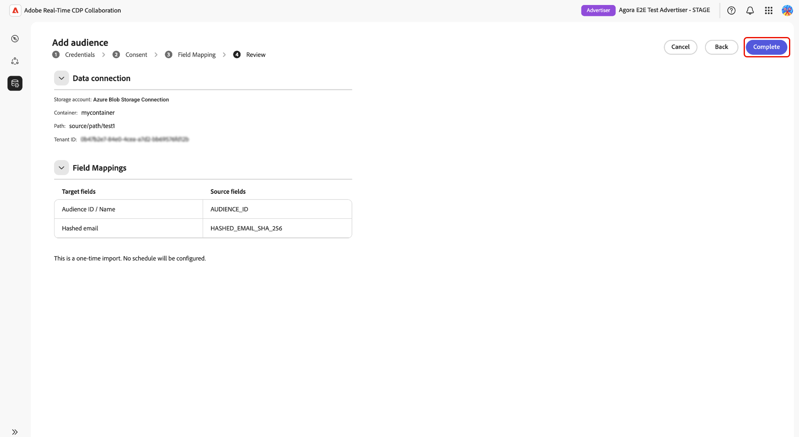

# Azure ストレージのSource オーディエンス

[!DNL Azure Blob Storage]または[!DNL Azure Data Lake Storage] （ADLS） Gen2をAdobe Real-Time CDP Collaborationに接続して、1st パーティオーディエンスデータを取得し、アクティベーションと重複分析を行います。

このガイドを使用して、再利用可能な[!DNL Azure] データ接続を作成し、設定されたストレージの場所から1回限りのインポートを実行します。 開始する前に、オーディエンスファイルが[&#x200B; オーディエンスソーシング仕様](../../assets/quick-start/RTCDP_Collaboration_Audience_Sourcing_Spec_v1_3.pdf)を満たしていることを確認してください。 設定プロセス中に、AdobeにAzure ストレージへの読み取りアクセス権を付与します。

## [!DNL Azure] ソースの種類を選択 {#choose-source-type}

Collaborationでは、2つの[!DNL Azure]取り込みオプションをサポートしています。 次の表を使用して、オーディエンスファイルの保存場所に一致するガイドパスを選択します。

| | **[!DNL Azure Blob Storage]** | **[!DNL Azure Data Lake Storage]Gen2** |
|---|---|---|
| **用途** | ファイルは、ストレージ アカウントの標準のBlob **container**&#x200B;にあります（階層名前空間は必要ありません）。 | ファイルは、**階層名前空間が有効になっているストレージアカウントの** ファイルシステム **にあります（ADLS Gen2）**。 |
| Collaborationの&#x200B;**Source オプション** | **[!DNL Azure Blob Storage]** | **[!DNL Azure Data Lake Storage]Gen2** |
| **Collaborationの必須フィールド** | ストレージアカウント、**[!UICONTROL コンテナ]**、**[!UICONTROL パス]** | ストレージアカウント、**[!UICONTROL Container]** （ADLS Gen2 ファイルシステム）、**[!UICONTROL Path]** |
| **権限セクション** | [[!DNL Azure Blob] permissions](#set-up-azure-blob-storage-permissions) | [[!DNL Azure Data Lake Storage] Gen2権限](#set-up-adls-gen2-permissions) |

データ接続ごとに&#x200B;**1つのソースタイプのみを設定できます**。 [!DNL Blob]とADLSの両方からソースを取得するには、個別のデータ接続を作成します。

## 前提条件 {#prerequisites}

このガイドに従う前に、[&#x200B; アカウントのオンボーディングと設定](./onboard-account.md)を完了してください。 次に、設定ワークフローを開始する前に、この節の前提条件を完了します。

一部の手順では、**[!DNL Azure]管理者**&#x200B;による操作が必要です。 組織の[!DNL Azure]管理者でない場合は、開始する前に適切なユーザーを特定してください。

### [!DNL Azure]のアクセスと権限 {#azure-access-and-permissions}

Collaborationで接続を設定する前に、ユーザーまたは[!DNL Azure]管理者が、オーディエンスファイルを含むストレージコンテナまたはADLS Gen2 ファイルシステムへのAdobe読み取りアクセス権を付与する必要があります。 権限の設定が完了すると、Collaboration設定ワークフローは&#x200B;**[!UICONTROL 同意]**&#x200B;手順でアクセスを検証します。

### オーディエンスデータの準備 {#prepare-audience-data}

オーディエンスファイルは、ソーシングを開始する前に、**[オーディエンスソーシング仕様（v1.2）](../../assets/quick-start/RTCDP_Collaboration_Audience_Sourcing_Spec_v1_3.pdf)**&#x200B;に準拠している必要があります。

主な要件は次の通りです。

* **ファイル形式：** CSV。1つのフィールド内の複数の値の区切り記号としてカンマを使用し、パイプ （`|`）を使用します。
* **必須フィールド：**&#x200B;すべてのレコードには、`AUDIENCE_ID`列と、サポートされている一致キー列が少なくとも1つ含まれている必要があります。
* **サポートされている一致キー：** `HASHED_EMAIL_SHA_256`、`HASHED_PHONE_SHA_256`、`HASHED_IPV4_SHA_256`、`CRM_ID`、`LOYALTY_ID`、`ADFIXUS_ID`。
* **ハッシュ化要件：**&#x200B;すべての一致キー値は、アップロード前にトリミング、小文字、およびSHA256 ハッシュ化する必要があります。 Collaborationでは、取り込み前にデータをハッシュ化または正規化しません。
* **列の一貫性：**&#x200B;設定したパス内のすべてのファイルで、同じ列構造を使用する必要があります。

オーディエンスファイルに存在するすべての照合キーも、Collaboration アカウントで有効にする必要があります。 ガイダンスについては、[照合キーの設定](https://experienceleague.adobe.com/ja/docs/real-time-cdp-collaboration/using/setup/onboard-account#set-up-match-keys)を参照してください。

>[!IMPORTANT]
>
> データ接続に対して有効になっている照合キーは、接続の作成後に削除できません。 一致キーのアクティブなセットを変更するには、接続を削除して新しい接続を作成する必要があります。 設定ワークフローを開始する前に、完全な一致キー設定を確認してください。

### 開始する前に必要な値 {#values-required}

設定ワークフローを開始する前に、次の値を準備しておきます。

| 値 | 説明 | Azure Blob Storageの例 | ADLS Gen2の例 |
| ------------------- | ------------------------ | -------------------------------------- | -------------------------------------- |
| **ストレージアカウント** | オーディエンスファイルをホストする[!DNL Azure] ストレージアカウントの名前。 | `customerdatastore` | `datalake-prod` |
| **コンテナ** | [!DNL Azure Blob Storage]の場合、オーディエンスファイルを含むストレージコンテナ。 [!DNL Azure Data Lake Storage] Gen2の場合、**[!UICONTROL Container]** フィールドにADLS Gen2 ファイルシステム名を入力します。 | `audience-ingest` | `audiences` |
| **パス** | 取り込むオーディエンスファイルを含むコンテナまたはファイルシステム内のフォルダーパス。 Collaborationは、設定されたパスの下にあるファイルのみを取り込み、ネストされたサブフォルダーからファイルを取り込みません。 | `sourcing/audiences/path1/` | `sourcing/inbound/` |
| **テナント ID** | [!DNL Azure] ストレージアカウントに関連付けられているMicrosoft Entra テナント ID。 | `00000000-0000-0000-0000-000000000000` | `00000000-0000-0000-0000-000000000000` |

## [!DNL Azure]権限の設定 {#set-up-azure-permissions}

このセクションの手順を完了して、[!DNL Azure]環境を準備します。 Adobeでは、Collaboration設定ワークフローで接続を確立する前に、ストレージコンテナへの読み取りアクセスが必要です。 この作業は[!DNL Azure] ポータルで実行され、[!DNL Azure]管理者が完了する必要がある場合があります。

このセクションを完了したら、[接続の設定 [!DNL Azure] に進みます](#configure-your-azure-connection)。

### Adobeの[!DNL Azure] サービス プリンシパル IDの取得 {#obtain-principal-identifier}

次の手順でロールの割り当て手順を完了する前に、Adobeのアカウントチームに連絡して、お住まいの地域（北米、EMEA、オーストラリア、ニュージーランド）の[!DNL Azure] サービスプリンシパル IDを取得してください。 このIDを使用して、Adobeにストレージへの読み取りアクセス権を付与します。

### [!DNL Azure Blob Storage]権限の設定 {#set-up-azure-blob-storage-permissions}

>[!IMPORTANT]
>
> ストレージ アカウントまたはコンテナに役割を割り当てる権限が必要です（例：**所有者**&#x200B;または&#x200B;**ユーザーアクセス管理者**&#x200B;または同等の権限）。

1. [[!DNL Azure]  ポータル &#x200B;](https://portal.azure.com/)で、ストレージアカウントを開き、**[!UICONTROL Containers]**&#x200B;に移動し、オーディエンスファイルを含むコンテナを選択します。
2. **[!DNL Access control (IAM)]**&#x200B;を選択してから、**[!DNL Add role assignment]**&#x200B;を選択します。
3. コンテナスコープのAdobe プリンシパルに&#x200B;**[!DNL Storage Blob Data Reader]** ロールを割り当てます。
4. 「**保存**」を選択します。

### ADLS Gen2権限の設定 {#set-up-adls-gen2-permissions}

ADLS Gen2接続の場合、Collaborationの&#x200B;**[!UICONTROL Container]** フィールドは、[!DNL Azure]のADLS Gen2 ファイルシステムに対応します。 オーディエンスファイルを含むファイルシステムを使用します。

権限を割り当てる前に、ストレージアカウントに&#x200B;**階層名前空間が有効になっており**、ファイアウォールまたはプライベートエンドポイントルールでAdobeへのアクセスが許可されていることを確認してください。

1. [[!DNL Azure]  ポータル &#x200B;](https://portal.azure.com/)で、ADLS Gen2 ファイルシステムを含むストレージ アカウントを開きます。
2. オーディエンスファイルを含むファイルシステムを開きます。
3. **[!UICONTROL アクセス制御（IAM）]**&#x200B;を選択し、**[!UICONTROL 役割の割り当てを追加]**&#x200B;を選択します。
4. ファイルシステムまたはディレクトリスコープのAdobe プリンシパルに&#x200B;**[!DNL Storage Blob Data Reader]** ロールを割り当てます。
5. 「**[!UICONTROL 保存]**」を選択します。

ソースタイプの権限の設定が完了したら、[接続の設定 [!DNL Azure] に進みます](#configure-your-azure-connection)。

## [!DNL Azure]接続の設定 {#configure-your-azure-connection}

Collaboration設定ワークフローを使用して、[!DNL Azure] ストレージの詳細を検証し、Adobe アクセスを確認し、自動マッピングされたID フィールドを確認して、データ接続を作成します。

### 新しいデータ接続を追加 {#add-new-data-connection}

**[!UICONTROL セットアップ]** > **[!UICONTROL マイ オーディエンス]**&#x200B;に移動し、追加アイコン（）を選択します。 **[!UICONTROL Audience]**&#x200B;を選択します。

{zoomable="yes"}

「**[!UICONTROL オーディエンスを追加]**」ワークフローが表示されます。 「**[!UICONTROL 新しいデータ接続を追加]**」を選択し、「**[!UICONTROL 次へ]**」を選択します。

{zoomable="yes"}

### [!DNL Azure] データソースを選択 {#select-azure-data-source}

**[!UICONTROL Azure Blob Storage]**&#x200B;または&#x200B;**[!UICONTROL Azure Data Lake Storage Gen2]**&#x200B;を選択し、**[!UICONTROL 次へ]**&#x200B;を選択します。

![&#x200B; データ接続タイプとして選択された[!DNL Azure Blob Storage]と、資格情報、同意、フィールドマッピング、レビューのオンボーディングステップを示すオーディエンスの追加ワークフロー](../../assets/setup/azure-sourcing/azure-source-selection-step.png){zoomable="yes"}。

残りの手順を続行して、Azure接続を検証し、Adobeへのアクセスを確認し、フィールドマッピングを確認して、データ接続を作成します。

### 接続資格情報を入力 {#enter-connection-credentials}

**[!UICONTROL 資格情報]**&#x200B;手順で、[!DNL Azure]のストレージの場所にアクセスするために必要な情報を入力します。

| フィールド | 説明 |
|---|---|
| **[!UICONTROL ストレージアカウント]** | オーディエンスファイルを含む[!DNL Azure] ストレージアカウント。 |
| **[!UICONTROL コンテナ]** | オーディエンスファイルを含むストレージコンテナまたはADLS Gen2 ファイルシステム。 |
| **[!UICONTROL パス]** | オーディエンスファイルが保存されるコンテナ内のフォルダーパス。 |
| **[!UICONTROL テナント ID]** | ストレージ アカウントに関連付けられている[!DNL Azure] テナント ID。 |

必要な値を入力したら、**[!UICONTROL Azureに接続]**&#x200B;を選択します。

接続が正常に確立されたことを示す確認メッセージが表示されます。 「**[!UICONTROL 次へ]**」をクリックして続行します。

![完了したストレージアカウント、コンテナ、パス、テナント ID フィールドを示す資格情報ステップで、「[!DNL Azure]に接続」という確認メッセージが表示されます。](../../assets/setup/azure-sourcing/azure-credentials-step.png){zoomable="yes"}

### Adobeに[!DNL Azure] ストレージへのアクセス権を付与する {#grant-adobe-access}

**[!UICONTROL 同意]** ステップで、Collaborationは以前に設定した[!DNL Azure]権限を検証します。

**[!UICONTROL 同意URL]**&#x200B;の横にある起動アイコンを選択して、[!DNL Azure]で認証ワークフローを開きます。 ストレージの場所に対する同意を付与する権限を持つアカウントでログインし、設定されたストレージの場所へのAdobe アクセスを付与するAzure認証プロンプトを実行します。 認証が完了したら、Collaborationに戻り、**[!UICONTROL 同意を確認]**&#x200B;を選択してAdobeのアクセス権を検証します。

>[!NOTE]
>
>[!DNL Azure]件の役割の割り当てが反映されるまでに数分かかる場合があります。 同意の検証がすぐに成功しない場合は、数分待ってから、Adobeのサービスプリンシパルに必要な役割の割り当てがあることを確認してから、再試行してください。

同意検証が成功すると、**[!UICONTROL 同意付与]**&#x200B;確認メッセージが表示されます。 「**[!UICONTROL 次へ]**」をクリックして続行します。

![同意URL、\[!DNL Azure\] アプリケーション ID、および同意承認済み確認メッセージを表示する同意手順。](../../assets/setup/azure-sourcing/azure-consent-granted-step.png){zoomable="yes"}

### フィールドマッピングの確認 {#review-field-mappings}

**[!UICONTROL フィールドマッピング]**&#x200B;手順では、CollaborationはサポートされているID フィールドをソースファイルから自動的にマッピングします。

手作業による設定は必要ありません。

>[!IMPORTANT]
>
> Collaborationは、Audience Sourcing Specificationに基づいてID フィールドを自動的にマッピングします。 表示されるマッピングが正しくない場合は、オンボーディングワークフローを完了する前にソースファイルを更新してください。

表示されたマッピングを確認し、ソースフィールドがオーディエンスファイルのID列と一致することを確認します。 「**[!UICONTROL 次へ]**」をクリックして続行します。

{zoomable="yes"}

### 接続を確認して完了 {#review-and-complete}

**[!UICONTROL レビュー]**&#x200B;手順で、ストレージアカウント、コンテナ、ソースパス、テナント ID、フィールドマッピングを確認します。

レビューページには、現在の[!DNL Azure] ワークフローが1回のソーシング実行を実行し、定期的なスケジュールを設定していないことも示されています。

設定が正しい場合は、**[!UICONTROL 完了]**&#x200B;を選択します。

{zoomable="yes"}

## 接続を確認し、ソースとなるオーディエンスを監視する {#confirm-connection-and-monitor-audiences}

**[!UICONTROL Complete]**&#x200B;を選択すると、Collaborationはデータ接続を作成し、**[!UICONTROL Setup]** > **[!UICONTROL My data connections]**&#x200B;に移動します。

### 接続が作成されたことを確認します {#confirm-connection-created}

**[!UICONTROL データ接続]**&#x200B;の接続カードは、接続が正常に作成されたことを確認します。 ソースの種類（**[!UICONTROL Azure Blob Storage]**&#x200B;または&#x200B;**[!UICONTROL Azure Data Lake Storage] Gen2**）、作成日、一致するキー、オーディエンスサイズ、現在の接続ステータスが表示されます。

![新しく作成された[!DNL Azure Blob Storage]接続カードを表示するMy data connections ビュー。接続の詳細、一致キー、オーディエンスサイズ、ステータス情報が表示されます。](../../assets/setup/azure-sourcing/azure-data-connection-card.png){zoomable="yes"}

### ソース別オーディエンスの表示 {#view-sourced-audiences}

接続が作成されると、Collaborationは、設定された[!DNL Azure]場所からオーディエンスのソーシングを自動的に開始します。 **[!UICONTROL 設定]** / **[!UICONTROL マイオーディエンス]**&#x200B;に移動して、ソーシングの進行状況を監視し、ソーシングされたオーディエンスを確認します。

ソースされたオーディエンスは、**[!UICONTROL マイ オーディエンス]** テーブルに表示されます。 オーディエンスのステータス、ID数、ソース、データ接続、最終更新日を使用して、想定されるオーディエンスが[!DNL Azure]接続からソースされていることを確認します。

>[!TIP]
>
>調達時間は、データ量によって異なります。 24時間後にオーディエンスが表示されない場合は、[&#x200B; トラブルシューティング &#x200B;](#troubleshooting)を参照してください。

## 既知の制限事項 {#known-limitations}

Azure データ接続を作成または管理する前に、次の制限事項を確認してください。

* **一致キーの制約：**&#x200B;一致キーを既存の接続から削除できません。 アクティブな一致キーを変更するには、接続を削除して新しい接続を作成します。
* **ソースタイプ [!DNL Azure]ごとに1つのアクティブな接続：** アカウントごとに1つのアクティブなBlob接続と1つのアクティブなADLS Gen2接続を持つことができます。 ストレージの場所を変更するには、既存の接続を削除し、新しい接続を作成します。
* **サブフォルダーのサポート：** Collaborationは、設定されたパスの直下にあるファイルのみを取り込みます。 ネストされたサブフォルダーからファイルを取り込むことはありません。
* **個別のソースタイプ：** BlobとADLS Gen2は個別の接続です。1回のウィザード実行でそれらの間に構成を混在させないでください。

## トラブルシューティング {#troubleshooting}

### オーディエンスが表示されない、またはソーシングが遅い {#audiences-not-appearing}

接続を作成した後にソースされたオーディエンスが表示されない場合は、次の操作を実行します。

* オーディエンスファイルが設定されたパスの直下に存在し、オーディエンスソーシング仕様に準拠していることを確認します。
* エラーについては、**[!UICONTROL データ接続]**&#x200B;を確認してください。
* 24時間後も問題が発生する場合は、接続名、ストレージアカウント、コンテナの詳細を記載したAdobe サポートにお問い合わせください。

### オーディエンスソース。ただし、ゼロまたは予期しないIDが表示される {#zero-identities}

オーディエンスがソーシング後に表示されますが、ID数がゼロまたは予想よりも少ない場合は、次のアクションを実行します。

* オーディエンスファイル内のすべての一致するキー値が、アップロード前にトリミング、小文字、SHA256 ハッシュ化されていることを確認します。 Collaborationは、取り込み時にデータをハッシュ化または正規化しません。
* ファイルに存在する照合キーが、Collaboration アカウントに対して有効になっていることを確認します。 [照合キーの設定](https://experienceleague.adobe.com/ja/docs/real-time-cdp-collaboration/using/setup/onboard-account#set-up-match-keys)を参照してください。

### 初回成功後に接続に失敗しました {#connection-failed}

これらのチェックは、接続が正常に作成されたが、後で失敗した状態になった場合に使用します。

* Adobe プリンシパルの[!DNL Azure] RBAC ロールの割り当てが削除または縮小されていないことを確認します。
* パスにまだファイルが存在し、仕様に一致することを確認します。

### インポートまたはフォーマットエラー {#format-errors}

ファイル構造、ハッシュ、または列形式の問題が原因でソーシングが失敗した場合は、これらのチェックを使用します。

* すべてのファイルが、最初の取り込みと同じ列構造とハッシュルールを保持していることを確認します。

## 次の手順 {#next-steps}

ソーシング完了後、オーディエンスは&#x200B;**[!UICONTROL マイオーディエンス]**&#x200B;で、アクティベーション、重複分析、測定ワークフローに使用できます。 共同作業者と共にソースされたオーディエンスをアクティブ化するには、[&#x200B; オーディエンスのアクティブ化](../collaborate/activate.md)を参照してください。

その他の使用可能なソーシング方法には、Experience Platform、[!DNL Amazon S3]、[!DNL Google Cloud Storage]、[!DNL Snowflake]、およびCSV ファイルのアップロードがあります。 その他のオーディエンスのソーシング方法については、次を参照してください。

* [オーディエンスソーシング用のGoogle Cloud Storageの設定](./configure-gcs-audience-sourcing.md)
* [オーディエンスソーシング用にSnowflakeを設定する](./configure-snowflake-audience-sourcing.md)
* [オーディエンスソーシング用にAWS S3を設定する](./configure-aws-s3-audience-sourcing.md)
* [Experience PlatformのSource オーディエンス](./onboard-audiences.md)
* [オーディエンスのソーシング用にCSV ファイルをアップロード](./upload-csv-audience-sourcing.md)
