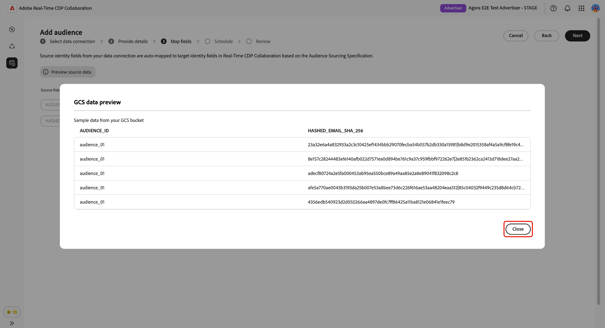
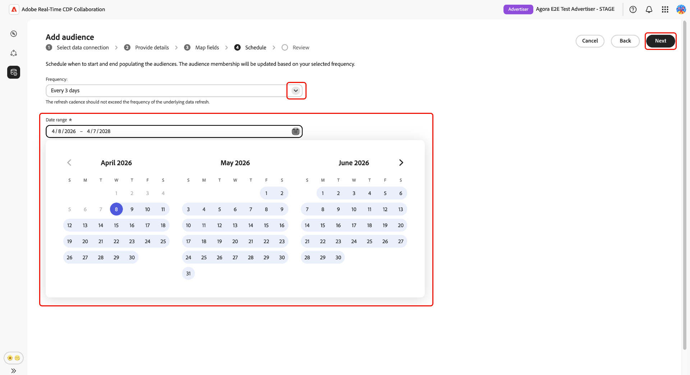

# オーディエンスソーシング用に[!DNL Google Cloud Storage]を設定

このガイドの手順に従って、[!DNL Google Cloud Storage] （GCS）バケットをAdobe Real-Time CDP Collaborationに接続し、UIを通じてファーストパーティオーディエンスデータのソーシングを開始します。

GCS バケットをCollaborationに接続すると、エンジニアリングのサポートなしでファーストパーティのオーディエンスデータを直接取り込むことができます。 接続が完了すると、Adobe Collaborationはバケットから定期的にオーディエンスを調達し、コラボレーションプロジェクト内でアクティベーションや重複分析のために利用できるようになります。 オーディエンスをアクティベートしたり、共同作業者との重複分析で使用したりするには、オーディエンスを分類する必要があります。

このガイドでは、前提条件の準備、GCS バケットの認証、自動マッピングされたID フィールドの確認、データ更新のスケジュール設定、ソーシングが正常に完了したことの確認など、エンドツーエンドの設定ワークフローについて説明します。

[!DNL Google Cloud Storage]から取得したオーディエンスは、Adobe Experience Platformから取得したオーディエンスと同じガバナンスとデータ処理ルールに従います。

その他の使用可能なソーシング方法には、[Experience Platform](./onboard-audiences.md)、[Amazon S3](./configure-aws-s3-audience-sourcing.md)、[Snowflake](./configure-snowflake-audience-sourcing.md)、および[CSV ファイルのアップロード &#x200B;](./upload-csv-audience-sourcing.md)があります。

## 前提条件 {#prerequisites}

設定ワークフローを開始する前に、このセクションのすべての項目を完了してください。 不完全な前提条件は、設定が失敗したり、オーディエンスがソーシング後に表示されなかったりする最も一般的な理由です。 このガイドに従う前に、[&#x200B; アカウントのオンボーディングと設定](./onboard-account.md)を完了している必要があります。

このセクションの一部の手順では、[!DNL Google Cloud]管理者による操作が必要です。 組織の[!DNL Google Cloud]管理者でない場合は、開始する前に適切なユーザーを特定してください。

### GCSのアクセスと権限 {#gcs-access-permissions}

続行する前に、次の点を[!DNL Google Cloud]管理者に確認してください。

* Adobeには、GCS バケットに対する認証とオーディエンスファイルの読み取りに必要な権限が付与されています。 詳細な手順については、[権限の設定の節](#setup-gcs-permissions)を参照してください。
* [!DNL Google Cloud Storage] オーディエンスのソーシングは、お住まいの地域で利用できます。 ご利用いただけるかどうかは、地域（NA、EMEA、ANZ）によって異なります。 お住まいの地域でGCSのソーシングがまだ利用できない場合は、Adobeのアカウント担当者にお問い合わせください。

### オーディエンスデータの準備 {#prepare-audience-data}

オーディエンスファイルは、ソーシングを開始する前に、**[オーディエンスソーシング仕様（v1.2）](../../assets/quick-start/RTCDP_Collaboration_Audience_Sourcing_Spec_v1.2.pdf)**&#x200B;に準拠している必要があります。 完全なスキーマ定義とフィールドレベルの例については、仕様を確認してください。 主な要件は次の通りです。

* **ファイル形式：** CSV。1つのフィールド内の複数の値の区切り記号としてカンマを使用し、パイプ （`|`）を使用します。
* **必須フィールド：**&#x200B;すべてのレコードには、`AUDIENCE_ID`列と、サポートされている一致キー列が少なくとも1つ含まれている必要があります。
* **サポートされている一致キー：** `HASHED_EMAIL_SHA_256`、`HASHED_PHONE_SHA_256`、`HASHED_IPV4_SHA_256`、`CRM_ID`、`LOYALTY_ID`、`ADFIXUS_ID`。
* **ハッシュ化要件：**&#x200B;すべての一致キー値は、アップロード前にトリミング、小文字、およびSHA256 ハッシュ化する必要があります。 Collaborationでは、取り込み前にデータをハッシュ化または正規化しません。
* **列の一貫性：** バケットに複数のオーディエンスファイルが含まれている場合、すべてのファイルで同じ列構造を使用する必要があります。

オーディエンスファイルに存在するすべての照合キーも、Collaboration アカウントで有効にする必要があります。 一致キーを追加または有効にするには、[一致キーの設定](./onboard-account.md#set-up-match-keys)を参照してください。

### 開始する前に必要な値 {#required-values}

設定ウィザードを開始する前に、次の値を準備しておく必要があります。

| 値 | 説明 |
| --- | --- |
| **[!UICONTROL バケット]** | オーディエンスファイルを含む[!DNL Google Cloud Storage] バケットの名前。 |
| **[!UICONTROL パス]** | オーディエンスファイルが保存されているバケット内のパス接頭辞（例：`sourcing/testdata/path1/`）。 |

## [!DNL Google Cloud Storage]接続の設定 {#configure-gcs-connection}

設定ワークフローは、**[!UICONTROL セットアップ]** ワークスペース内のマルチステップ ウィザードです。 各ステップを順番に進めていきます。 接続を作成する前に、最終レビュー画面の鉛筆アイコンを使用して、任意の手順に戻ることができます。

### 新しいデータ接続を追加 {#add-data-connection}

**[!UICONTROL セットアップ]** ワークスペース内の&#x200B;**[!UICONTROL マイオーディエンス]** タブから、追加アイコン（）を選択します。 **[!UICONTROL Audience]**&#x200B;を選択します。

これが初めてのオーディエンスの場合は、**[!UICONTROL 追加]** オプションを選択することもできます。

オーディエンスを追加ワークフローが表示されます。 「**[!UICONTROL 新しいデータ接続を追加]**」を選択し、「**[!UICONTROL 次へ]**」を選択します。

{zoomable="yes"}

### データソースとして[!DNL Google Cloud Storage]を選択 {#select-gcs}

>[!CONTEXTUALHELP]
>id="rtcdp_collaboration_audience_sourcing_specifications_gcs"
>title="オンボーディング用にデータを準備"
>abstract="Google Cloud Storage for Collaborationからオーディエンスデータをフォーマットおよび構造化する方法については、オーディエンスソーシングの仕様ガイドを参照してください。"
>additional-url="https://www.adobe.com/go/rtcdp-collaboration-audience-sourcing" text="オーディエンスソーシングの仕様ガイドを参照してください"

データソース選択画面には、使用可能なすべての接続タイプが一覧表示されます。 「**[!UICONTROL Google Cloud Storage]**」を選択し、「**[!UICONTROL 次へ]**」を選択します。

必要な設定手順（GCS バケットの設定やIAM ロールの割り当てなど）の概要を示す前提条件ダイアログが表示され、データが&#x200B;**[[!UICONTROL オーディエンスソーシング仕様]](../../assets/quick-start/RTCDP_Collaboration_Audience_Sourcing_Spec_v1.2.pdf)**&#x200B;に準拠している必要があることに注意します。 「**[!UICONTROL オンボーディングを開始]**」を選択して、続行する前にコンプライアンスを確認します。

### [!DNL Google Cloud Storage]接続の詳細を入力 {#authenticate-gcs-connection}

>[!CONTEXTUALHELP]
>id="rtcdp_collaboration_audience_sourcing_gcs"
>title="Google Cloud Storageからオーディエンスを追加する"
>abstract="Google Cloud Storageを接続するには、Adobeのサービスユーザーに対して、処理のためにオーディエンスデータを取得することを許可してください。 Experience Leagueで説明されている手順に従って、AdobeにGoogle クラウドストレージへのアクセス権を付与します。"

Collaborationによる[!DNL Google Cloud Storage] バケットへのアクセスを許可するために必要な詳細を入力してください。 必要な情報を入力したら、**[!UICONTROL 次へ]**&#x200B;を選択します。

| フィールド | 説明 |
| --- | --- |
| **[!UICONTROL バケット]** | [!DNL Google Cloud Storage] バケットの名前。 開始する前に必要な[値](#required-values)を参照してください。 |
| **[!UICONTROL パス]** | オーディエンスファイルが保存されるバケット内のパス接頭辞。 |

### 同意とデータ使用の確認 {#confirm-consent}

Collaborationで処理する前に、オーディエンスデータから同意オプトアウトが削除されていることを確認する必要があります。 データがこの要件を満たしているかどうかわからない場合は、続行する前に、[&#x200B; ガバナンスポリシーと施行アクション &#x200B;](./onboard-audiences.md#governance-policy-and-enforcement-actions) ガイドを確認してください。 確認チェックボックスを選択し、**[!UICONTROL OK]**&#x200B;を選択して続行します。

### 接続の詳細を提供 {#provide-connection-details}

このデータ接続の名前とオプションの説明を入力します。 指定した名前は、**[!UICONTROL My data connections]** タブに表示され、複数のデータ接続を管理する場合にこのソースを区別するのに役立ちます。

* **[!UICONTROL データ接続名]** （必須）
* **[!UICONTROL データ接続の説明]** （オプション）。

「**[!UICONTROL 次へ]**」をクリックして続行します。

### 自動マッピングされたID フィールドの確認 {#auto-mapped-fields}

**[!UICONTROL マッピング]**&#x200B;画面は読み取り専用です。 Collaborationは、オーディエンスソーシング仕様で定義された列名に基づいて、オーディエンスファイルのソース ID フィールドをターゲットフィールドに自動的にマッピングします。 この段階では、マッピングされたフィールドに変換を追加、削除、または適用することはできません。

>[!TIP]
>
>「**[!UICONTROL ソースデータをプレビュー]**」を選択してオーディエンスデータのサンプルを表形式で確認し、「**[!UICONTROL 閉じる]**」を選択してマッピング画面に戻ります。

{zoomable="yes"}

表示されるマッピングが、オーディエンスファイルのフィールドを反映していることを確認します。 そうでない場合は、続行する前にファイルを停止して修正し、[&#x200B; オーディエンスソーシング仕様](../../assets/quick-start/RTCDP_Collaboration_Audience_Sourcing_Spec_v1.2.pdf)に準拠させます。 「**[!UICONTROL 次へ]**」をクリックして続行します。

### データ更新のスケジュール {#schedule-data-refresh}

**[!UICONTROL スケジュール]** ビューで、Collaborationが更新されたオーディエンスデータをGCS バケットから取得する頻度を設定し、ソーシングのアクティブな日付範囲を定義します。

**[!UICONTROL 頻度]** ドロップダウンを使用して、CollaborationがGCS バケットから更新されたオーディエンスデータを取得する頻度を選択します。 利用できる間隔の範囲は、**[!UICONTROL 日単位]**&#x200B;から&#x200B;**[!UICONTROL 6日単位]**&#x200B;です。

入力フィールドに日付範囲を入力するか、カレンダーアイコンを選択して、アクティブなソーシング期間の&#x200B;**[!UICONTROL 開始日]**&#x200B;と&#x200B;**[!UICONTROL 終了日]**&#x200B;を設定します。 終了日に達すると、ソーシングが停止され、以前にソースしたオーディエンスは期限切れになり、コラボレーションプロジェクトで使用できなくなります。

>[!IMPORTANT]
>
>更新の頻度は、基になるGCS オーディエンスデータが更新される頻度と一致するか、それを超えないように設定します。 サポートされる最小の更新間隔は、6日ごとに1回です。 データの変更よりも頻繁に更新すると、更新された結果を生成せずにCollaboration クレジットが使用されます。 クレジットの使用状況を監視するには、[&#x200B; クレジットの使用状況を追跡](./my-activity.md)を参照してください。

「**[!UICONTROL 次へ]**」をクリックして続行します。

### 接続を確認して完了 {#review-and-complete}

接続を作成する前に、設定の概要を確認します。 概要画面には、次のセクションが表示されます。

* **[!UICONTROL データ接続]**：設定したGCS バケットの資格情報とフォルダーパス。
* **[!UICONTROL 詳細]**：このデータ接続の名前とオプションの説明。
* **[!UICONTROL マッピング]**：自動マッピングされたソースおよびターゲット ID フィールド。
* **[!UICONTROL スケジュール]**：更新頻度とアクティブな日付範囲。

鉛筆アイコン（）を選択します。 セクションの横に移動して、そのステップに戻って変更を加えます。 すべてのセクションが正しい場合は、**[!UICONTROL 完了]**&#x200B;を選択します。

確認ダイアログが表示され、Collaborationがデータ接続を作成し、オーディエンスのソーシングが進行中であることを示します。

## ソース別オーディエンスの確認 {#review-sourced-audiences}

コンフィギュレーションウィザードが完了すると、CollaborationはGCS バケットからオーディエンスのソーシングを非同期で開始します。 **[!UICONTROL セットアップ]** / **[!UICONTROL マイオーディエンス]**&#x200B;に移動して、進行状況を監視します。 ソーシングはすぐに完了するわけではありません。必要な時間は、データのサイズと設定された更新頻度によって異なります。

### オーディエンスのソーシングの進捗状況の監視 {#monitor-sourcing-progress}

Collaborationがオーディエンスデータを取得している間、**[!UICONTROL My audiences]** ワークスペースの上部にあるバナーは、ソーシングが進行中であることを示します。 個々のオーディエンスは、各オーディエンスのソーシング完了後にのみリストに表示されます。

。

>[!TIP]
>
>オーディエンスのソーシング時間は、GCS データのサイズと設定した更新頻度によって異なります。 データセットが大きい場合や更新スケジュールの頻度が低い場合は、**[!UICONTROL 自分のオーディエンス]** ワークスペースに表示されるまでに時間がかかる場合があります。

### ソースされたオーディエンスの詳細の表示 {#view-audience-details}

ソーシングが完了すると、[!DNL Google Cloud Storage]個のオーディエンスが、他の接続からソーシングされたオーディエンスと共に&#x200B;**[!UICONTROL 個のマイオーディエンス]** タブに表示されます。 特定のオーディエンスの詳細ビューを開くには、行項目を選択するか、**[!UICONTROL オーディエンスを表示]**&#x200B;します。

詳細ビューには、オーディエンスのステータス、ソースおよびデータ接続名が、次のパネルとともに表示されます。

* **[!UICONTROL ID]**: データが利用可能になると、オーディエンスのID数と内訳の合計が表示されます。
* **[!UICONTROL カテゴリ]**: オーディエンスの整理またはフィルタリングに適用されたタグ。
* **[!UICONTROL 接続アクセス]**: オーディエンスがプライベート、パブリック、または特定の共同作業者と共有されているかどうか。
* **[!UICONTROL メタデータの可視化]**：どのオーディエンス情報（ID数、重複率、インデックスなど）が共同作業者に表示されるか。

コラボレーションプロジェクトでオーディエンスを使用する前に、これらの設定を確認してください。 カテゴリ、接続アクセス、またはメタデータの表示を更新するには、[個々のオーディエンスの表示と管理](./onboard-audiences.md#view-individual-audiences)を参照してください。

### オーディエンス設定の編集 {#edit-audience-settings}

詳細ビューを開かずに、**[!UICONTROL 自分のオーディエンス]**&#x200B;のリストビューからオーディエンスメタデータを直接編集できます。 オーディエンスのチェックボックスを選択してアクションツールバーを表示し、アクションを選択します。**[!UICONTROL メタデータ表示を編集]**、**[!UICONTROL 接続アクセスを編集]**、**[!UICONTROL 名前と説明を編集]**、**[!UICONTROL カテゴリを編集]**、または&#x200B;**[!UICONTROL 削除]**。

### GCS データ接続の表示 {#view-gcs-connection}

一致キーとスケジュールを含む接続自体を確認または管理するには、**[!UICONTROL 設定]** > **[!UICONTROL データ接続]**&#x200B;に移動します。 新しいGCS接続がすぐに利用できます。 オーディエンスソースは&#x200B;**[!UICONTROL Google Cloud Storage]**&#x200B;として表示されます。

## 既知の制限事項 {#known-limitations}

[!DNL Google Cloud Storage] オーディエンスソーシングを設定して使用する場合は、次の制約に注意してください。

* **一致キーの制約：** データ接続で一致キーが有効になると、削除できません。 既存の接続に一致するキーを追加することはできますが、無効にしたり削除したりすることはできません。 アクティブな一致キーを変更するには、[&#x200B; データ接続](./manage-data-connection.md#delete-data-connection)を削除して新しい接続を作成する必要があります。
* **ソースごとに1つのアクティブなデータ接続：** アクティブな[!DNL Google Cloud Storage] データ接続は一度に1つしかサポートされていません。 別のバケットからオーディエンスを調達する必要がある場合は、[既存の接続](./manage-data-connection.md#delete-data-connection)を削除し、新しいバケットを指す新しい接続を作成します。
* **サブフォルダーのサポート：** オーディエンスファイルは、指定されたフォルダーパス内に直接配置する必要があります。 Collaborationは、そのパス内のサブフォルダーをトラバースしません。

## トラブルシューティング {#troubleshooting}

このセクションでは、最初の接続を確立した後に発生する問題を解決する場合に使用します。 認証中に発生するエラーについては、資格情報とバケット権限を確認するか、管理者にお問い合わせください。

**オーディエンスが表示されていないか、ソーシングに予想以上の時間がかかっています**

* ソーシング時間は、データ量と設定された更新頻度に応じて拡大・縮小されます。 大規模なデータセットでは、処理時間の延長が期待されます。
* オーディエンスが24時間以内に表示されない場合は、オーディエンスファイルが設定中に指定したフォルダーパスに存在することを確認し、オーディエンスソーシング仕様に準拠してください。
* 接続のエラーインジケーターについては、**[!UICONTROL データ接続]** タブを確認してください。
* これらの手順を実行しても問題が解決しない場合は、Adobe カスタマーサポートに連絡し、データ接続名とバケットの詳細を提供してください。

**最初に成功した後、データ接続に失敗したステータスが表示される**

* 接続を作成してから、GCS バケットの権限と資格情報が変更されていないことを確認します。 Adobeのバケットへのアクセス権を削除すると、その後のソーシング実行が失敗します。
* オーディエンスファイルが設定済みのフォルダーパスにまだ存在し、オーディエンスソーシング仕様に準拠していることを確認します。
* 権限とファイルの可用性を確認した後も問題が解決しない場合は、[接続を削除して新しい接続を作成するか、Adobe カスタマーサポートにお問い合わせください。](./manage-data-connection.md#delete-data-connection)

スケジュールされた更新中に&#x200B;**オーディエンスファイル形式エラーが発生する**

* バケット内の更新されたファイルが、[&#x200B; オーディエンスソーシング仕様](../../assets/quick-start/RTCDP_Collaboration_Audience_Sourcing_Spec_v1.2.pdf)の列構造とフィールド要件に準拠していることを確認します。
* 設定されたフォルダーパス内のすべてのファイルで、同じ列構造が使用されていることを確認します。 同じパス内の混在フォーマットのファイルは、部分的なソーシング失敗を引き起こす可能性があります。

## [!DNL Google Cloud Storage]権限の設定 {#setup-gcs-permissions}

[!DNL Google Cloud Storage]は、クラウド内のデータを安全かつスケーラブルな方法で保存し、アクセスできるようにします。 AdobeがGCS バケットから読み取れるようにするには、[!DNL Google Cloud] アカウントで適切なIdentity and Access Management （IAM）権限とサービスアカウントへのアクセス権を設定する必要があります。

### Adobeの[!DNL Google Service Account]情報を収集 {#collect-account-information}

開始するには、お住まいの地域に一致するAdobeの[!DNL Google Service Account]に注意してください。 後の手順でAdobeへのアクセス権を付与するには、この情報が必要です。

| 領域 | [!DNL Google Service Account] |
| ------------- | --------------- |
| 北米 | `kk9930000@va3-22da.iam.gserviceaccount.com` |
| EMEA | `kze830000@sfc-eufrankfurt-1-g4a.iam.gserviceaccount.com` |
| オーストラリア | `knhv20000@sfc-au-1-nla.iam.gserviceaccount.com` |

{style="table-layout:auto"}

### IAMの役割を設定 {#setup-iam-role}

>[!IMPORTANT]
>
>この設定を完了するには、[!DNL Google Cloud] アカウントの&#x200B;**アカウント管理者**&#x200B;権限が必要です。 これらの権限がない場合は、続行する前に管理者に連絡してください。

必要な権限を持つカスタム IAM ロールを作成し、Adobe サービスアカウントに割り当てるには、次の手順に従います。 これにより、AdobeがGCS オーディエンスデータに安全にアクセスできるようになります。

#### IAM ロールの作成 {#create-iam-role}

まず、Adobeに割り当てるために必要な権限を持つカスタム IAM ロールを[!DNL Google Cloud] プロジェクトに作成します。

[[!DNL Google Cloud]  コンソール &#x200B;](https://console.cloud.google.com)の&#x200B;**[!DNL IAM & Admin]** ページで、**[!DNL Roles]**&#x200B;に移動し、**[!DNL Create role]**&#x200B;を選択します。 新しい役割のタイトルやIDなど、必要な情報を入力します。

次に、役割に次の権限を追加します。

| 権限 | 目的 |
| ------------- | --------------- |
| `storage.buckets.get` | バケットのメタデータの読み取り： |
| `storage.objects.get` | オブジェクトデータとメタデータの読み取り： |
| `storage.objects.list` | バケット内のオブジェクトのリストを表示します。 |

{style="table-layout:auto"}

権限について詳しくは、[GCS IAM権限](https://cloud.google.com/storage/docs/access-control/iam-permissions)を参照してください。 詳細な手順については、[&#x200B; カスタムロールの作成方法](https://docs.cloud.google.com/iam/docs/creating-custom-roles)を参照してください。

#### AdobeへのIAM ロールの割り当て {#assign-role}

次に、[!DNL Google Cloud Console]で&#x200B;[**[!DNL Buckets]**&#x200B;ページ &#x200B;](https://console.cloud.google.com/storage/browser)を開き、オーディエンスデータを含むバケットを選択します。

「**[!DNL Permissions]**」タブに移動し、**[!DNL View by principals]**&#x200B;を選択してから「**[!DNL Grant access]**」を選択します。

**[!DNL Add principals]** ダイアログで、[Adobe Google Service Account](#collect-account-information)をプリンシパルとして追加し、以前に作成したカスタム IAM ロールを割り当てます。 **[!DNL Save]**&#x200B;を選択して、設定を確認します。

Adobeは、選択したGCS バケット内のオーディエンスデータに安全にアクセスできるようになりました。 必要に応じて追加の[前提条件](#prerequisites)を確認するか、[GCSからCollaborationへのオーディエンスのソーシングを開始](#configure-gcs-connection)します。

#### [!DNL Google Cloud Storage]件の詳細を収集 {#collect-gcs-details}

最後に、次の表に示すように、GCS バケットの詳細を収集します。 GCSとCollaboration間の接続を設定するには、この情報が必要です。

| フィールド | 説明 | 例 |
|------ |------------ |-------- |
| [!DNL Bucket] | オーディエンスファイルを含む[!DNL Google Cloud Storage] バケットの正確な名前。 | `customer-data-bucket` |
| [!DNL Path] | オーディエンスファイルが保存されるバケット内のパス接頭辞。 すべてのファイルを読み取るには`/`で終わる必要があります。 | `sourcing/testdata/path1/` |

{style="table-layout:auto"}

## 次の手順 {#next-steps}

[!DNL Google Cloud Storage]をCollaborationのデータソースとして設定しました。 ソーシングが完了すると、オーディエンスは&#x200B;**[!UICONTROL マイオーディエンス]** ワークスペースで使用できるようになり、コラボレーションプロジェクトで使用できるようになります。

ここから、次の操作を実行できます。

* [コラボレーションプロジェクトの作成と管理](../collaborate/manage-projects.md)
* [プロジェクト内でオーディエンスを活用](../collaborate/activate.md)
* [重複を確認し、パフォーマンスを測定する](../collaborate/measure.md)
* [オーディエンス設定と可視性の管理](./onboard-audiences.md#view-individual-audiences)
* [このデータ接続の一致キーとスケジュールを管理します](./manage-data-connection.md)

その他のオーディエンスのソーシング方法については、次を参照してください。

* [オーディエンスのソーシング用に [!DNL Amazon S3] を設定](./configure-aws-s3-audience-sourcing.md)
* [オーディエンスのソーシング用に [!DNL Snowflake] を設定](./configure-snowflake-audience-sourcing.md)
* [Experience PlatformのSource オーディエンス](./onboard-audiences.md)
* [オーディエンスのソーシング用にCSV ファイルをアップロード](./upload-csv-audience-sourcing.md)
