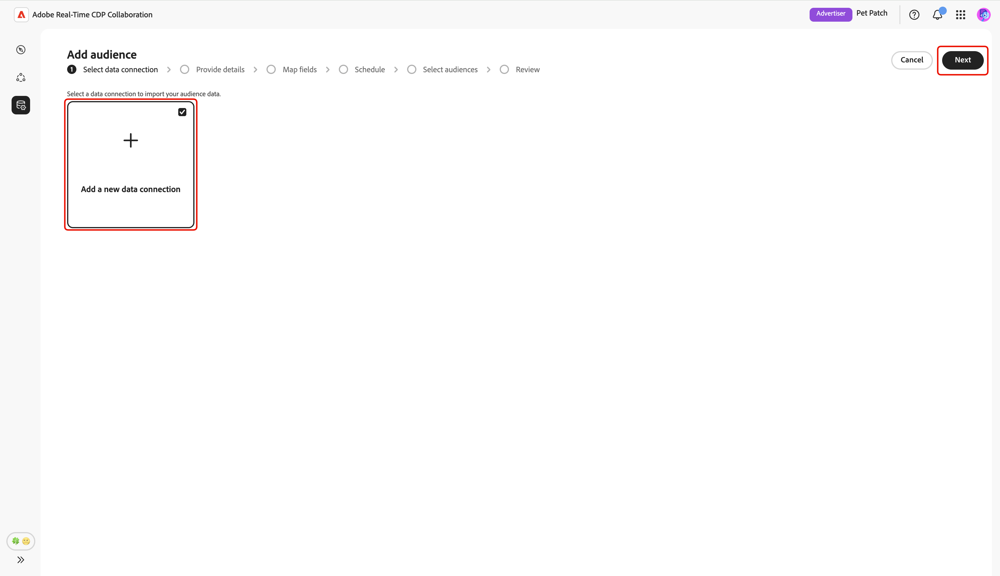
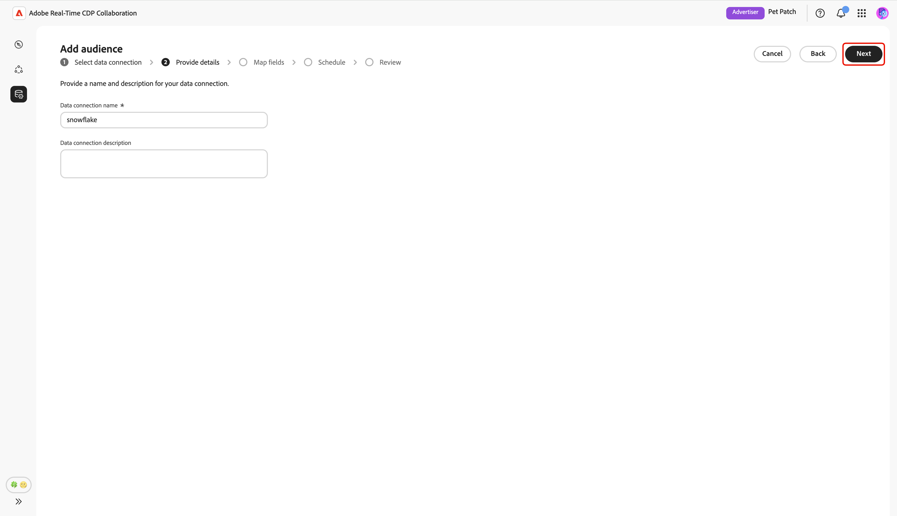
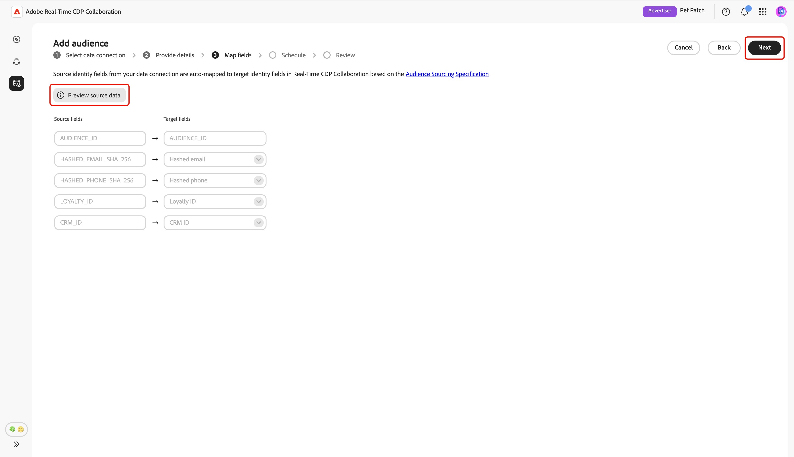
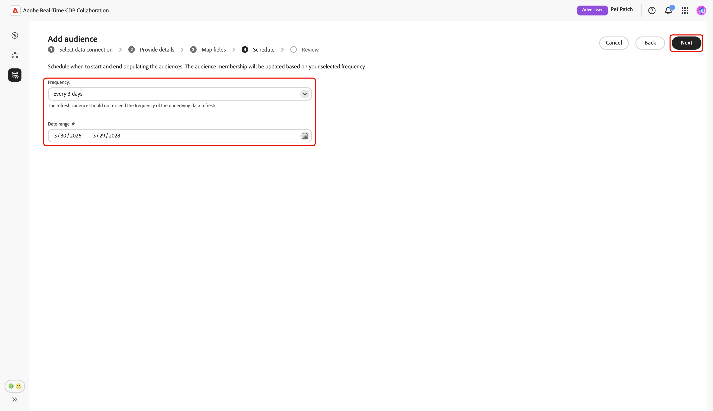

# オーディエンスソーシング用に[!DNL Snowflake]を設定

Adobe Real-Time CDP Collaboration UIで[!DNL Snowflake Secure Data Share]を設定してソースオーディエンスデータに接続し、アクティベーションと重複分析を行う方法について説明します。

## 概要 {#overview}

[!DNL Snowflake]は、1st パーティオーディエンスデータをCollaborationにソーシングするためにサポートされているオプションの1つです。 その他の使用可能な方法には、[Experience Platform](./onboard-audiences.md)からのオーディエンスのソーシング、[[!DNL AWS S3]  バケット ](./configure-aws-s3-audience-sourcing.md)の接続、または[CSV ファイル ](./upload-csv-audience-sourcing.md)のアップロードがあります。

次の手順に従って[!DNL Snowflake Secure Data Share]を接続し、オーディエンスデータをCollaborationにソースします。 設定が完了したら、コラボレーションプロジェクト用にソースされたオーディエンスをレビュー、アクティブ化、管理できます。

## 前提条件 {#prerequisites}

[!DNL Snowflake]接続を設定する前に、次の前提条件を満たしていることを確認してください。

* [!DNL Snowflake Share]を作成し、[!DNL Snowflake] アカウントで必要な権限を設定して、Adobeに[!DNL Snowflake Secure Data Share]へのアクセス権を付与しました。 [権限の設定方法 [!DNL Snowflake] について説明します](#set-up-snowflake-permissions)。
* 次の[!DNL Snowflake Share]個の値を準備しています：

   * **共有名**
   * **アカウント ID**
   * **スキーマ**
   * **ビュー**

* [!DNL Snowflake Secure Data Share]のオーディエンスデータは、[ オーディエンスソーシング仕様（v1.3） ](../../assets/quick-start/RTCDP_Collaboration_Audience_Sourcing_Spec_v1_3.pdf) ガイドで説明されているフォーマット要件を満たしている必要があります。
* [!DNL Snowflake] オーディエンスファイルのすべての一致キーを、Collaboration アカウントに対しても有効にする必要があります。 [一致キーを有効にする](./onboard-account.md#set-up-match-keys)または[新しい一致キー](./onboard-account.md#edit-match-keys)をアカウントに追加する方法について説明します。

## [!DNL Snowflake]権限の設定 {#setup-snowflake-permissions}

[!DNL Snowflake Secure Data Share]は、データをコピーまたは移動することなく、[!DNL Snowflake] アカウント間でライブの読み取り専用データを安全に共有する方法を提供します。 Adobeに[!DNL Secure Data Share]へのアクセス権を付与するには、[!DNL Snowflake] アカウントで適切な権限を設定してください。

先に進む前に、次の点を確認してください。

* [!DNL Snowflake] アカウントにアクセスできます。
* お客様の[!DNL Snowflake] アカウントはプライベートリストに登録されています。 必要な権限を設定するには、Snowflakeの管理者権限が必要です。
* [!DNL Snowflake] アカウントのクラウドプロバイダーと地域を知っています。

必要な権限について詳しくは、[[!DNL Snowflake]  ドキュメント ](https://docs.snowflake.com/en/collaboration/consumer-listings-access#access-a-private-listing)を参照してください。

### Adobeの[!DNL Snowflake]のアカウント情報を収集 {#collect-account-information}

開始するには、お住まいの地域に一致するAdobe [!DNL Snowflake] アカウント IDを見つけてメモしてください。 後の手順でAdobeへのアクセス権を付与するには、このIDが必要です。

| 領域 | [!DNL Snowflake]実稼動アカウントの完全識別子 |
| ------------- | --------------- |
| 北米 | ADOBE.AGORA_SF_02 |
| EMEA | ADOBE.RTCDP_COLLABORATION_DEU1_EXTERNAL |
| オーストラリア | ADOBE.RTCDP_COLLABORATION_AUS3_EXTERNAL |

{style="table-layout:auto"}

### 作成して[!DNL Snowflake Share]へのアクセス権を付与する {#create-grant-access-to-share}

次に、次の手順に従って、[!DNL Snowflake] アカウントに[!DNL Secure Data Share]を作成し、Adobeにオーディエンスデータへの読み取り専用アクセス権を付与します。

1. ソーステーブルから必要な列のみにアクセスできる制限のある、安全なビューを作成します。

   ```sql
   CREATE OR REPLACE SECURE VIEW my_database.my_schema.secure_view_for_adobe AS
   SELECT 
       column1,
       column2,
       column3
   FROM my_database.my_schema.source_table;
   ```

2. 新しい[!DNL Snowflake Secure Data Share]を作成します。

   ```sql
   CREATE OR REPLACE SHARE adobe_data_share;
   ```

3. データベースのUSAGE権限を[!DNL Snowflake Secure Data Share]に付与して、データベース内のオブジェクトにアクセスできるようにします。

   ```sql
   GRANT USAGE ON DATABASE my_database TO SHARE adobe_data_share;
   ```

4. スキーマにUSAGEを付与して、スキーマ内のオブジェクトにアクセスできるようにします。[!DNL Snowflake Secure Data Share]

   ```sql
   GRANT USAGE ON SCHEMA my_database.my_schema TO SHARE adobe_data_share;
   ```

5. Adobeがオーディエンスデータを読み取れるように、セキュアビューに対するSELECT権限を[!DNL Snowflake Secure Data Share]に付与します。

   ```sql
   GRANT SELECT ON VIEW my_database.my_schema.secure_view_for_adobe TO SHARE adobe_data_share;
   ```

6. お住まいの地域の正しいIDを使用して、Adobeの[!DNL Snowflake] アカウントを[!DNL Snowflake Secure Data Share]に追加します。 [上の地域/アカウントマッピングテーブル ](#collect-account-information)を参照してください。

   ```sql
   ALTER SHARE adobe_data_share ADD ACCOUNTS = <Account Identifier based on region from the mapping table>;
   ```

### [!DNL Snowflake Share]件の詳細を収集 {#collect-share-details}

最後に、次の表に示すように、[!DNL Snowflake Share]の詳細を収集します。 [!DNL Snowflake Share]とCollaborationの間の接続を設定するには、この情報が必要です。

| フィールド | 例 |
| -------------------------- | --------------- |
| アカウント Id | CUSTOMER_ORG.CUSTOMER_SNOWFLAKE_ACCOUNT |
| [!DNL Share]名 | adobe_data_share |
| スキーマ名 | customer_schema |
| ビュー名 | secure_view_for_adobe |

{style="table-layout:auto"}

## [!DNL Snowflake]接続の設定 {#configure-snowflake-connection}

[Snowflake権限設定](#set-up-snowflake-permissions)を完了し、すべての[前提条件](#prerequisites)を満たしていることを確認したら、次に[!DNL Snowflake Secure Data Share]をCollaborationに接続してオーディエンスのソーシングを開始できます。

**[!UICONTROL セットアップ]** ワークスペース内の&#x200B;**[!UICONTROL マイオーディエンス]** タブから、追加アイコン（）を選択します。 **[!UICONTROL Audience]**&#x200B;を選択します。

これが初めてのオーディエンスの場合は、**[!UICONTROL オーディエンスを追加]** オプションを選択することもできます。


オーディエンスを追加ワークフローが表示されます。 「**[!UICONTROL 新しいデータ接続を追加]**」を選択し、「**[!UICONTROL 次へ]**」を選択します。

{zoomable="yes"}

### データ接続として[!DNL Snowflake]を選択 {#select-snowflake}

次に、**[!UICONTROL Snowflake]**&#x200B;をデータ接続として選択し、次に&#x200B;**[!UICONTROL 次]**&#x200B;を選択します。

![選択可能なオプションとして[!DNL Snowflake]を含むデータ接続の選択画面。](../../assets/setup/snowflake-audience-sourcing/select-snowflake-data-connection.png)

### オーディエンスファイルを確認 {#review-audience-file}

>[!CONTEXTUALHELP]
>id="rtcdp_collaboration_audience_sourcing_specifications_snowflake"
>title="オンボーディング用にデータを準備"
>abstract="Snowflake for Collaboration から取り込むオーディエンスデータをフォーマットおよび構造化する方法について詳しくは、オーディエンスソーシング仕様ガイドを参照してください。"
>additional-url="https://www.adobe.com/go/rtcdp-collaboration-audience-sourcing" text="詳しくは、ガイドを参照してください。"

ソーシングを開始する前に、[!DNL Snowflake Share]と[!DNL Snowflake] オーディエンスファイルの要件を説明するダイアログが表示されます。 [!DNL Snowflake Share]が正しい共有名、アカウント ID、スキーマ、ビューで作成されていることを確認してください。 Collaborationで使用するためにオーディエンスデータが正しくフォーマットおよび構造化されていることを確認するには、**[[!UICONTROL オーディエンスソーシング仕様]](../../assets/quick-start/RTCDP_Collaboration_Audience_Sourcing_Spec_v1_3.pdf)** ガイドを参照してください。

完了したら、**[!UICONTROL オンボーディングの開始]**&#x200B;を選択します。

![ オーディエンスソーシング仕様へのリンクを含むオンボーディングダイアログ用に[!DNL Snowflake Share]を準備します。](../../assets/setup/snowflake-audience-sourcing/prepare-snowflake-share-onboarding-dialog.png)

### [!DNL Snowflake Share]接続を認証 {#authenticate-snowflake-share-connection}

>[!CONTEXTUALHELP]
>id="rtcdp_collaboration_audience_sharing_snowflake"
>title="Snowflakeからオーディエンスを追加"
>abstract="Snowflake Shareを接続するには、Adobeのサービスユーザーに対し、処理のためにオーディエンスデータを取得することを許可してください。 Experience Leagueで説明されている手順に従って、AdobeにSnowflake Shareへのアクセス権を付与します。"

この手順では、[!DNL Snowflake Share]をCollaborationに接続するために必要な[!DNL Snowflake Share]資格情報を指定する必要があります。

| フィールド | 説明 | 例 |
|--------------------|-------------|------------------------------|
| 共有名 | [!DNL Snowflake Share]の名前。 | `ADOBE_DATA_SHARE` |
| アカウント識別子 | Snowflake アカウントの一意のID。 | `CUSTOMER_ORG.CUSTOMER_SNOWFLAKE_ACCOUNT` |
| スキーマ | オーディエンスデータを含む[!DNL Snowflake Share]内のスキーマ。 | `CUSTOMER_SCHEMA` |
| 表示 | Collaborationがオーディエンスデータを取り込む実際のデータセットです。 | `SECURE_VIEW_FOR_ADOBE` |

{style="table-layout:auto"}

必要なすべての資格情報を入力したら、**[!UICONTROL 次へ]**&#x200B;を選択します。

![共有名、アカウント ID、スキーマ、ビューのフィールドを含む[!DNL Snowflake Share]接続フォームが入力され、「次へ」ボタンがハイライト表示されます。](../../assets/setup/snowflake-audience-sourcing/snowflake-authentication-credentials-form.png)

確認ダイアログが次のページの下部に表示され、[!DNL Snowflake Share]がCollaborationに正常に接続されたことを確認します。

![確認ダイアログで、[!DNL Snowflake Share]接続が正常に確立されたことを確認します。](../../assets/setup/snowflake-audience-sourcing/snowflake-share-connection-established.png)

### 名前と説明を入力 {#provide-name-description}

**[!UICONTROL 詳細を入力]** ビューで、[!DNL Snowflake] データ接続の説明的な名前とオプションの説明を入力します。 完了したら、**[!UICONTROL 次へ]**&#x200B;を選択します。



### フィールドのマッピング {#map-fields}

現時点では、**[!UICONTROL マッピング]**&#x200B;画面は読み取り専用です。 変換を追加、削除、または適用することはできません。 Collaborationは、**[オーディエンスソーシング仕様（v1.3）](../../assets/quick-start/RTCDP_Collaboration_Audience_Sourcing_Spec_v1_3.pdf)**&#x200B;に基づいて、ソース ID フィールドを[!DNL Snowflake Share] データからターゲットフィールドに自動的にマッピングします。

マッピングされたフィールドを視覚的に確認し、**[!UICONTROL 次へ]**&#x200B;を選択して続行します。 **[!UICONTROL ソースデータをプレビュー]** オプションを使用して、[!DNL Snowflake Share]からサンプルデータをプレビューすることもできます。



プレビューを選択すると、**[!UICONTROL [!DNL Snowflake Share]データのプレビュー]** ダイアログが表示され、サンプルデータが表形式で表示されます。 これを確認し、**[!UICONTROL 閉じる]**&#x200B;を選択します。

![[!DNL Snowflake Share] データのプレビューダイアログには、[!DNL Snowflake Share]のサンプルデータと閉じるオプションが強調表示されています。](../../assets/setup/snowflake-audience-sourcing/preview-source-data.png)

<!-- NOTE: Manual mapping will be available in the future. -->
<!-- In the **[!UICONTROL Map fields]** screen, you can use the **[!UICONTROL Source field]** and **[!UICONTROL Target field]** dropdowns to update the auto-mapped fields, or include additional fields with the **[!UICONTROL Add field]** option. Once finished, select **[!UICONTROL Next]**. -->

<!--  -->

### スケジュール更新頻度と日付範囲 {#refresh-frequency-date-range}

次に、**[!UICONTROL スケジュール]** ビューで、ドロップダウンメニューを使用して、1日から6日の間の更新頻度を選択します。 次に、カレンダーアイコンを使用して、ソーシングオーディエンスの開始日と終了日を指定します。

>[!IMPORTANT]
>
>Collaboration クレジットを効果的に管理するには、更新の頻度を、基になる[!DNL Snowflake] データの更新頻度と一致するか、それを超えないように設定します。 サポートされる最小の更新間隔は、6日ごとに1回です。



### 接続を確認して完了 {#review-and-complete}

最後に、サマリー画面で設定を確認します。 このビューには、次のセクションの概要が含まれています。

* **[!UICONTROL データ接続]**: [!DNL Snowflake Share]の共有名、アカウント ID、スキームおよびビューを表示します。
* **[!UICONTROL 詳細]**: データ接続の名前とオプションの説明を表示して、後で識別できるようにします。
* **[!UICONTROL マッピング]**: オーディエンスファイルのソースフィールドが、Collaborationで使用されるターゲットフィールドにどのようにマッピングされるかを表示します。
* **[!UICONTROL スケジュール]**：接続がオーディエンスデータを更新する頻度と、ソーシング用にアクティブな日付範囲を表示します。

セクションを編集する必要がある場合は、鉛筆アイコン（）を選択します。 すべてのセクションを確認するには、**[!UICONTROL 完了]**&#x200B;を選択します。


確認ダイアログは、データ接続が正常に作成され、オーディエンスのソーシングが進行中であることを確認します。

## ソース別オーディエンスの確認 {#review-sourced-audiences}

設定が完了すると、Collaborationは[!DNL Snowflake Share]からオーディエンスのソーシングを開始します。 オーディエンスのソーシングが進行中の場合は、ビューの上部にバナーが表示されます。


>[!TIP]
>
>オーディエンスのソーシング時間は、[!DNL Snowflake] データのサイズと、設定した更新頻度によって異なります。 データセットが大きい場合や更新スケジュールの頻度が低い場合は、**[!UICONTROL 自分のオーディエンス]** ワークスペースに表示されるまでに時間がかかる場合があります。

オーディエンスの取得が完了すると、Experience Platformから取得したオーディエンスと同じ機能と情報を持つ&#x200B;**[!UICONTROL マイオーディエンス]** タブでオーディエンスを利用できるようになります。


グリッド表示またはテーブル表示で、行アイテムを選択するか、**[!UICONTROL オーディエンスを表示]**&#x200B;して、特定のオーディエンスの概要を表示します。 オーディエンスのステータス、ソース、データ接続名が表示され、**[!UICONTROL ID]**、**[!UICONTROL カテゴリー]**、**[!UICONTROL 接続アクセス]**、**[!UICONTROL メタデータの表示]**&#x200B;の詳細パネルが表示されます。 詳しくは、[個別のオーディエンスを表示する方法](./onboard-audiences.md#view-individual-audiences)を参照してください。

このビューを使用して、コラボレーションプロジェクトでオーディエンスを使用する前に、オーディエンスの設定と表示設定を確認します。

## [!DNL Snowflake] データ接続の表示 {#view-snowflake-connection}

新しく追加された[!DNL Snowflake]接続は、**[!UICONTROL データ接続]** タブですぐに利用できます。 オーディエンスソースは[!UICONTROL [!DNL Snowflake]]として表示されます。

[!DNL Snowflake] データ接続には、他のオーディエンスデータ接続と同じ機能と詳細が含まれます。 [ データ接続を表示および管理する方法](../setup/manage-data-connection.md)の詳細をご覧ください。

![ データ接続タブには、ソーシングステータス情報を含む[!DNL Snowflake] データ接続が表示されます。](../../assets/setup/snowflake-audience-sourcing/data-connection-tab-snowflake.png)

## 次の手順 {#next-steps}

これで、Collaborationのデータソースとして[!DNL Snowflake]を正常に設定および接続しました。 ソーシング完了後、[ コラボレーションプロジェクトを作成](../collaborate/manage-projects.md)、[ オーディエンスをアクティブ化](../collaborate/activate.md)、[重複とインサイトのレビュー](../collaborate/measure.md)、[ オーディエンス設定と表示の管理](./onboard-audiences.md)ができます。

その他のオーディエンスのソーシング方法について詳しくは、次のドキュメントを参照してください。

* [オーディエンスのソーシング用に [!DNL Amazon S3] を設定](./configure-aws-s3-audience-sourcing.md)
* [Experience PlatformのSource オーディエンス](./onboard-audiences.md)
* [オーディエンスのソース用にCSV ファイルをアップロード](./upload-csv-audience-sourcing.md)
