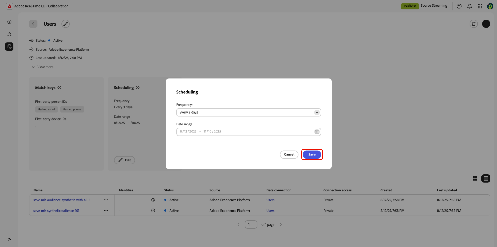

# データ接続を管理

{{limited-availability-release-note}}

## 概要

Real-Time CDP Collaborationのデータ接続を使用して、様々なプラットフォームからオーディエンスをソース化します。 一致キーを管理し、既存のデータ接続のデータ更新をスケジュールする方法を説明します。 さらに、様々な属性でオーディエンスをフィルタリングして、より詳細なインサイトを得ることができます。

## データ接続の表示

既存のデータ接続を表示するには、**[!UICONTROL 設定]** に移動し、「**[!UICONTROL マイデータ接続]**」タブを選択します。 現在のすべてのデータ接続が表示され、各接続の概要が簡単に示されます。 一致キー、スケジュールの詳細、オーディエンスなど、データ接続の情報の完全な表示については、対応する接続で **[!UICONTROL データ接続を表示]** を選択します。

{zoomable="yes"}

### 一致キー {#match-keys}

>[!CONTEXTUALHELP]
>id="rtcdp_collaboration_manage_dataconnections_matchkeys"
>title="一致キー"
>abstract=" 一致キーは、様々なソースのデータの一致方法を決定します。ユースケースとプライバシーガイドラインに最も関連性の高い一致キーを選択します。"

一致キーは、様々なデータソースのオーディエンス間でメンバーを紐付けるために使用される識別子です。データ接続用に最初に選択した一致キーは編集できません。

>[!IMPORTANT]
> 
>データ接続が作成された後は、一致キーを編集できません。 一致キーを更新するには、新しいデータ接続を作成する必要があります。

使用可能な一致キーは次のとおりです。

- **ハッシュ化されたメール**

{zoomable="yes"}

### スケジュール設定 {#scheduling}

>[!CONTEXTUALHELP]
>id="rtcdp_collaboration_manage_dataconnections_scheduling"
>title="スケジュール設定"
>abstract="データ接続のスケジュールの詳細を表示し、必要に応じて更新頻度を編集します。"

データ接続のスケジュール設定を表示および管理します。 スケジュールによって、オーディエンスの更新頻度が決定されます。

データ接続が作成されたら、データ接続ワークスペースの **[!UICONTROL スケジュール]** セクションから直接更新頻度を更新できます。

>[!NOTE]
>
>Adobe Experience Platformからオーディエンスを取得する場合、オーディエンスは、データ接続が確立されてから 24 時間以内に使用可能になります。 最初の読み込み後、オーディエンスデータは、定義された頻度に従って更新されます。

スケジュールについて詳しくは、オーディエンスの設定ガイドの [ スケジュールの節 ](/help/guide/setup/onboard-audiences.md#schedule) を参照してください。

{zoomable="yes"}

#### スケジュールの編集 {#edit-scheduling}

既存のデータ接続の頻度を編集して、オーディエンスの更新頻度をより詳細に制御できます。 スケジュールを編集するには、スケジュールカードのデータ接続内から **[!UICONTROL 編集]** を選択します。

**[!UICONTROL スケジュール]** ダイアログで、ドロップダウンメニューを選択して **[!UICONTROL 頻度]** を更新します。 更新頻度を、毎日または 2 ～ 6 日ごとに実行するように設定します。 完了したら、「**[!UICONTROL 保存]** を選択して変更を適用します。

{zoomable="yes"}

## データ接続を削除

データ接続を削除すると、Collaboration全体で、基になるすべてのオーディエンス、関連する設定および使用状況が削除されます。 このアクションは取り消せません。

既存のデータ接続を削除するには、個々のデータ接続のワークスペース内にある削除アイコン（）を選択します。

{zoomable="yes"}

確認ダイアログが表示されます。 **[!UICONTROL 削除]** を選択して、データ接続の削除を終了します。

{zoomable="yes"}

## オーディエンス管理 {#manage-audiences}

データ接続に接続されているオーディエンスのリストが、ワークスペースの下部に表示されます。 リストには、ステータス、ソース、接続アクセスなど、各オーディエンスの簡単な概要が表示されます。 オーディエンスのカテゴリ、接続アクセスまたはメタデータ表示を編集するには、オーディエンスの名前を選択します。 オーディエンスの管理に関する完全なガイドについては、[ 個々のオーディエンスの表示 ](./onboard-audiences.md#view-individual-audiences) ガイドを参照してください。

{zoomable="yes"}

## 次の手順

データ接続を管理すると、共同作業者が検出可能にしたオーディエンスとオーディエンスの間で [ 重複を検出 ](/help/guide/collaborate/discover.md) できます。
