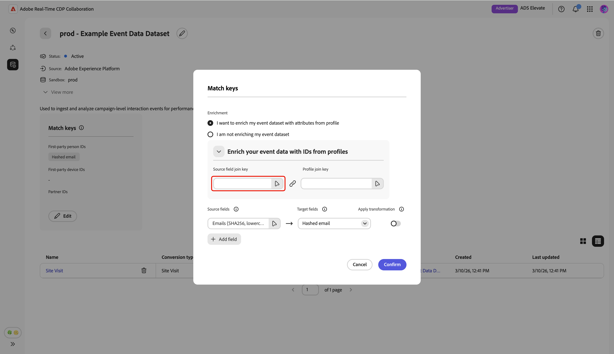

# 測定データ接続の管理

{{limited-availability-release-note}}

## 概要

Real-Time CDP Collaborationの測定データ接続を使用して、様々なプラットフォームからコンバージョンデータを取得できます。 既存のデータ接続の詳細と一致キーを管理する方法について説明します。

## 測定データの接続を表示 {#view-measurement-data-connections}

既存の測定データ接続の詳細（コンバージョンデータのソース方法、使用されている照合キー、接続にリンクされているすべてのコンバージョンイベントなど）を表示できます。

**[!UICONTROL セットアップ]** ワークスペースから、**[!UICONTROL データ接続]** タブに移動します。 現在のすべての測定データ接続は、表形式表示またはグリッドビューの&#x200B;**[!UICONTROL Measurement]** セクションの下に表示されます。 関連する接続カードで&#x200B;**[!UICONTROL データ接続を表示]**&#x200B;を選択するか、テーブルビューでデータ接続名を選択して、ワークスペースを開き、すべての詳細を表示します。

{zoomable="yes"}

### 測定データ接続の詳細 {#measurement-data-connection-details}

このセクションでは、データ接続の次の詳細を確認できます。

| フィールド | 説明 |
|-------------------|-------------|
| ステータス | 測定データ接続の現在の状態（例：**[!UICONTROL Active]**）。 |
| ソース | この接続の測定データを提供するプラットフォームまたはシステム。 |
| サンドボックス | 測定データ接続が設定されているサンドボックスの名前。 |
| データセット | 接続で測定データを取得するために使用されるデータセットの名前。 |
| 最終更新日時 | 測定データ接続に対する最新の更新のタイムスタンプ。 |
| 最終更新者 | 測定データ接続を最後に変更したユーザー。 |
| 作成日時 | 測定データ接続が作成されたタイムスタンプ。 |
| 作成者 | 最初に測定データ接続を作成したユーザー。 |

{style="table-layout:auto"}

### 一致キー {#match-keys}

一致キーは、[測定データを取得する](./onboard-measurement-data.md)際にソースフィールドをマッピングしたターゲットフィールドです。 一致キーの仕組みについて詳しくは、[一致キー](./onboard-account.md#set-up-match-keys) ガイドを参照してください。

{zoomable="yes"}

### コンバージョンイベント {#conversion-events}

データ接続に添付されたコンバージョンイベントのリストがワークスペースの下部に表示されます。 このリストには、ステータス、コンバージョンタイプ、ソースなど、各イベントの概要が表示されます。 イベント名を選択して設定を表示および編集するか、削除オプション（）を使用してコンバージョンイベントを削除できます。 コンバージョンイベントの管理に関する完全なガイドについては、[測定データの追加と管理](./onboard-measurement-data.md) ガイドを参照してください。

{zoomable="yes"}

## 測定データ接続の編集 {#edit-measurement-data-connection}

既存の測定データ接続の詳細と照合キーをいつでも更新して、レポートと分析の正確性を維持できます。 最初に、**[!UICONTROL My data connections]** タブに移動し、編集する測定データ接続を選択します。 これにより、データ接続ワークスペースが開き、次の手順に従って必要な変更を行うことができます。

### 名前と説明を編集 {#edit-name-and-description}

データ接続の名前と説明を更新するには、現在の接続名の横にある編集アイコン（）を選択します。

{zoomable="yes"}

**[!UICONTROL データ接続を編集]** ダイアログで、目的の値でフィールドを更新し、**[!UICONTROL 保存]**&#x200B;を選択して変更を適用します。

{zoomable="yes"}

詳細が正常に更新されたことを確認する確認ダイアログが表示されます。

### 一致キーを編集 {#edit-match-keys}

>[!IMPORTANT]
>
>データ接続の一致キーを編集する前に、次の点に注意してください。
>
>* データ接続には、アカウントに設定された一致キーのみを使用できます。
>* 現時点では、データ接続に照合キーを追加できますが、照合キーを有効にすると、削除できません。

データ接続ワークスペースで、**[!UICONTROL 照合キー]** パネル内の&#x200B;**[!UICONTROL 編集]**&#x200B;を選択します。

{zoomable="yes"}

確認ダイアログが表示され、データ接続に対する変更が、関連するすべてのコンバージョンに適用されることを説明します。 確認するには、**[!UICONTROL OK]**&#x200B;を選択してください。 この確認は後でスキップできます。

{zoomable="yes"}

**[!UICONTROL キーの照合]** ダイアログで、エンリッチメント設定を確認し、ソースフィールドとターゲットフィールド（照合キー）間の現在のマッピングを確認できます。

{zoomable="yes"}

#### エンリッチメント {#enrichment}

測定データ [&#128279;](./onboard-measurement-data.md)を送信したときにエンリッチメントが有効になっていない場合は、リアルタイム顧客プロファイルの属性を使用してイベントデータセットをエンリッチメントするオプションがあります。 測定データのエンリッチメントをオンにすると、無効にできなくなります。 必要に応じて、エンリッチメント結合キーを更新することもできます。

**[!UICONTROL キーの照合]** ダイアログでエンリッチメントを有効にすると、UIが拡張され、**[!UICONTROL プロファイルのIDでイベントデータをエンリッチメント]** セクションの下に追加の設定オプションが表示されます。

「**[!UICONTROL Source フィールド結合キー]**」オプションを選択します。

{zoomable="yes"}

**[!UICONTROL Source フィールド結合キー]** ダイアログで、ソースフィールドを選択し、次に&#x200B;**[!UICONTROL 選択]**&#x200B;します。

{zoomable="yes"}

次に、**[!UICONTROL プロファイル結合キー]** オプションを選択します。 **[!UICONTROL プロファイル結合キー]** ダイアログで、リストからプロファイルフィールドを選択します。 「検索」オプションを使用して、目的のフィールドを検索できます。 次に、**[!UICONTROL 選択]**&#x200B;を選択して確認します。

{zoomable="yes"}

#### マッピングを編集 {#edit-mapping}

既存の一致キーを編集するには、**[!UICONTROL 一致キー]** ダイアログ内で、関連するソースフィールドとターゲットフィールドを更新します。 新しい一致キーを含める場合は、**[!UICONTROL フィールドを追加]**&#x200B;を選択します。 これにより、ソースフィールドとターゲットフィールド間の追加マッピングを定義できる空の行が作成されます。

{zoomable="yes"}

次に、空のソースフィールドを選択します。 **[!UICONTROL ソースフィールドを選択]** ダイアログが表示され、**[!UICONTROL ID名前空間]**&#x200B;や&#x200B;**[!UICONTROL プロファイル属性]**&#x200B;などのオプションにグループ化された、利用可能なソースフィールドのリストが表示されます。 リストをフィルタリングし、検索オプションを使用して目的のソースフィールドを見つけることができます。

必要なソースフィールドを選択し、続いて&#x200B;**[!UICONTROL 選択]**&#x200B;します。

{zoomable="yes"}

**[!UICONTROL キーを一致]** ダイアログで、ドロップダウンメニューを使用して、新しいソースフィールドをターゲットフィールドにマッピングします。 使用可能なすべてのターゲットフィールドは、共同作業者アカウントに設定された一致キーです。 必要なターゲットフィールドが表示されない場合は、[&#x200B; アカウントの照合キー](./onboard-account.md#edit-match-keys)を編集して追加します。

ハッシュ化されていないフィールドをハッシュ化されたターゲットフィールドにソーシングする場合は、**[!UICONTROL 変換を適用]** オプションを使用します。例えば、プレーンテキストの電話元フィールドを&#x200B;**[!UICONTROL ハッシュ化された電話元フィールドにマッピングする場合などです。]** ターゲットフィールド。

{zoomable="yes"}

フィールドのマッピングが完了したら、更新を確認し、**[!UICONTROL 確認]**&#x200B;を選択して変更を適用します。

{zoomable="yes"}

確認ダイアログは、一致キーが正常に更新されたことを確認します。

## データ接続を削除

データ接続を削除すると、Collaboration全体で基になるすべてのコンバージョン、関連する設定、使用が削除されます。 このアクションは取り消せません。

既存のデータ接続を削除するには、個々のデータ接続のワークスペース内の削除アイコン（）を選択します。

{zoomable="yes"}

確認ダイアログが表示されます。 データ接続の削除を完了するには、**[!UICONTROL 削除]**&#x200B;を選択します。

{zoomable="yes"}

確認ダイアログは、データ接続が正常に削除されたことを確認します。

## 次の手順 {#next-steps}

測定データ接続を管理すると、次のことが可能になります。

* 必要に応じて、データ接続にリンクされているその他のコンバージョンイベントを追加します。 詳細な手順については、[測定データの追加と管理](./onboard-measurement-data.md) ドキュメントを参照してください。
* 測定レポートを生成して、キャンペーンのパフォーマンスと影響に関するインサイトを得ることができます。 使用可能なレポートタイプとその作成方法について詳しくは、[&#x200B; パフォーマンスを測定](/help/guide/collaborate/measure.md) ガイドを参照してください。
