# 測定データの追加と管理 {#add-and-manage-measurement-data}

>[!CONTEXTUALHELP]
>id="rtcdp_collaboration_onboard_measurement_data"
>title="詳細情報"
>abstract=""

>[!CONTEXTUALHELP]
>id="rtcdp_collaboration_measurement_data_target_fields"
>title="ターゲットフィールド"
>abstract="測定ターゲットフィールドのプレースホルダー。"

>[!CONTEXTUALHELP]
>id="rtcdp_collaboration_measurement_data_source_fields"
>title="ソースフィールド"
>abstract="測定ソースフィールドのプレースホルダー。"

>[!CONTEXTUALHELP]
>id="rtcdp_collaboration_import_measurement_mapping_source_fields"
>title="ソースフィールドのマッピング"
>abstract="ソースフィールドの測定マッピング用プレースホルダー。"

>[!CONTEXTUALHELP]
>id="rtcdp_collaboration_import_measurement_mapping_target_fields"
>title="ターゲットフィールドのマッピング"
>abstract="ターゲットフィールドの測定マッピング用プレースホルダー。"

{{limited-availability-release-note}}

このドキュメントでは、Adobe Real-Time CDP Collaborationにキャンペーン測定データを追加する手順の概要を説明します。 パブリッシャーは、Adobeチームと協力して、キャンペーン測定データをアップロードできます。 そのデータがアップロードされ、処理されると、パブリッシャーと広告主の両方が広範な[ キャンペーン測定レポート ](/help/guide/collaborate/measure.md)を表示できるようになります。

## 測定データを追加 {#add-measurement-data}

広告主は、コンバージョンイベントを含む測定データをCollaborationにアップロードして、キャンペーン測定レポートで使用できます。 コンバージョンデータには、通常、ユーザーID （ハッシュ化された電子メールやデバイス IDなど）、コンバージョンイベントのタイムスタンプ、購入やサインアップなどの特定のコンバージョンイベントの詳細などのフィールドが含まれます。

測定データを取得するには、**[!UICONTROL セットアップ]** ワークスペース内の&#x200B;**[!UICONTROL My measurement data]** タブに移動します。 追加アイコン（）を選択します **[!UICONTROL 測定データ]**&#x200B;を選択します。

これが最初の測定データである場合は、**[!UICONTROL 追加]** オプションを選択することもできます。

{zoomable="yes"}

**[!UICONTROL 測定データを追加]**&#x200B;画面が表示され、ソース測定データへの手順の概要が表示されます。 「**[!UICONTROL オンボーディングの開始]**」を選択します。

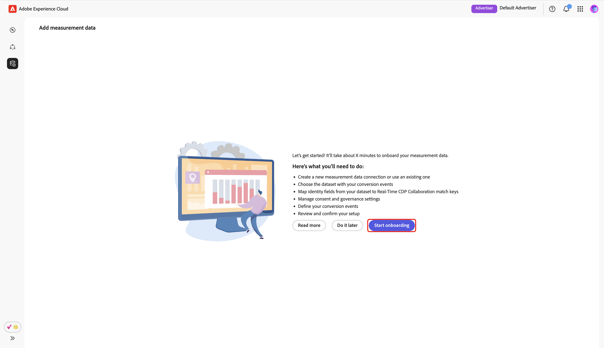{zoomable="yes"}。

### データ接続と詳細 {#data-connection-and-details}

この手順では、データ接続を設定し、測定データの詳細を指定する必要があります。

#### 測定データタイプを選択 {#select-measurement-data-type}

測定データタイプは、キャンペーン測定に取り込むイベントの種類を定義します。 現在、コンバージョンデータがサポートされているタイプです。

測定データタイプとして&#x200B;**[!UICONTROL コンバージョンデータ]**&#x200B;を選択し、次に&#x200B;**[!UICONTROL 次]**&#x200B;を選択します。

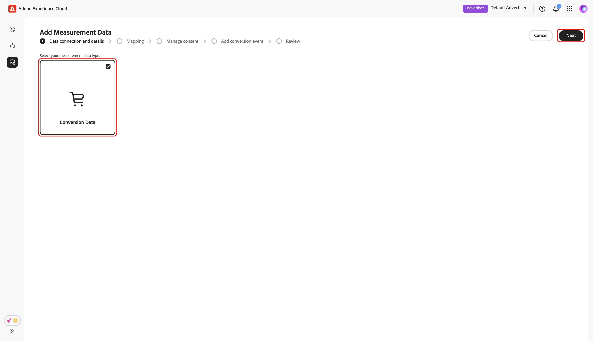{zoomable="yes"}

#### データ接続の選択 {#select-data-connection}

データ接続とは、Collaborationに測定データを取り込むソースのことです。 最初のデータ接続を確立し、最初の測定データを取得したら、同じデータ接続を使用して追加の測定データを取得し続けることができます。

データ接続を追加するには、**[!UICONTROL 新しいデータ接続を追加]**&#x200B;を選択し、**[!UICONTROL 次へ]**&#x200B;を選択します。

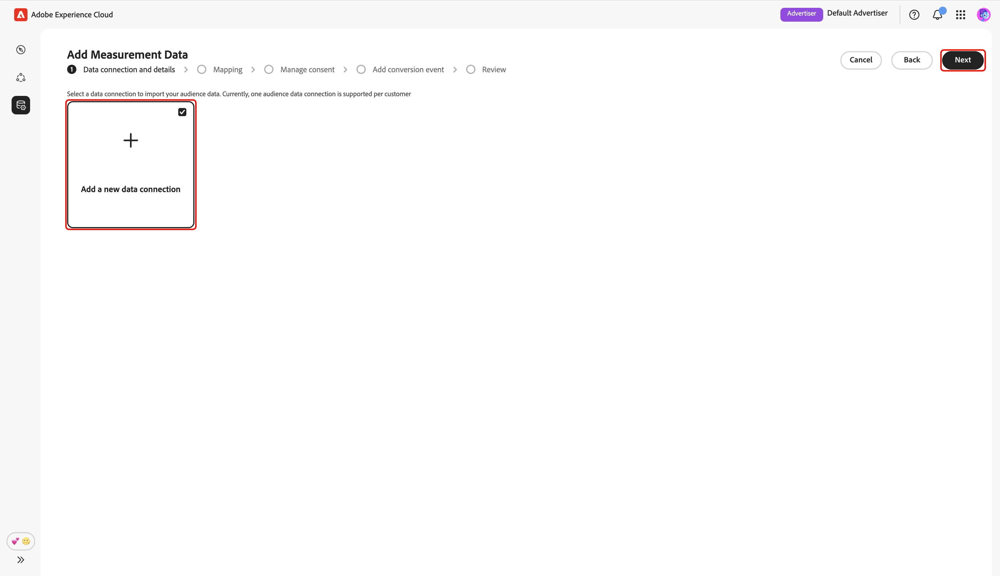{zoomable="yes"}

#### データソースを選択 {#select-data-source}

次に、データ接続のソースを選択します。 現時点では、Adobe Experience Platformが唯一サポートされているデータソースです。

データソースを選択し、**[!UICONTROL 次へ]**&#x200B;を選択します。

{zoomable="yes"}

#### サンドボックスを選択 {#select-sandbox}

Collaboration Campaignの測定レポートに使用する測定データが含まれているサンドボックスを選択します。 使用可能なサンドボックスのリストからサンドボックスを選択し、**[!UICONTROL 次へ]**&#x200B;を選択します。

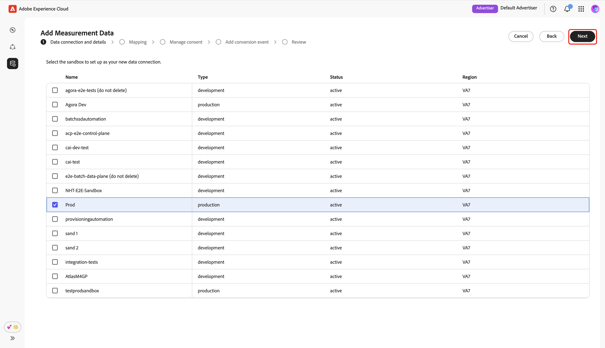{zoomable="yes"}

#### 測定データセットの選択 {#select-measurement-dataset}

選択したサンドボックス内のデータセットのリストが表示されます。 測定データとしてデータセットを選択し、**[!UICONTROL 次へ]**&#x200B;を選択します。 検索オプションを使用して、目的のデータセットをフィルタリングして検索できます。

{zoomable="yes"}

#### 名前と詳細を入力 {#provide-name-and-details}

次に、データ接続の名前と説明を入力します。 この情報は、後でデータ接続を特定するのに役立ちます。

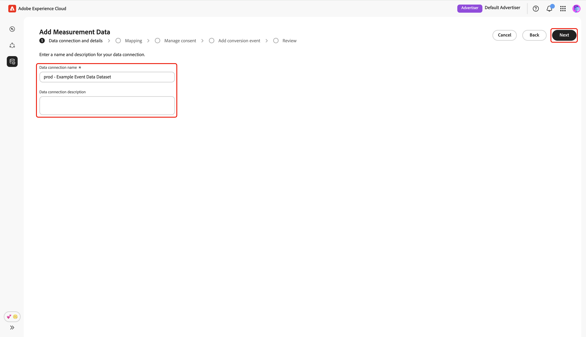{zoomable="yes"}

### マッピング {#mapping}

次のステップでは、測定データのフィールドを、Collaborationで使用される対応するターゲットフィールドにマッピングします。 また、結合キーをマッピングしてリアルタイム顧客プロファイルの属性をイベントデータセットに追加し、これらの属性を使用して測定レポートを分類することもできます。

#### イベントデータの拡充 {#enrich-event-data}

イベントデータを拡充するには、**[!UICONTROL Source フィールド結合キー]** オプションを選択します。

{zoomable="yes"}

**[!UICONTROL Source フィールド結合キー]** ダイアログで、ソースフィールドを選択し、次に&#x200B;**[!UICONTROL 選択]**&#x200B;します。

{zoomable="yes"}

次に、**[!UICONTROL プロファイル結合キー]** オプションを選択します。 **[!UICONTROL プロファイル結合キー]** ダイアログで、リストからプロファイルフィールドを選択します。 「検索」オプションを使用して、目的のフィールドを検索できます。 次に、**[!UICONTROL 選択]**&#x200B;を選択して確認します。

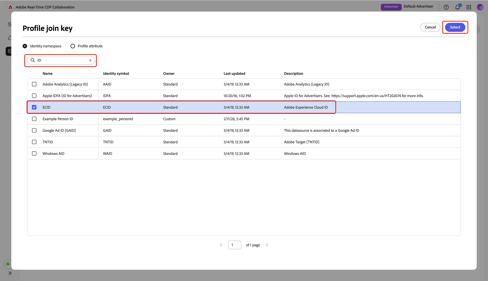{zoomable="yes"}

#### マッピングフィールド {#mapping-fields}

測定データからCollaborationのターゲットフィールドへのソースフィールドのマッピングを開始するには、**[!UICONTROL マッピング]**&#x200B;画面で空のソースフィールドを選択します。

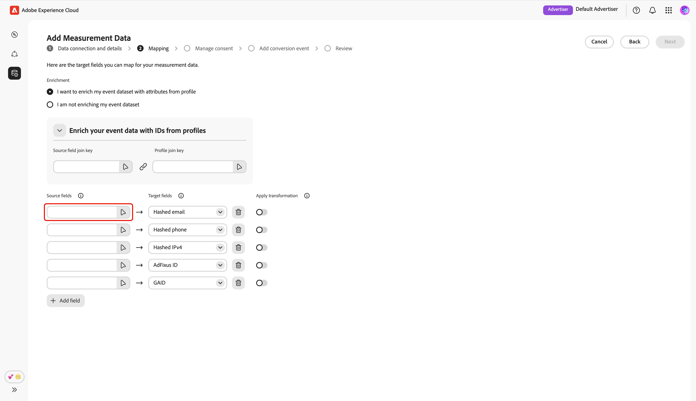{zoomable="yes"}

**[!UICONTROL ソースフィールドを選択]** ダイアログが表示され、**[!UICONTROL ID名前空間]**&#x200B;や&#x200B;**[!UICONTROL イベントスキーマ]**&#x200B;などのオプションにグループ化された、利用可能なソースフィールドのリストが表示されます。 検索オプションを使用して、リストからソースフィールドをフィルタリングして検索できます。

必要なソースフィールドを選択し、続いて&#x200B;**[!UICONTROL 選択]**&#x200B;します。

{zoomable="yes"}

次に、ドロップダウンメニューを使用して、選択したソースフィールドを適切なターゲットフィールドにマッピングします。 使用可能なすべてのターゲットフィールドは、共同作業者アカウント用に設定された[一致キーです](./onboard-account.md#set-up-match-keys)。

{zoomable="yes"}

必要に応じて、マッピング行を追加または削除できます。 ハッシュ化されていないソースフィールドをハッシュ化されたターゲットフィールドにマッピングする必要がある場合（例えば、プレーンテキストメールを[!UICONTROL  ハッシュ化されたメール ]にマッピングする場合）、**[!UICONTROL 変換を適用]** オプションを使用して、必要なハッシュ化を適用します。

完了したら、エンリッチメントが有効になっている場合は、マッピングされたフィールドと結合キーを確認します。 次に、**[!UICONTROL 次へ]**&#x200B;を選択します。

{zoomable="yes"}

### 同意を管理 {#manage-consent}

先に進む前に、Collaborationでのデータ使用がReal-Time CDP データガバナンスポリシーに準拠していることを確認する必要があります。 同意の要件や適用されるカスタム同意ポリシーに従って、あらゆるデータを事前にフィルタリングする必要があるため、追加の処理は必要ありません。

確認を確認するには、**[!UICONTROL 次へ]**&#x200B;を選択してください。

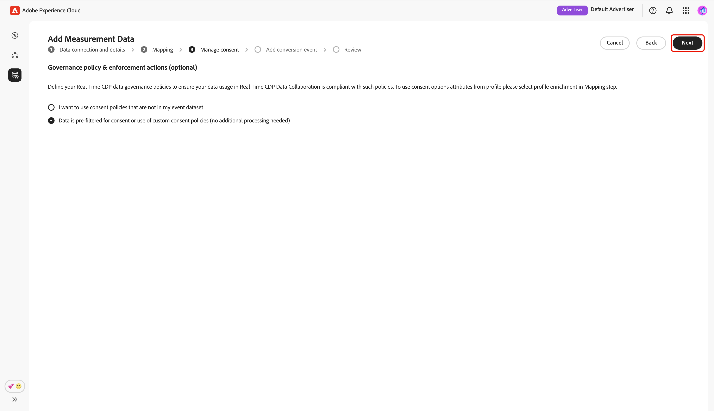{zoomable="yes"}

マッピング手順](#enrich-event-data)中にプロファイルのエンリッチメントを[有効にする場合は、事前定義されたオプションのリストから同意ポリシーを設定できます。 これには以下が含まれます。

* **マーケティングアクション**：これらのマーケティングアクションを使用して、Experience PlatformからCollaborationに取り込むオーディエンスデータを制御します。
* **同意ルール**: Collaborationに送信するデータに適用する同意ルールを選択します。
* **オーディエンス**: オーディエンスフィルターを使用して、同意のためにオーディエンスプロファイルを含めたり除外したりします。

>[!NOTE]
>
>**[!UICONTROL Data Collaboration]**&#x200B;はC4、C5、C9のデータ使用ラベルをサポートしていますが、**[!UICONTROL Data Science]**&#x200B;はC9のみをサポートしています。 データ使用ラベルの詳細については、Experience Platformのドキュメントを参照してください。
>
>* [データ使用ラベルの概要](https://experienceleague.adobe.com/ja/docs/experience-platform/data-governance/labels/overview){target="_blank"}
>* [用語集](https://experienceleague.adobe.com/ja/docs/experience-platform/data-governance/labels/reference){target="_blank"}

必要な設定を選択し、**[!UICONTROL 次へ]**&#x200B;を選択します。

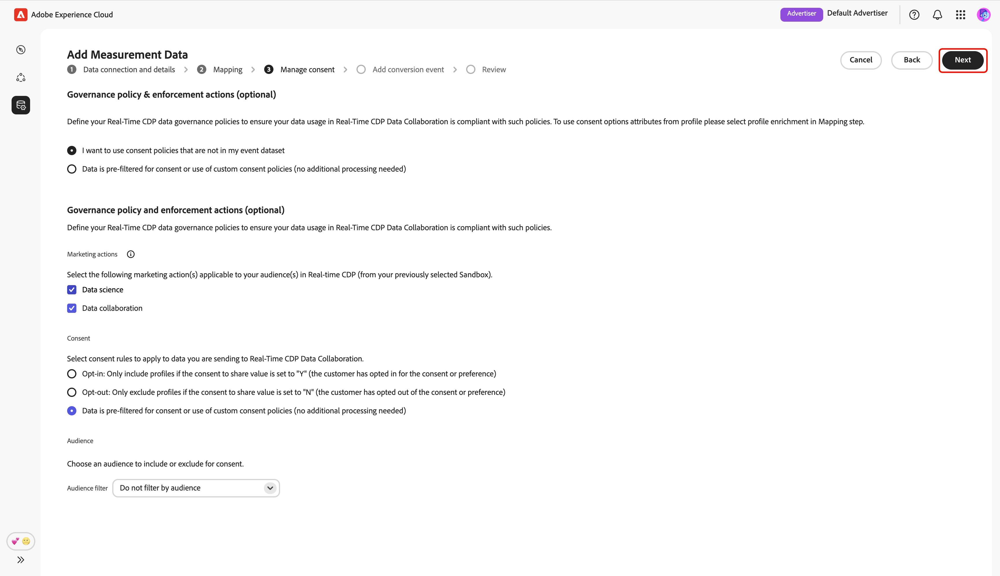{zoomable="yes"}

続行する前に、**[!UICONTROL ガバナンスポリシーと実行アクション]** ダイアログで条件を確認して同意する必要があります。 チェックボックスを選択し、その後に&#x200B;**[!UICONTROL OK]**&#x200B;を選択します。

{zoomable="yes"}

#### オーディエンスフィルター {#audience-filter}

同意のために特定のオーディエンスプロファイルを含めるか除外するには、**[!UICONTROL オーディエンスフィルター]** ドロップダウンメニューを使用します。 このフィルターを選択すると、UIが更新され、**[!UICONTROL オーディエンスを参照]** オプションが表示されます。 「**[!UICONTROL オーディエンスを参照]**」を選択します。

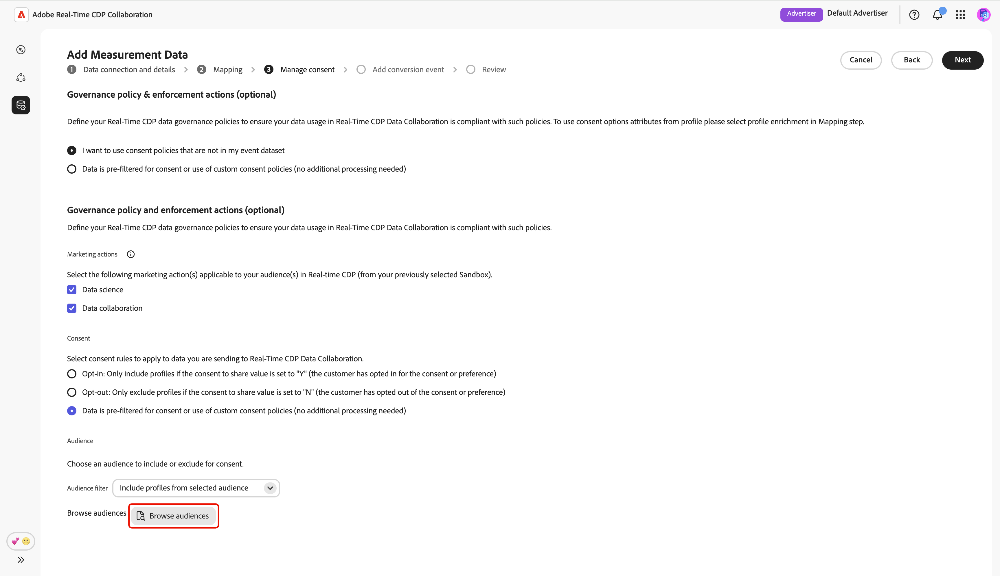{zoomable="yes"}

「**[!UICONTROL オーディエンスを選択]**」ダイアログが表示されます。 リストからオーディエンスを選択し、次に&#x200B;**[!UICONTROL 選択]**&#x200B;します。

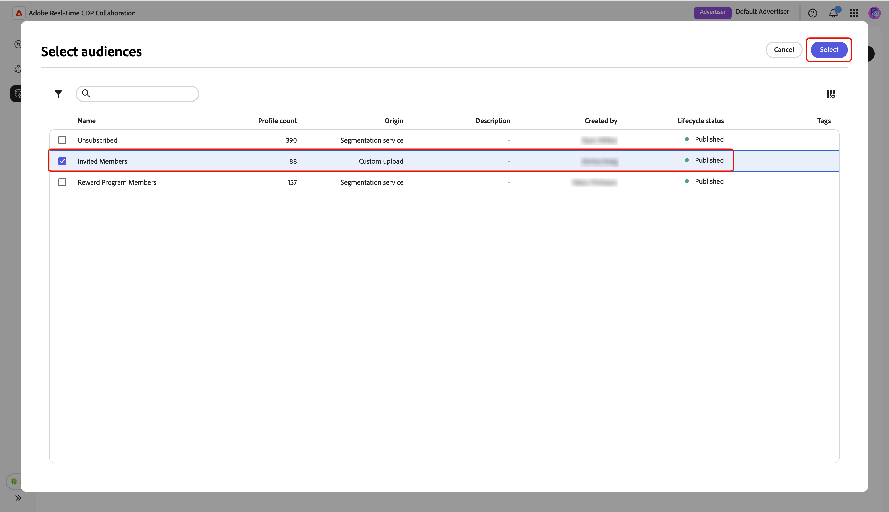{zoomable="yes"}

選択したオーディエンスが表示され、必要に応じて削除するオプションが表示されます。 同意設定を確認し、**[!UICONTROL 次へ]**&#x200B;を選択します。

{zoomable="yes"}

### コンバージョンイベントを追加 {#add-conversion-event}

続いて、サイト訪問、登録、購入完了など、キャンペーンが与える影響を測定するためのコンバージョンイベントを定義します。 測定には、最大&#x200B;**3**&#x200B;個の個別のコンバージョンイベントを指定できます。

コンバージョンイベントの名前を入力し、ドロップダウンメニューを使用してコンバージョンタイプを選択します。

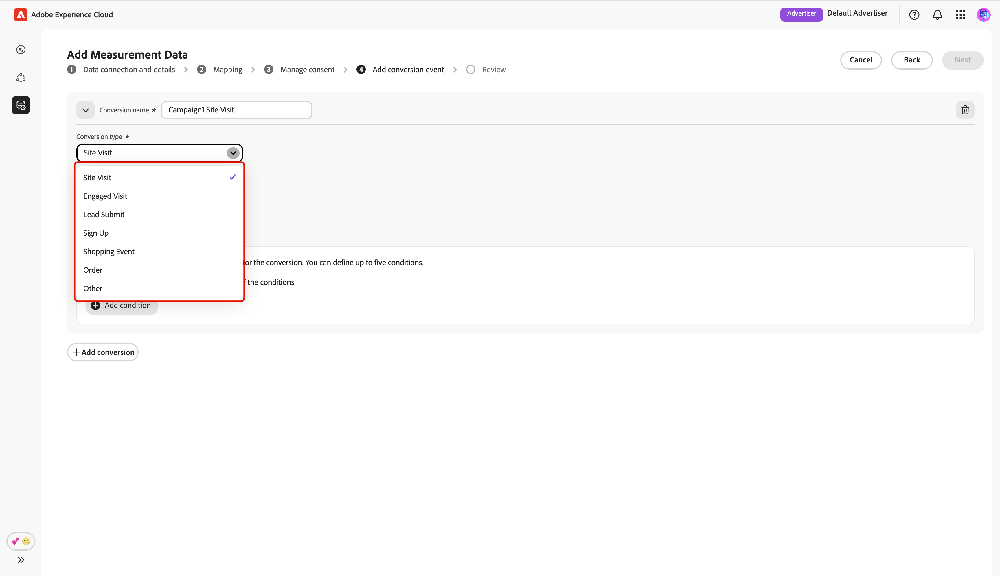{zoomable="yes"}

この時点で値を割り当てたくない場合は、コンバージョンの値を入力するか、空のままにすることができます。

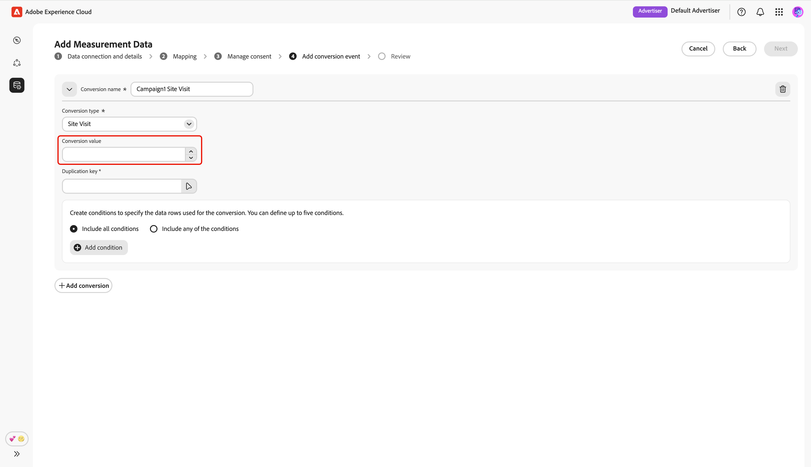{zoomable="yes"}

次に、イベントデータセット内のどの行が同じ基になるコンバージョンイベントに属しているかを示すために、複製キーを指定する必要があります（例えば、サインアッププロセス中に同じタイムスタンプ）。 これにより、測定レポートで同じコンバージョンを複数回カウントするのを防ぐことができます。 これを行うには、**[!UICONTROL 複製キー]**&#x200B;を選択します。 **[!UICONTROL 複製キー]** ダイアログで、キーを検索して選択し、続いて&#x200B;**[!UICONTROL 選択]**&#x200B;します。

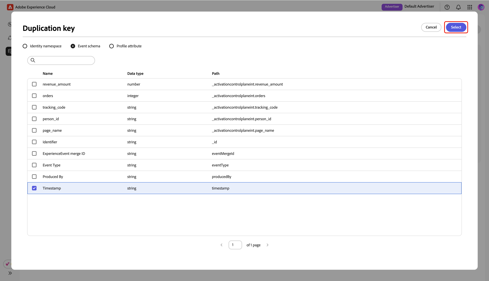{zoomable="yes"}

複製キーを指定した後、変換用のイベントデータセットの関連行のみを含めるように、最大&#x200B;**5**&#x200B;件の条件を追加できます。 これらの条件の全部または一部を適用することを選択します。

「**[!UICONTROL 条件を追加]**」を選択し、条件オプションを選択します。

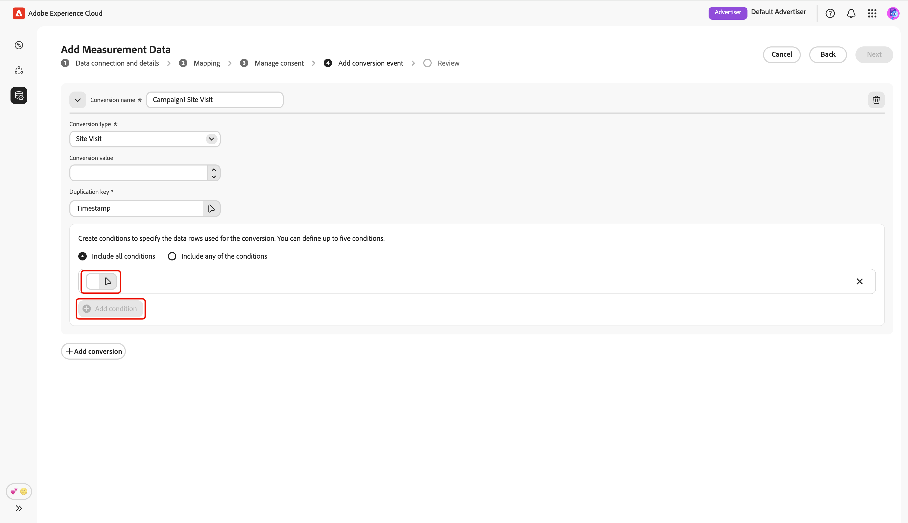{zoomable="yes"}

**[!UICONTROL ソースフィールドを選択]** ダイアログで、条件ルールのソースフィールドを検索して選択し、次に&#x200B;**[!UICONTROL Select]**&#x200B;を選択します。

{zoomable="yes"}

ドロップダウンメニューを使用してロジック演算子を選択し、設定ルールの値を入力します。

{zoomable="yes"}

別のコンバージョンイベントを追加するには、**[!UICONTROL コンバージョンを追加]**&#x200B;を選択します。 合計&#x200B;**3**&#x200B;個のコンバージョンイベントを含めることができます。 完了したら、コンバージョン設定を確認し、**[!UICONTROL 次へ]**&#x200B;を選択します。

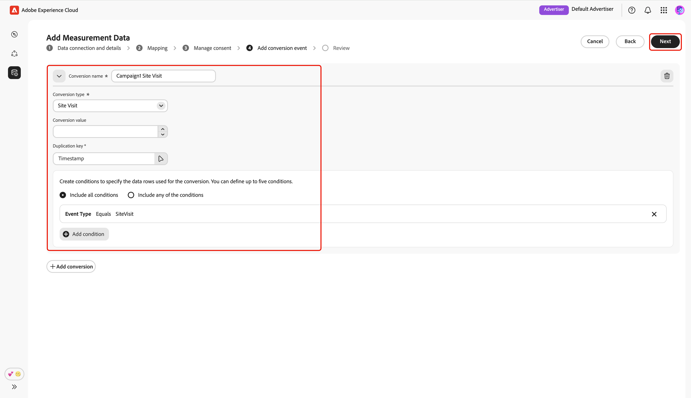{zoomable="yes"}

### レビュー {#review}

**[!UICONTROL レビュー]**&#x200B;画面が表示され、測定データ設定の概要が表示されます。 すべての情報が正しいことを確認します。 セクションを変更する必要がある場合は、**[!UICONTROL 編集]** オプションを使用します。

最後に、**[!UICONTROL 完了]**&#x200B;を選択して、測定データの追加を完了します。

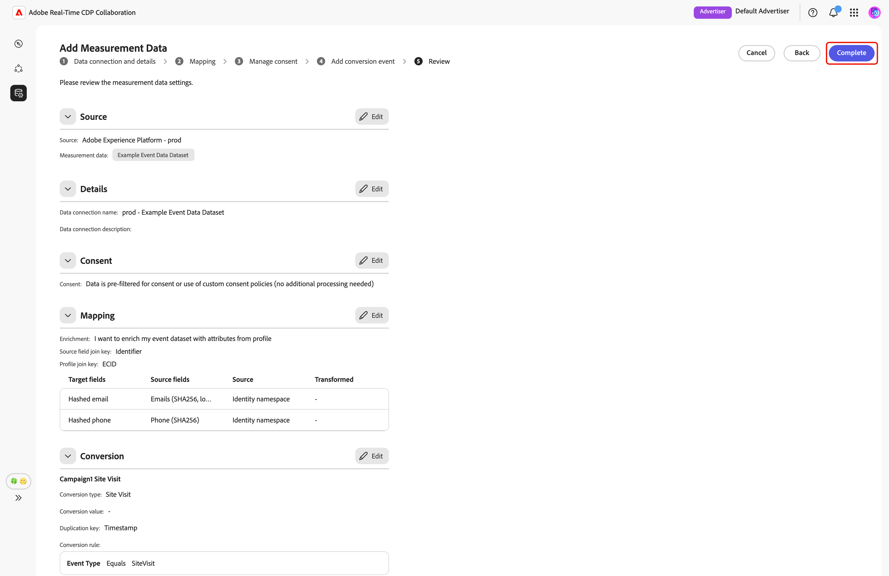{zoomable="yes"}

確認ダイアログは、測定データが正常に作成されたことを確認します。 測定データから設定された新しいコンバージョンイベントは、**[!UICONTROL My measurement data]** ワークスペースで確認できます。

{zoomable="yes"}

グリッドビューまたはテーブルビューで、行アイテムまたはイベントカード内の&#x200B;**[!UICONTROL コンバージョンを表示]** オプションを選択すると、特定のコンバージョンイベントの概要が表示されます。 イベントのステータス、ソース、データ接続名が表示され、次の詳細パネルが表示されます。

* **[!UICONTROL コンバージョンの詳細]**：コンバージョンに関する重要な情報を表示します。その情報には、種類、一意のイベントの識別に使用される複製キー、割り当てられたコンバージョン値（指定されている場合）が含まれます。
* **[!UICONTROL 条件]**：このコンバージョンイベントに適用された条件ルールを表示します。

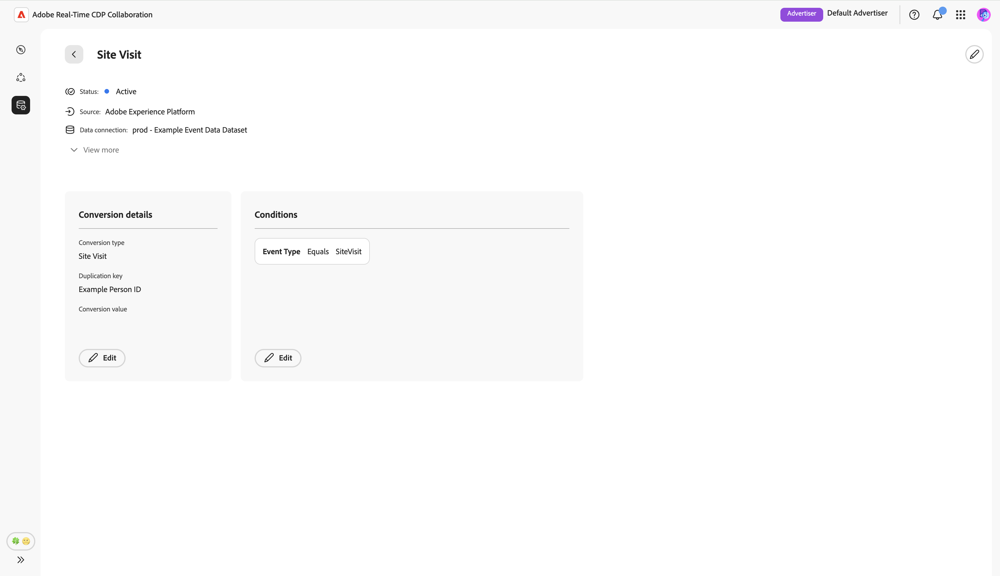{zoomable="yes"}

## 測定データの編集 {#edit-measurement-data}

測定データを取得した後は、コンバージョンイベントの詳細と条件ルールをいつでも編集できます。

「**[!UICONTROL 測定データ]**」タブから、関連するコンバージョンイベントカード内の省略記号オプション（）を選択します。 次に、ドロップダウンメニューから「**[!UICONTROL コンバージョンを表示]**」を選択して、そのコンバージョンイベントの詳細ページを開きます。

{zoomable="yes"}

### 名前と説明を編集 {#edit-name-and-description}

イベントの名前と説明を更新するには、ページの右上にある編集アイコン（）を選択します。

{zoomable="yes"}

**[!UICONTROL 名前と説明を編集]** ダイアログで、目的の値でフィールドを更新し、**[!UICONTROL 保存]**&#x200B;を選択して変更を適用します。

{zoomable="yes"}

詳細が正常に更新されたことを確認する確認ダイアログが表示されます。

### コンバージョンの詳細を編集 {#edit-conversion-details}

イベントの以下のコンバージョンの詳細を更新できます。

| フィールド | 説明 |
|-------------------|-------------|
| コンバージョンタイプ | サイト訪問、購入、サインアップなど、コンバージョンイベントのカテゴリ。 |
| 重複キー | 同じコンバージョンイベントに属するイベントデータセットの行の識別子（例：同じタイムスタンプ）。 重複したカウントを防ぎます。 |
| コンバージョン値 | 各コンバージョンに関連付けられた値。 |

{style="table-layout:auto"}

編集を開始するには、**[!UICONTROL コンバージョンの詳細]** パネルで&#x200B;**[!UICONTROL 編集]**&#x200B;を選択します。

{zoomable="yes"}

**[!UICONTROL コンバージョンの詳細を編集]** ダイアログで、ドロップダウンメニューを使用してコンバージョンタイプを更新します。 コンバージョンの値を入力するか、値を割り当てたくない場合は空のままにすることができます。 複製キーを編集するには、「既存のキー」オプションを選択します。

{zoomable="yes"}

**[!UICONTROL 複製キー]** ダイアログには、**[!UICONTROL ID名前空間]**&#x200B;や&#x200B;**[!UICONTROL イベントスキーマ]**&#x200B;などのオプションにグループ化された、使用可能なフィールドのリストが表示されます。 目的のキーを検索して選択し、続いて&#x200B;**[!UICONTROL 選択]**&#x200B;します。

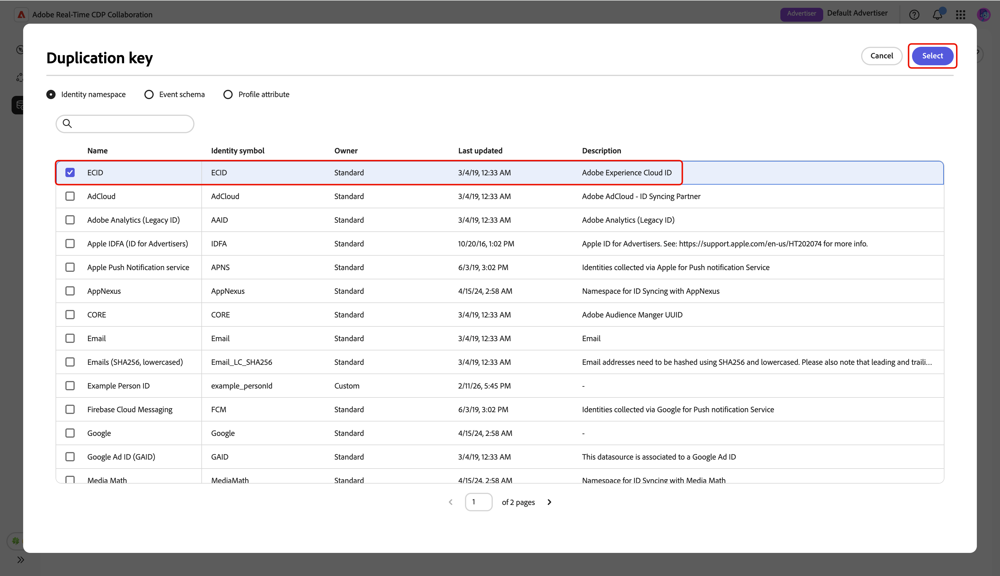{zoomable="yes"}

完了したら、更新を確認し、**[!UICONTROL 保存]**&#x200B;を選択して変更を適用します。

{zoomable="yes"}

詳細が正常に更新されたことを確認する確認ダイアログが表示されます。

### 条件の編集 {#edit-conditions}

コンディションルールは、イベントデータセットのどのデータ行をコンバージョンとして含めるかを指定します。 必要に応じてこれらのルールを更新し、測定で分析に最も関連性の高いデータのみが反映されるようにします。

条件を編集するには、**[!UICONTROL 条件]** パネルで&#x200B;**[!UICONTROL 編集]**&#x200B;を選択します。

{zoomable="yes"}

**[!UICONTROL コンバージョンルールを編集]** ダイアログでは、すべての条件の現在の詳細を表示できます。 ソースフィールド、ロジックルール、値などの詳細を更新するには、既存の条件オプションを選択します。

{zoomable="yes"}

追加のコンバージョンルールを含めるには、**[!UICONTROL 条件を追加]**&#x200B;を選択します。 次に、「新しい空の条件」オプションを選択します。

{zoomable="yes"}

**[!UICONTROL ソースフィールドを選択]** ダイアログで、**[!UICONTROL ID名前空間]**&#x200B;や&#x200B;**[!UICONTROL イベントスキーマ]**&#x200B;などのオプションにグループ化された利用可能なフィールドを確認できます。 条件に使用する適切なフィールドを選択し、**[!UICONTROL 選択]**&#x200B;を選択します。 **[!UICONTROL 検索]** オプションを使用すると、お好みのフィールドをすばやく検索できます。

{zoomable="yes"}

次に、ドロップダウンメニューを使用して、使用可能なリストからロジック演算子を選択し、条件の値を入力します。

{zoomable="yes"}

コンバージョンごとに指定されたすべての条件が必要な場合は、**[!UICONTROL すべての条件を含める]**&#x200B;を使用するか、**[!UICONTROL いずれかの条件を含める]**&#x200B;を使用して、少なくとも1つの条件に一致するコンバージョンを許可します。 更新が完了したら、**[!UICONTROL 保存]**&#x200B;を確認して選択し、変更を適用します。

{zoomable="yes"}

詳細が正常に更新されたことを確認する確認ダイアログが表示されます。

## 測定データの削除 {#delete-measurement-data}

測定データを削除すると、関連するコンバージョンイベントとリンクされたすべての測定の詳細がプロジェクトから完全に削除されます。 このイベントに依存する測定レポートは、対応するコンバージョン指標を失い、更新できなくなります。 このアクションは取り消せません。

既存のコンバージョンイベントを削除するには、**[!UICONTROL 設定]** ワークスペースの&#x200B;**[!UICONTROL 測定データ]** タブに移動します。 グリッド表示で、関連するイベントカード内の&#x200B;**[!UICONTROL 削除]**&#x200B;を選択します。 テーブル表示で、イベント名の横にある削除アイコン（）を選択します。

{zoomable="yes"}

**[!UICONTROL 測定を削除]** ダイアログが表示され、イベントの削除を確認するメッセージが表示されます。 「**[!UICONTROL 削除]**」を選択します。

{zoomable="yes"}

コンバージョンイベントが正常に削除されたことを確認する確認ダイアログが表示されます。

## 次の手順 {#next-steps}

Collaborationでの測定データのソーシングが完了しました。 広告主は、アトリビューションレポートを作成して、キャンペーンがどのようにコンバージョンを促進しているかを調査し、全体的な影響を測定できるようになりました。 パブリッシャーの場合は、キャンペーンのアトリビューションレポートを共同作業者に生成するように依頼します。 詳細な手順については、[ アトリビューションレポートの作成](../collaborate/measure.md#create-attribution-report) ガイドを参照してください。
