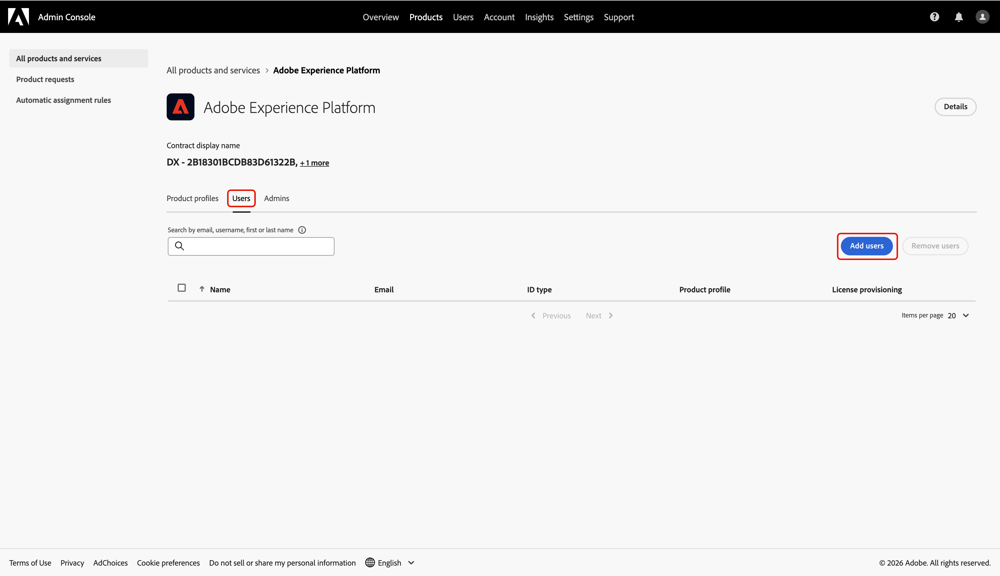
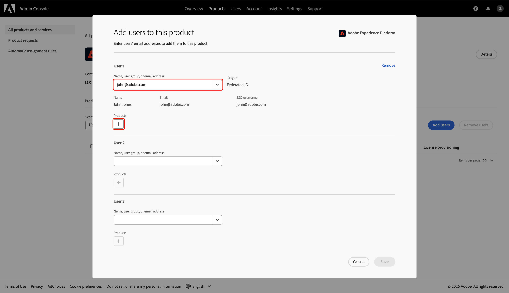
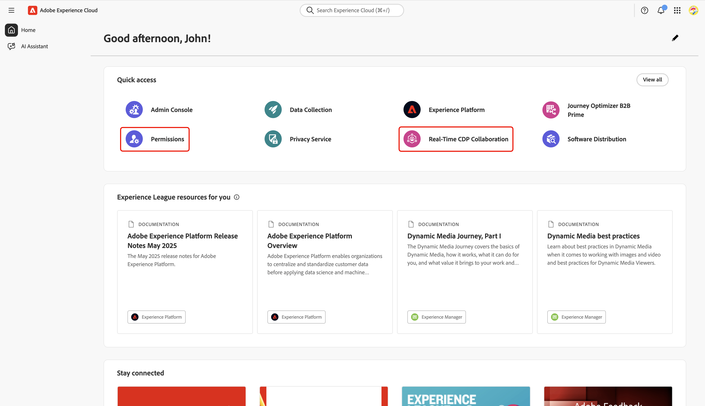

# Collaboration [!DNL Starter] オンボーディングの管理者アクセス権の設定

Collaboration [!DNL Starter]を通じてAdobe Experience Platformにアクセスする最初のユーザーは、チームのアクセス権を設定および管理する責任があります。 Real-Time CDP Collaborationで作業を開始するには、必要な管理者およびユーザー権限を付与する必要があります。 このガイドでは、Admin Consoleで必要なアクセス権を設定し、権限インターフェイスで共同作業の権限を管理する方法について説明します。

## 前提条件 {#prerequisites}

続ける前に、次の項目を確認してください。

* ライセンスを取得したCollaboration パートナーからの招待を受け入れました。 招待状の要件について詳しくは、[Collaboration [!DNL Starter] 概要](../overview/starter-overview.md#prerequisites)を参照してください。
* Collaborationの利用条件を確認し、署名しました。
* Adobeのウェルカムメールを受信し、初めてのアカウント作成を完了しました。

## アクセスの設定 {#setup-access}

Adobe アカウントが[!DNL Starter] ワークフローを通じて作成されると、システム管理者ロールが自動的に割り当てられます。 これにより、Admin Consoleでユーザーと製品アクセスを管理できます。 ただし、Collaborationのアクセス権を管理するために必要な&#x200B;**[!UICONTROL 権限]**&#x200B;へのアクセス権はまだ付与されていません。

Admin Consoleを使用して、製品管理者に&#x200B;**Experience Platformへのアクセス**&#x200B;とExperience Platform製品への&#x200B;**ユーザーアクセス**&#x200B;の両方を付与し、**[!UICONTROL 権限]**&#x200B;にアクセスできるようにします。

Experience Cloudの役割と製品について詳しくは、[&#x200B; アクセス制御の概要](../permissions/overview.md)のドキュメントを参照してください。

>[!TIP]
>
>このガイド全体を通して、**管理者**&#x200B;は&#x200B;**システム管理者と製品管理者**&#x200B;の両方を参照します。

### 製品管理者アクセス権の設定 {#configure-product-admin-access}

この節では、Collaboration [!DNL Starter]へのアクセス権の設定を開始するための管理者権限を付与する方法について説明します。

#### Admin Consoleへのアクセス {#access-admin-console}

最初に、資格情報を使用して[Adobe Experience Cloud](https://experience.adobe.com/){target="_blank"}にログインします。 利用可能な製品のリストは、**[!UICONTROL クイックアクセス]** セクション内に表示されます。 「**[!UICONTROL Admin Console]**」を選択します。

{zoomable="yes"}

#### Adobe Experience Platform製品ダッシュボードへのアクセス {#access-adobe-experience-platform}

[Admin Console](https://adminconsole.adobe.com/) ワークスペースが新しいタブで開きます。 **[!UICONTROL 製品とサービス]**&#x200B;の下の&#x200B;**[!UICONTROL 製品]** リストから&#x200B;**[!UICONTROL Adobe Experience Platform]**&#x200B;を選択します。

{zoomable="yes"}

#### 製品管理者を追加 {#add-product-admin}

**[!UICONTROL Adobe Experience Platform]**&#x200B;製品ダッシュボードで、「**[!UICONTROL 管理者]**」タブに移動します。 次に、**[!UICONTROL 管理者を追加]**&#x200B;を選択します。

{zoomable="yes"}

「**[!UICONTROL 製品管理者を追加]**」ダイアログにメールアドレスまたはユーザー名を入力し、ドロップダウンから正しいアカウントを選択します。 完了したら、**[!UICONTROL 保存]**&#x200B;を選択します。

{zoomable="yes"}

これでプロダクト管理者になり、Admin Console内でプロダクトにユーザーまたは他の管理者を追加できます。 次に、Experience Platform製品へのユーザーアクセス権を付与し、権限で機能にアクセスして実行します。

### ユーザーアクセスの設定 {#configure-user-access}

Collaboration権限を管理するには、管理者アクセス権に加えて、製品に&#x200B;**ユーザーアクセス**&#x200B;が必要です。 ユーザーアクセスは、システム管理者または製品管理者が設定できます。

>[!TIP]
>
>前のセクションから進めている場合は、Admin Console内の&#x200B;**[!UICONTROL Adobe Experience Platform]**&#x200B;商品ダッシュボードに既に存在している必要があります。 ここから、[自分自身をユーザーとして追加](#add-user)に進みます。

ユーザーアクセスの設定を開始するには、次の手順を実行します。

1. [Adobe Experience Cloud ホームページ &#x200B;](#access-admin-console)からAdmin Consoleにアクセスします。
2. [Adobe Experience Platform製品ダッシュボード &#x200B;](#access-adobe-experience-platform)に移動します。

#### 製品にユーザーを追加 {#add-user}

現在、**[!UICONTROL Adobe Experience Platform]**&#x200B;商品ダッシュボードにアクセスしています。 「**[!UICONTROL ユーザー]**」タブに移動し、「**[!UICONTROL ユーザーを追加]**」を選択します。

「ユーザー」タブと「ユーザーを追加」オプションがハイライト表示された{zoomable="yes"}

この製品にユーザーを追加&#x200B;**[!UICONTROL ダイアログが表示され、名前、ユーザーグループ、または電子メールアドレスの入力を求められます。]**&#x200B;値を入力し、ドロップダウンリストからアカウントを選択します。

{zoomable="yes"}

次に、**[!UICONTROL 製品]**&#x200B;の下にある追加アイコン を選択します。

使用可能な[製品プロファイル &#x200B;](https://helpx.adobe.com/jp/enterprise/using/manage-product-profiles.html)のリストを含むダイアログが表示されます。 **[!UICONTROL AEP-Default-All-Users]**&#x200B;と&#x200B;**[!UICONTROL Default Production All Access]**&#x200B;を選択します。 次に、**[!UICONTROL 適用]**&#x200B;を選択します。

{zoomable="yes"}

最後に、**[!UICONTROL 保存]**&#x200B;を選択して、製品への新規ユーザーの追加を完了します。

{zoomable="yes"}

ユーザーアクセス権を取得したら、[Adobe Experience Cloud](https://experience.adobe.com/){target="_blank"}に戻ります。 **[!UICONTROL 権限]**&#x200B;と&#x200B;**[!UICONTROL Real-Time CDP Collaboration]**&#x200B;が&#x200B;**[!UICONTROL クイックアクセス]**&#x200B;で利用できることを確認します。

{zoomable="yes"}

>[!TIP]
>
>**[!UICONTROL 権限]**&#x200B;と&#x200B;**[!UICONTROL Real-Time CDP Collaboration]**&#x200B;が&#x200B;**[!UICONTROL クイックアクセス]**&#x200B;に表示されない場合は、ログアウトして再度ログインしてみてください。

## 次の手順 {#next-steps}

**管理者アクセス**&#x200B;と&#x200B;**ユーザーアクセス**&#x200B;の両方にアクセス権を付与し、Collaborationの機能とリソースに対する役割の定義、特定の権限の割り当て、ユーザーアクセスの管理を行えるようになりました。 詳細な手順については、[権限コントロール ガイド &#x200B;](./starter-permission-controls.md)を参照してください。
