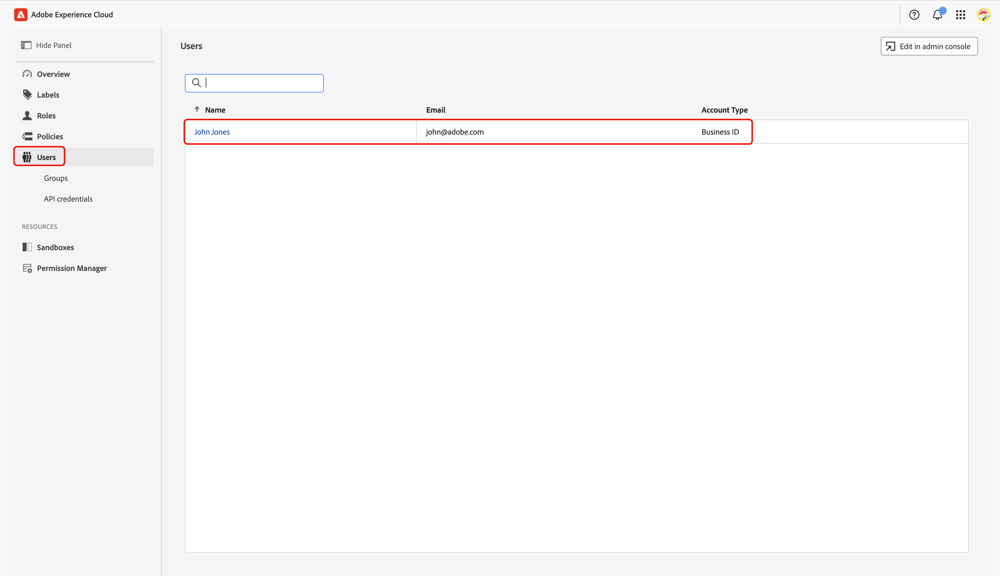
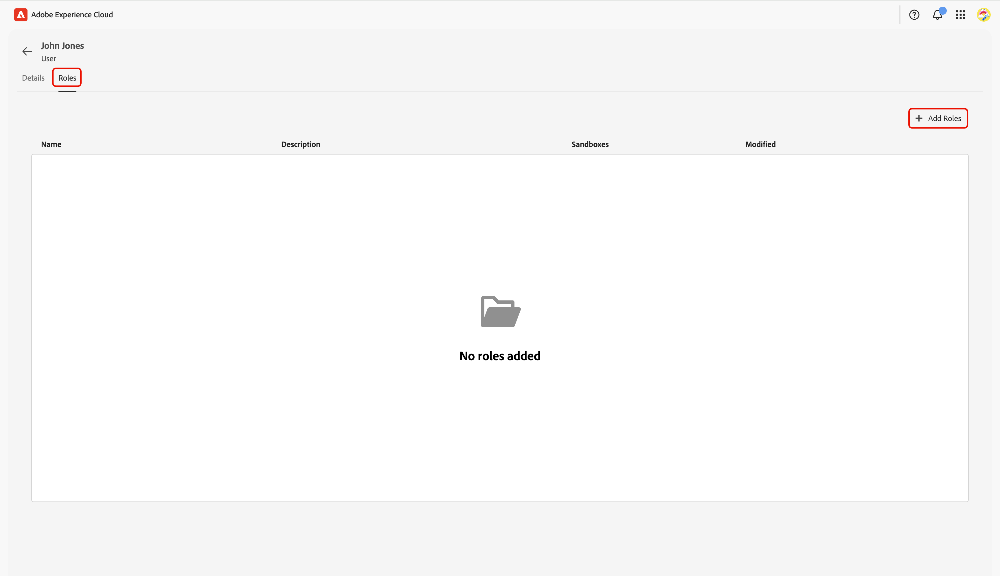

# Collaboration [!DNL Starter] オンボーディングの権限コントロールの設定

Adobe Experience Platform製品への管理者およびユーザーアクセス権を設定したら、Real-Time CDP Collaborationの適切な権限を自分に割り当てる必要があります。 このガイドでは、Collaborationの権限インターフェイスを使用して適切なロールをアカウントに追加し、Experience Cloud機能へのユーザーアクセスにアクセスして管理する方法について説明します。

Collaboration リソースに含まれる標準ロールと使用可能な権限について詳しくは、[役割の管理方法ガイド ](../permissions/manage-roles.md)を参照してください。

## 前提条件 {#prerequisites}

Adobe Experience Platform製品への&#x200B;**管理者権限**&#x200B;と&#x200B;**ユーザーアクセス**&#x200B;の両方があることを確認してください。 これらのアクセス レベルをまだ設定していない場合は、手順を説明する手順については、[管理者アクセス ガイド ](./starter-admin-access.md)を参照してください。

## 権限の設定 {#setup-permissions}

Collaborationに必要な権限を設定するには、次の手順に従います。 まず、資格情報を使用して[Adobe Experience Cloud](https://experience.adobe.com/)にログインします。

### アクセス権限 {#access-permissions}

ログインしたら、**[!UICONTROL クイックアクセス]** セクションに移動し、**[!UICONTROL 権限]**&#x200B;を選択します。 権限ダッシュボードが開き、必要な役割を自分に割り当てることができます。

クイックアクセス セクション内の権限が強調表示された{zoomable="yes"}

### ユーザーの選択 {#select-user}

**[!UICONTROL 権限]** ダッシュボードで、左側のパネルから&#x200B;**[!UICONTROL ユーザー]**&#x200B;を選択します。 次に、「ユーザー」テーブルからアカウントを選択します。

>[!NOTE]
>
> 組織の最初のユーザーがExperience Platformにアクセスする場合は、**Users** テーブルにリストされている唯一のユーザーである可能性があります。 追加のチームメンバーを招待するには、[ ユーザーアクセス設定ガイド ](../permissions/manage-user-access.md#administrators-configure-user-access-to-experience-platform)の手順に従います。

{zoomable="yes"}

### 役割の割り当て {#assign-roles}

対応する&#x200B;**[!UICONTROL ユーザー]** ワークスペースで、「**[!UICONTROL 役割]**」タブに移動します。 Then select **[!UICONTROL Add Roles]**.

{zoomable="yes"}

The **[!UICONTROL Add Roles]** dialog appears with a table of available roles. Each row in the table represents a role with the following information:

| **Column** | **説明** |
|---------------|--------------------------------------------------------|
| **名前** | The name of the role. |
| **説明** | A short summary outlining the role&#39;s function. Note that &quot;read-only&quot; roles cannot be customized. |
| **サンドボックス** | Specifies which sandboxes (for example, `Prod`) the role provides access to. |
| **Modified** | The date the role was last updated. |

{style="table-layout:auto"}

For an in-depth overview of a specific role and its permissions, see the [Manage permissions for a role](https://experienceleague.adobe.com/en/docs/experience-platform/access-control/abac/permissions-ui/permissions) guide.

Review the information and select the roles you want to assign to your account. When finished, select **[!UICONTROL Save]**.

{zoomable="yes"}

A confirmation dialog confirms that new roles were successfully added.

To make sure your permissions are set up correctly, return to the [Experience Cloud](https://experience.adobe.com/) homepage. Select **[!UICONTROL Real-Time CDP Collaboration]** within **[!UICONTROL Quick access]**. You should be able to access Collaboration workspace and begin using the features available for your [!DNL Starter] account.

## 次の手順 {#next-steps}

With your permissions set up, you are ready to access Collaboration. Next, you can:

* [Create custom roles with specific permissions to manage different access levels](../permissions/manage-roles.md#create-specific-access-roles).
* [Assign multiple users to one role in Permissions](../permissions/manage-user-access.md#assign-a-role).
* [Set up Collaboration account and establish connections with your inviting collaborator](../overview/starter-overview.md#set-up-connections).
* [Learn more about credit usage and consumption in Collaboration [!DNL Starter]](./starter-credit-usage.md).

To get a complete overview of Real-Time CDP Collaboration and its key features, read the [overview guide](../home.md).
