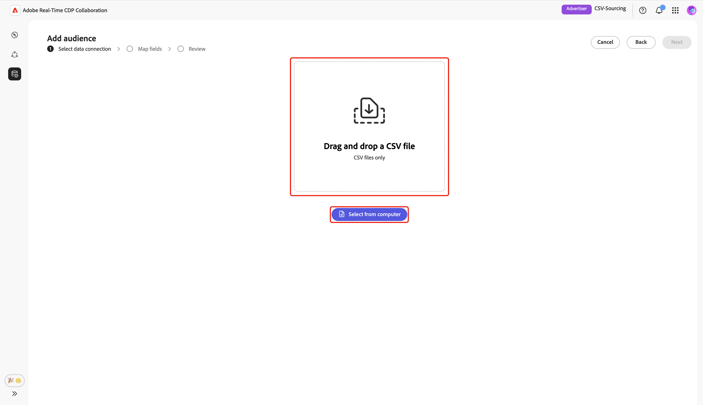
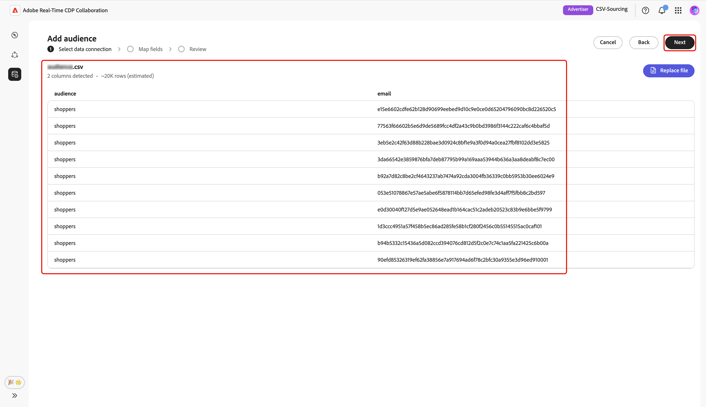
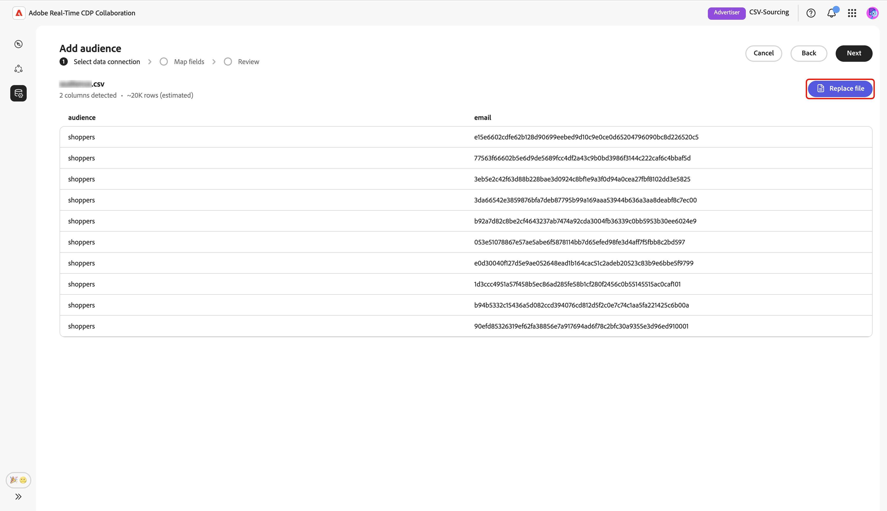
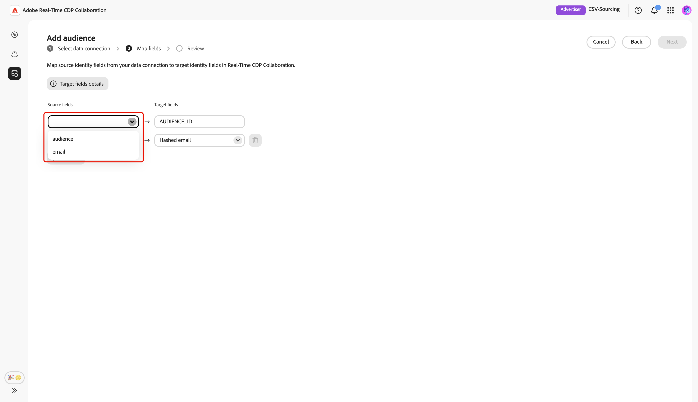
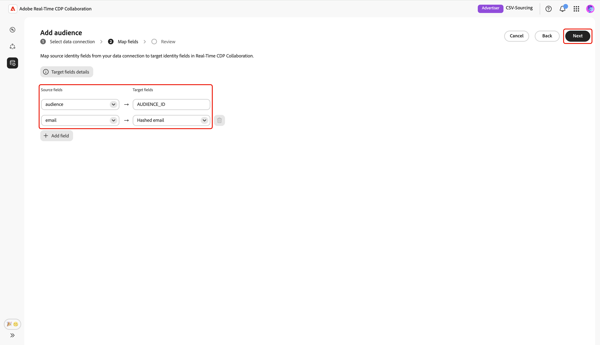
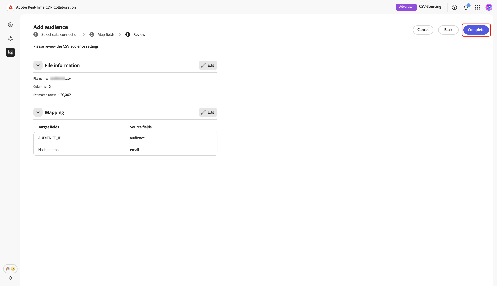
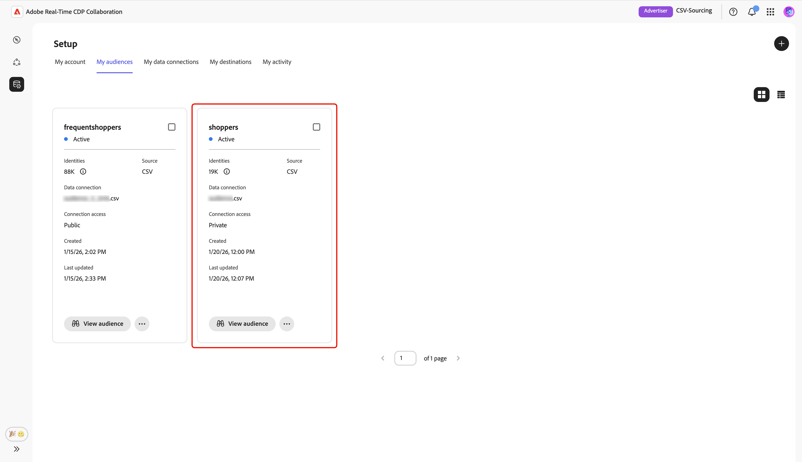

# オーディエンスのソース用にCSV ファイルをアップロード

このガイドでは、Adobe Real-Time CDP Collaboration UIにCSV ファイルをアップロードして、コラボレーションプロジェクトで使用するオーディエンスデータを取得する手順を説明します。

## 概要 {#overview}

CSV ファイルのアップロードは、共同作業プロジェクト用にファーストパーティのオーディエンスデータを取得する方法のひとつです。 これは、[Experience Platform S3 バケットを接続する](./configure-aws-s3-audience-sourcing.md)、[Google Cloud Storageを接続する](./configure-gcs-audience-sourcing.md)、または[AWSからオーディエンスをソーシングする](./onboard-audiences.md)の代わりに使用できます。

次のワークフローに従って、オーディエンスデータを含むCSV ファイルをアップロードし、Collaboration内でファーストパーティオーディエンスを取得および管理します。 アクティベーションや重複分析用にID フィールドをマッピングできます。 ファイルがアップロードされ、処理されると、ソースされたオーディエンスは&#x200B;**[!UICONTROL マイオーディエンス]** ワークスペースで利用できるようになります。このワークスペースでは、コラボレーションプロジェクトのレビュー、アクティブ化、管理を行うことができます。

>[!IMPORTANT]
>
>* CSV アップロードを通じてソースされたオーディエンスは、**7日間**&#x200B;利用できます。 この期間が経過すると、オーディエンスは期限切れになり、コラボレーションプロジェクトで使用するために再アップロードする必要があります。
>
>* この時点で、セッションごとに1つのCSV ファイルをアップロードできます。 追加のオーディエンスを追加するには、ソースファイルごとにアップロードワークフローを再度実行します。

## 前提条件 {#prerequisites}

オーディエンスのソース用にCSV ファイルをアップロードする前に、次の点を確認してください。

* Real-Time CDP Collaborationでアカウントオンボーディングを完了しました。 詳細な手順については、[&#x200B; アカウントのオンボーディング &#x200B;](./onboard-account.md)を参照してください。
* 組織にオーディエンスを追加するために必要な権限。
* 電子メールや電話などのID フィールドを含むオーディエンスデータを含むCSV ファイル。

## CSV ファイルのアップロード {#upload-csv-file}

**[!UICONTROL セットアップ]** ワークスペース内の&#x200B;**[!UICONTROL マイオーディエンス]** タブから、追加アイコン（）を選択します。 **[!UICONTROL Audience]**&#x200B;を選択します。

これが初めてのオーディエンスの場合は、**[!UICONTROL 追加]** オプションを選択することもできます。

オーディエンスを追加ワークフローが表示されます。 「**[!UICONTROL 新しいデータ接続を追加]**」を選択し、「**[!UICONTROL 次へ]**」を選択します。

{zoomable="yes"}

### データ接続として「CSV ファイル」を選択します {#select-csv-file}

**[!UICONTROL CSV ファイル]**&#x200B;をデータ接続として選択し、次に&#x200B;**[!UICONTROL 次]**&#x200B;を選択します。

### ファイルを選択 {#select-file}

>[!CONTEXTUALHELP]
>id="rtcdp_collaboration_audience_sourcing_csv"
>title="CSV ファイルからオーディエンスを追加"
>abstract="コンピューターからCSV ファイルをアップロードして、オーディエンスをReal-Time CDP Collaborationにソースします。"

**[!UICONTROL コンピューターから選択]**&#x200B;を選択して、ローカルシステムからCSV ファイルをアップロードします。 または、アップロードするCSV ファイルを[!UICONTROL CSV ファイルを] パネルにドラッグ&amp;ドロップすることもできます。

>[!IMPORTANT]
>
>CSV ファイルのみがサポートされます。 最大ファイルサイズは&#x200B;**2 GB**&#x200B;です。

アップロードが完了すると、UIには、列数、推定される行数、ファイルの構造、およびデータの最初の10行のプレビューを含む概要が表示されます。

概要を確認し、**[!UICONTROL 次へ]**&#x200B;を選択します。

#### ファイルを置換 {#replace-file}

別のCSV ファイルをアップロードする必要がある場合は、**[!UICONTROL ファイルを置換]**&#x200B;を選択し、新しいファイルを選択します。 その後、インターフェイスが更新され、新しいデータの更新された概要が表示されます。

修正された概要を確認したら、**[!UICONTROL 次へ]**&#x200B;を選択します。

### 同意の確認 {#confirm-consent}

続行する前に、同意オプトアウトがオーディエンスデータから削除されたことを確認する必要があります。 Collaborationでは、データ共有をオプトアウトした利用者がいなくても、クリーンなオーディエンスデータが必要です。

確認ボックスにチェックを入れ、**[!UICONTROL OK]**&#x200B;にチェックを入れて確認します。 ダイアログが閉じ、マップフィールド画面に進みます。

### ソース ID フィールドのマッピング {#map-fields}

フィールドマッピングは、Collaborationがオーディエンスデータを活用してアクティベーションや重複分析を行う方法を決定します。 **[!UICONTROL フィールドをマッピング]**&#x200B;画面で、ドロップダウンメニューを使用して、CSV ファイルの各ソース ID フィールドをCollaborationの適切なターゲットフィールドにマッピングします。

データ型または説明を含むターゲットフィールドに関する追加の詳細が必要な場合は、**[!UICONTROL ターゲットフィールドの詳細]**&#x200B;を選択して詳細を確認してください。

次に、マッピングされたフィールドを確認し、**[!UICONTROL 次へ]**&#x200B;を選択します。

### アップロードの確認と完了 {#review-and-complete}

**[!UICONTROL レビュー]**&#x200B;画面が表示され、CSV ファイルのオーディエンス設定の概要が表示されます。 次のセクションの情報を確認します。

* **[!UICONTROL ファイル情報]**: ファイル名、列数、推定される行数を表示します。
* **[!UICONTROL マッピング]**: アップロードしたオーディエンスファイルのソースフィールド（`email`など）が、Collaborationで使用されるターゲットフィールド（ハッシュ化された電子メールなど）にどのようにマッピングされるかを一覧表示します。

セクションを編集する必要がある場合は、鉛筆アイコンを選択します。 すべてのセクションを確認するには、**[!UICONTROL 完了]**&#x200B;を選択します。

概要セクションの下にプログレスバーが表示され、アップロードの進行状況が示されます。 アップロードが完了すると、CSV オーディエンスが作成され、オーディエンスのソーシングが進行中であることを確認する確認ダイアログが表示されます。

## ソース別オーディエンスの確認 {#review-sourced-audiences}

CSV ファイルをアップロードすると、Collaborationはファイルからオーディエンスのソーシングを開始します。 このプロセスには数分かかる場合があります。 オーディエンスの取得が完了すると、Experience Platformから取得したオーディエンスと同じ機能と情報を持つ&#x200B;**[!UICONTROL マイオーディエンス]** タブでオーディエンスを利用できるようになります。

グリッド表示またはテーブル表示で、行アイテムを選択するか、**[!UICONTROL オーディエンスを表示]**&#x200B;して、特定のオーディエンスの概要を表示します。 オーディエンスのステータス、ソース、データ接続名が表示され、次の詳細パネルが表示されます。

**[!UICONTROL ID]**: データが使用可能になると、合計ID数と分類が表示されます。
**[!UICONTROL カテゴリ]**: オーディエンスの整理またはフィルタリングに使用されるタグを表示します。
**[!UICONTROL 接続アクセス]**: オーディエンスがプライベート、パブリック、または特定の共同作業者と共有されているかどうかを表示します。
**[!UICONTROL メタデータの可視化]**：共同作業者が表示できるオーディエンス情報（ID数、重複率、インデックスなど）を表示します。

このビューを使用して、コラボレーションプロジェクトでオーディエンスを使用する前に、オーディエンスの設定と表示設定を確認します。 詳しくは、[個別のオーディエンスを表示する方法](./onboard-audiences.md#view-individual-audiences)を参照してください。

## 次の手順 {#next-steps}

これで、CollaborationにCSV ファイルが正常にアップロードされました。 ソーシング完了後、次の操作を実行できます。

* 調達先のオーディエンスと共同作業プロジェクトを作成。 [&#x200B; オーディエンスの発見](../../guide/collaborate/discover.md)を参照してください。
* 接続された配信先でオーディエンスを活用。 [&#x200B; オーディエンスのアクティベーション &#x200B;](../../guide/collaborate/activate.md)を参照してください。
* オーディエンスの重複とインサイトのレビュー。 [&#x200B; キャンペーンパフォーマンスの測定](../../guide/collaborate/measure.md)を参照してください。
* オーディエンスの設定と可視性を管理。 [Sourceとオーディエンスの管理](./onboard-audiences.md)を参照してください。

その他のオーディエンスのソーシング方法について詳しくは、[&#x200B; オーディエンスソーシング用にAWS S3を設定](./configure-aws-s3-audience-sourcing.md)または[Experience PlatformからのSource オーディエンス &#x200B;](./onboard-audiences.md)を参照してください。
